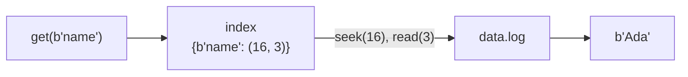

# Replay and the Index - the Read Path

Your store writes everything and remembers nothing across a restart. This phase closes the loop: on startup, read the log front to back and rebuild the state it describes. Along the way you'll handle the ugliest moment in a database's life - waking up next to a record that was half-written when the machine died - and then make one more upgrade that turns "a dict with a log" into an actual storage engine design with a name.

## Replay: the log is the database

Here's the mental shift this phase runs on. The dict is not the database. The **log** is the database - the complete, ordered history of every change. The dict is a *cache of the log's final state*, disposable and rebuildable at any time by one procedure:

Walk the log record by record. For each `set`, put the key in the dict. For each tombstone, remove it. When you reach the end, the dict holds exactly the state the store had when it last ran. A key written five times shows up five times in the log; the walk naturally keeps the last one, because later records overwrite earlier ones in the dict. **Last write wins**, by construction.

This is not a startup hack - it's the deepest pattern in the field. PostgreSQL replays its WAL after a crash. Redis replays its append-only file on boot. A [database replica](/guides/scaling-a-database) is a machine replaying the leader's log a moment behind. You're about to write the same procedure they run.

## The torn record at the end

One thing stands between us and a working replay. Phase 2's crash story: the process died *mid-append*. The log now ends with a fragment - maybe half a header, maybe a full header promising 300 bytes of value with only 120 present, maybe all the bytes but garbage in them. Your replay will walk straight into it.

The CRC and length prefixes were built for this moment. Reading a record can fail three ways, and each one means the same thing - *the log ends here*:

1. **Short header.** Fewer than 12 bytes remain. Either the file ended cleanly, or a header was torn. Stop.
2. **Short body.** The header promises more key/value bytes than the file has. The append never finished. Stop.
3. **Bad checksum.** All the bytes are present but the CRC doesn't match. The bytes are damaged; and since everything after a damaged record has unknowable framing, trust nothing past it. Stop.

In all three cases the move is the same: keep everything up to the last record that verified, and **truncate the file** back to that point, amputating the torn tail. The failed write is erased as if it never happened - which is the correct semantics, because it was never acknowledged. No caller was ever told that write succeeded, so no promise is broken by dropping it.

## From values in RAM to an index

While we're rebuilding the read path, fix a scaling problem before it bites. So far the dict maps key → *value*, meaning every value in the database lives in RAM. A store holding 10 GB of values needs 10 GB of memory - the log made writes durable but did nothing for memory.

The fix: the dict stops holding values and starts holding **directions to values**. Each key maps to `(offset, length)` - where in the log file the current value's bytes sit, and how many there are. A `get` becomes: look up the offset (dict lookup, nanoseconds), `seek` there, read exactly `length` bytes (one disk read, usually served from the OS page cache). Now RAM holds only keys and two integers per key; values live on disk where 10 GB is cheap.



That dict-of-offsets is an **index** in the full database sense of the word: a structure that turns "search everything" into "go directly there." It's the same job an index does for [a slow SQL query](/guides/why-is-my-query-slow) - only here you can see the mechanism with no abstraction in the way: literally a Python dict pointing into a file. This exact design - append-only log plus in-memory hash of key → offset - is **Bitcask**, the engine that shipped inside the Riak database, where the index goes by "keydir."

The trade, stated honestly: every *key* must still fit in RAM (values don't), and a hash index can't answer range queries like "every key between `user:100` and `user:200`" - hash maps have no order. Phase 6 shows what LevelDB pays to lift those limits.

## The full engine

Here is the complete `kv.py` - replay, recovery, and the index, replacing phase 2's class. This is the heart of the whole project, about ninety lines:

```python
import os
import struct
import zlib

# One record on disk:
#   [crc:4][key_len:4][val_len:4][key bytes][value bytes]
# crc covers everything after itself. val_len == -1 marks a delete.
HEADER = struct.Struct("<Iii")   # uint32 crc, int32 key_len, int32 val_len
TOMBSTONE = -1


def encode_record(key: bytes, value) -> bytes:
    if value is None:  # a delete
        body = struct.pack("<ii", len(key), TOMBSTONE) + key
    else:
        body = struct.pack("<ii", len(key), len(value)) + key + value
    crc = zlib.crc32(body)
    return struct.pack("<I", crc) + body


class KV:
    def __init__(self, path):
        self.path = path
        self._index = {}          # key -> (value_offset, value_len)
        self._replay()
        self._log = open(path, "ab")
        self._reader = open(path, "rb")

    def _replay(self):
        if not os.path.exists(self.path):
            self._offset = 0
            return
        good = 0
        with open(self.path, "rb") as f:
            while True:
                pos = f.tell()
                header = f.read(HEADER.size)
                if len(header) < HEADER.size:
                    break                    # clean end of file, or a torn header
                crc, key_len, val_len = HEADER.unpack(header)
                is_delete = val_len == TOMBSTONE
                body_len = key_len + (0 if is_delete else val_len)
                body = f.read(body_len)
                if len(body) < body_len:
                    break                    # torn record: the write never finished
                if zlib.crc32(header[4:] + body) != crc:
                    break                    # corrupt: trust nothing from here on
                key = body[:key_len]
                if is_delete:
                    self._index.pop(key, None)
                else:
                    value_off = pos + HEADER.size + key_len
                    self._index[key] = (value_off, val_len)
                good = f.tell()
        if good < os.path.getsize(self.path):
            with open(self.path, "r+b") as f:
                f.truncate(good)             # drop the torn tail
        self._offset = good

    def set(self, key: bytes, value: bytes):
        record = encode_record(key, value)
        self._log.write(record)
        self._log.flush()
        os.fsync(self._log.fileno())
        self._index[key] = (self._offset + HEADER.size + len(key), len(value))
        self._offset += len(record)

    def get(self, key: bytes):
        entry = self._index.get(key)
        if entry is None:
            return None
        offset, length = entry
        self._reader.seek(offset)
        return self._reader.read(length)

    def delete(self, key: bytes) -> bool:
        if key not in self._index:
            return False
        record = encode_record(key, None)
        self._log.write(record)
        self._log.flush()
        os.fsync(self._log.fileno())
        self._offset += len(record)
        del self._index[key]
        return True

    def close(self):
        self._log.close()
        self._reader.close()
```

Walk the parts that carry weight:

- **`_replay` is the read-side of the record format.** It reads a header, computes how much body to expect (tombstones have no value bytes), reads it, verifies the CRC over exactly the bytes the writer checksummed (`header[4:] + body` - the lengths, key, and value). The three `break`s are the three failure modes; `good` always marks the end of the last verified record, and the `truncate(good)` amputates anything after it.
- **Two file handles.** `_log` is opened in append mode and only writes; `_reader` is opened read-only and only seeks. Splitting them means the writer's position (always the end) and the reader's position (wherever the last `get` went) never fight over one shared file cursor. Real engines do the same - one appender, many readers.
- **The store tracks its own end.** `self._offset` is the file's length, maintained arithmetically. When `set` appends a record, it already knows the value's offset - `self._offset + HEADER.size + len(key)` - without asking the filesystem. Bookkeeping beats syscalls.
- **`get` never scans.** Index lookup, seek, read. The cost of a read does not depend on the size of the database. That sentence is what "indexed" means.

## Prove it survives

The demo the last two phases have been promising - kill the store, corrupt the file, watch it recover. Delete any old `data.log` first, then:

```console
$ python
>>> from kv import KV
>>> db = KV("data.log")
>>> db.set(b"name", b"Ada")
>>> db.set(b"language", b"python")
>>> db.set(b"name", b"Grace")
>>> db.delete(b"language")
True
>>> db.close()
>>> import os; os.path.getsize("data.log")
86
```

Four records: two sets, an overwrite, a tombstone. Now simulate the crash - a power cut halfway through appending a fifth record is indistinguishable from writing only its first 11 bytes:

```console
>>> from kv import encode_record
>>> record = encode_record(b"city", b"London")
>>> with open("data.log", "ab") as f:
...     f.write(record[:11])
...
11
>>> os.path.getsize("data.log")
97
>>> db = KV("data.log")          # reopen: replay + recovery run
>>> db.get(b"name")
b'Grace'
>>> db.get(b"language") is None
True
>>> db.get(b"city") is None
True
>>> os.path.getsize("data.log")
86
```

*What just happened:* Replay walked four good records - `name` ended up as `Grace` (last write wins), `language` came and went (the tombstone removed it) - then hit a header promising more bytes than existed, stopped, and truncated the file from 97 bytes back to 86. The torn write vanished; every acknowledged write survived. Compare that to phase 1, where the same crash cost the entire file.

## What you have now

A crash-safe, persistent key-value store: durable writes, startup recovery, and reads that go straight to the data through an index. It has one growing embarrassment - that overwrite of `name` left `Ada`'s corpse in the log, and the log never shrinks. A store that's written a billion updates to one key holds a billion records for it. Phase 4 takes out the garbage.

```quiz
[
  {
    "q": "What does the in-memory index map a key to?",
    "choices": [
      "The value itself, kept in RAM for speed",
      "The file offset and length of the value's bytes in the log",
      "The CRC32 checksum of the value"
    ],
    "answer": 1,
    "explain": "The index holds directions, not data: (offset, length). A get() seeks to the offset and reads exactly length bytes, so values live on disk and only keys plus two integers live in RAM."
  },
  {
    "q": "During replay, the last record's header promises 300 value bytes but only 120 remain in the file. What does the store do?",
    "choices": [
      "Raise an exception and refuse to open - the database is corrupt",
      "Keep the 120 bytes as a best-effort partial value",
      "Truncate the file back to the end of the last verified record and carry on - the torn write was never acknowledged, so dropping it breaks no promise"
    ],
    "answer": 2,
    "explain": "A torn tail is the expected signature of a crash mid-append. Every record before it verified fine, and the interrupted write was never confirmed to any caller - amputating it restores a consistent store."
  },
  {
    "q": "Where does the truth live in this design?",
    "choices": [
      "In the log - the index is a disposable cache that can always be rebuilt by replaying it",
      "In the index - the log is a backup of it",
      "Split evenly: keys in the index, values in the log"
    ],
    "answer": 0,
    "explain": "The log is the complete ordered history; replaying it reconstructs the index from nothing, which is exactly what __init__ does on every startup."
  }
]
```

---

[← Phase 2: The Append-Only Log](02-the-append-only-log.md) · [Guide overview](_guide.md) · [Phase 4: Compaction →](04-compaction.md)
