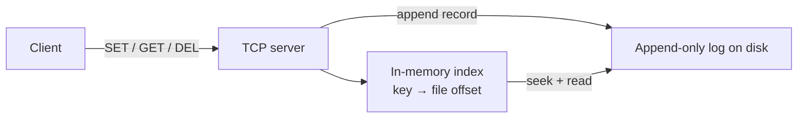

# Build Your Own Key-Value Store (Python)

You use databases every day and trust them completely. You call `save()`, the power can die a millisecond later, and your data is still there when the machine comes back. Have you ever asked *how*? Most developers haven't - storage is the deepest magic in the stack, and everyone politely agrees not to look at it.

This weekend you're going to look at it. You'll build a real persistent key-value store in Python, from an empty folder: a store that survives crashes, recovers from half-written files, keeps reads fast with an index, cleans up after itself, and speaks a wire protocol so other programs can use it over TCP. The design you'll build - an append-only log plus an in-memory hash index - is not a toy pattern. It's **Bitcask**, the storage engine that shipped inside the Riak database, and its core moves (log-first writes, replay on startup, compaction) are the same moves inside Redis, LevelDB, and PostgreSQL.

This one runs **on your machine.** No sandbox, no framework, and remarkably: no dependencies. The entire project is Python's standard library - `struct`, `zlib`, `os`, and `socketserver`. The hard part of a database was never the libraries. It's the thinking.

## The one idea everything hangs on

Databases don't keep your data safe by carefully editing files in place. Editing in place is exactly how you corrupt data - a crash halfway through an edit leaves neither the old value nor the new one. Instead, real storage engines **append**: every change is written as a new record at the end of a log, and old bytes are never touched. The current state of the database is a *replay* of that log.

Every phase of this project adds one piece of that picture, and every piece exists because the previous phase broke without it.

## What you'll need

- **Python 3.10 or newer.** Check with `python --version`. Nothing to `pip install`.
- A terminal and a text editor.
- Solid Python. This is the hard project in this section: you should be comfortable with classes, `bytes` vs `str`, file handles, and context managers. The database concepts are all explained; the Python is not.

If terms like *durability* or *index* are hazy, the databases section has your back - [What a Database Actually Is](/guides/what-a-database-is) and [Transactions & ACID](/guides/transactions-and-acid) are good grounding, and this project will make both feel concrete in a way reading never can.

Rough time: a weekend. Six to eight focused hours if you read as you go.

## What you'll learn

- Why "write the file out again" is not persistence, and what a torn write does to your data
- The append-only log: why every serious database writes changes to a log *first*
- What `fsync` actually promises, and the three layers a byte passes through before it's truly on disk
- How a database restarts: replaying the log, detecting a half-written record, and recovering
- What an index physically is: a map from key to file offset, so reads don't scan
- Compaction: why logs grow forever and how engines reclaim the space without downtime
- How to put a real wire protocol in front of it all with a threaded TCP server
- Where your engine sits next to Redis, LevelDB, and SQLite - honestly measured

## The phases

1. **[A Dict, and Why Persistence Is Hard](01-the-dict-and-the-problem.md)** - the in-memory store is ten lines; every naive way to save it to disk fails in an instructive way.
2. **[The Append-Only Log](02-the-append-only-log.md)** - the write path: a binary record format, checksums, and what `fsync` really buys you.
3. **[Replay and the Index](03-replay-and-the-index.md)** - the read path: rebuild state from the log on startup, survive a crash mid-write, and stop keeping values in RAM.
4. **[Compaction](04-compaction.md)** - the log grows forever; rewrite it live, swap it atomically, lose nothing.
5. **[A TCP Server](05-a-tcp-server.md)** - a SET/GET/DEL protocol over sockets, so any program on the machine can talk to your database.
6. **[Benchmarks, and What Redis Does Differently](06-benchmarks-and-real-databases.md)** - measure your engine for real, then compare its design to Redis, LevelDB, and SQLite without hand-waving.

Each phase ends with a store that runs. By phase 3 your data survives `kill -9`. By phase 5 it's a server. Let's break persistence first, so you believe the fix.
