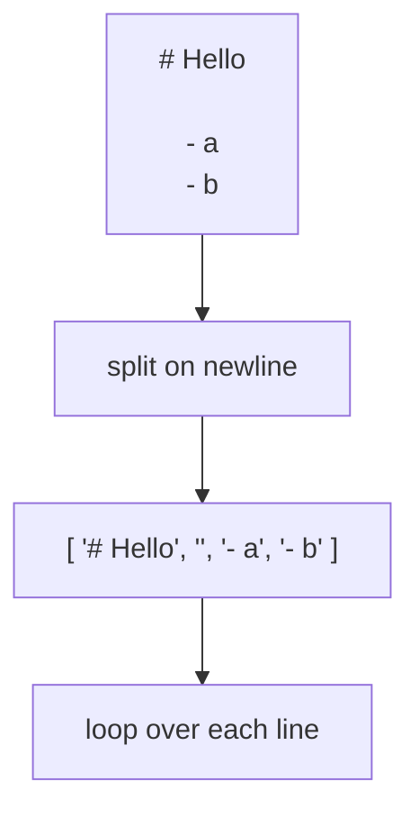

# The Plan: Lines to HTML

Before we write a single regex, let's agree on what we are actually doing. A converter
is a translator. Markdown goes in, HTML comes out, and our job is to write down the
translation rules.

## What translates to what

Markdown is a tiny language. Most of it is a handful of one-line patterns. Here is the
slice we care about:

| You write              | You get                          |
| ---------------------- | -------------------------------- |
| `# Title`              | `<h1>Title</h1>`                 |
| `## Subtitle`          | `<h2>Subtitle</h2>`              |
| `- item`               | a list item in a `<ul>`          |
| `Some text.`           | `<p>Some text.</p>`              |
| `**bold**`             | `<strong>bold</strong>`          |
| `*italic*`             | `<em>italic</em>`                |
| `` `code` ``           | `<code>code</code>`              |
| `[text](url)`          | `<a href="url">text</a>`         |

Notice the split in that table. The top four rules look at a **whole line** - a `#` at
the start makes the entire line a heading. The bottom four work **inside** a line -
`**bold**` could appear in the middle of a paragraph or a heading.

That split is the most important idea in this guide. We have two kinds of rules:

- **Block rules** decide what each line *becomes* (a heading, a list item, a paragraph).
- **Inline rules** decorate the *text within* a block (bold, italic, code, links).

We will handle blocks first (Phase 2), inline second (Phase 3). Keeping them separate is
what keeps the code readable. Try to do both at once and you get a tangle.

## Why lines?

Markdown is line-oriented. The thing at the *start* of a line decides what that line is.
`#` at the start means heading. `-` at the start means list item. Nothing special at the
start means paragraph.

So the first move of almost every Markdown parser is the same: chop the input into
lines and look at each one. JavaScript hands us that for free with `split`.



## Splitting the input

Let's prove this works. We will take a small Markdown document, split it into an array of
lines, and print each one with its index so we can see exactly what the loop will be
chewing on.

```js runnable
const markdown = `# My Notes

Here is a paragraph.

- first item
- second item`;

// The whole game starts here: text becomes an array of lines.
const lines = markdown.split("\n");

console.log("Got", lines.length, "lines:\n");

lines.forEach((line, i) => {
  // Show the index and the raw content, quoted so blank lines are visible.
  console.log(`${i}: "${line}"`);
});
```

Run that. You should see six lines, including the two blank ones (index 1 and 4). Those
blank lines matter later - they are how Markdown separates one paragraph from the next -
so it is good that `split` keeps them.

## Framing the loop

Now the skeleton everything else hangs on. We loop over the lines and, for each one,
decide what it is. Right now we only know how to *classify* a line, not convert it - but
classifying is the first half of the job, and it shows you the shape of the code we will
fill in over the next phases.

```js runnable
const markdown = `# My Notes

Here is a paragraph.

- first item`;

const lines = markdown.split("\n");

function classify(line) {
  if (line.startsWith("# ")) return "heading";
  if (line.startsWith("- ")) return "list-item";
  if (line.trim() === "") return "blank";
  return "paragraph";
}

const output = [];
for (const line of lines) {
  const kind = classify(line);
  output.push(`${kind.padEnd(10)} <- "${line}"`);
}

console.log(output.join("\n"));
```

Run it. Each line now has a label. `# My Notes` is a heading, the bullet is a list-item,
the blank line is blank, and the rest is a paragraph.

This is the real architecture in miniature. A Markdown parser is fundamentally a thing
that walks lines, classifies each one, and emits the matching HTML. Everything from here
is filling in the "emit the matching HTML" part - making `classify` smarter and turning
those labels into real tags.

## Where we are

You have a converter's skeleton: input split into lines, and a function that knows what
each line is. You also have the mental model - blocks versus inline - that the rest of
the build rests on.

Next phase we replace those labels with actual HTML tags. Bring the `classify` idea with
you; it is about to grow up.
