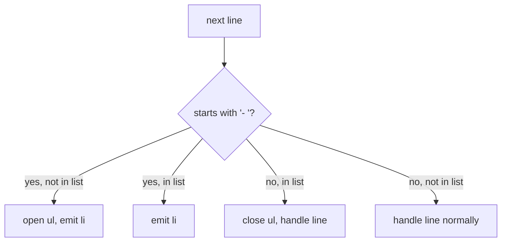

# Block Elements

Last phase we labeled each line. Now we make those labels do work: a heading line becomes
an `<h1>`, a bullet becomes an `<li>` inside a `<ul>`, and everything else becomes a
`<p>`. This is block-level conversion — deciding what each line *is*.

## Regex with capture groups

A regular expression can do two things at once: confirm a line matches a pattern *and*
pull out the part you care about. The part you pull out is a **capture group** —
anything inside parentheses.

Take a heading. The pattern is "a hash, a space, then the rest of the line":

```js runnable
const line = "# My Notes";

// ^      start of line
// #\s    a hash followed by a space
// (.*)   capture everything after it
const match = line.match(/^#\s(.*)/);

console.log("Matched?", match !== null);
console.log("Captured text:", match[1]);
```

`match[0]` is the whole match; `match[1]` is the first capture group — the heading text
without the `#`. That captured text is exactly what goes between `<h1>` and `</h1>`.

## Headings at six levels

Markdown has six heading levels, `#` through `######`. We could write six patterns, but
one regex with two capture groups handles them all: capture the run of hashes to count
them, capture the text to wrap it.

```js runnable
function heading(line) {
  // (#{1,6}) one to six hashes; \s a space; (.*) the text
  const m = line.match(/^(#{1,6})\s(.*)/);
  if (!m) return null;
  const level = m[1].length;       // number of hashes = heading level
  return `<h${level}>${m[2]}</h${level}>`;
}

console.log(heading("# Big"));
console.log(heading("### Smaller"));
console.log(heading("Not a heading"));  // returns null
```

Run it. One hash gives `<h1>`, three hashes give `<h3>`, and a plain line returns `null`
so we know to try other rules. Returning `null` on no-match is a pattern we will lean on:
each block rule either claims a line or passes.

## Lists are the tricky one

Headings and paragraphs are one line in, one tag out. Lists are different. Several
consecutive `- item` lines need to be wrapped in a *single* `<ul>`:

```
- a          <ul>
- b    -->     <li>a</li>
                <li>b</li>
              </ul>
```

So a list item alone is not enough; we need to know whether we are already inside a list.
That means keeping a little state as we walk the lines: are we currently in a list or
not? When we hit the first `-`, open a `<ul>`. When we hit a non-`-` line, close it.



## The block converter

Here it all comes together. We walk the lines, track whether we are inside a list, and
emit the right tags. Paragraphs are the fallback — any non-blank line that is not a
heading or list item.

```js runnable
function toBlocks(markdown) {
  const lines = markdown.split("\n");
  const out = [];
  let inList = false;

  function closeList() {
    if (inList) {
      out.push("</ul>");
      inList = false;
    }
  }

  for (const line of lines) {
    const heading = line.match(/^(#{1,6})\s(.*)/);
    const item = line.match(/^-\s(.*)/);

    if (item) {
      if (!inList) {
        out.push("<ul>");
        inList = true;
      }
      out.push(`  <li>${item[1]}</li>`);
    } else if (heading) {
      closeList();
      const level = heading[1].length;
      out.push(`<h${level}>${heading[2]}</h${level}>`);
    } else if (line.trim() === "") {
      closeList();
      // blank line: paragraph separator, emit nothing
    } else {
      closeList();
      out.push(`<p>${line}</p>`);
    }
  }

  closeList(); // a list at the very end still needs closing
  return out.join("\n");
}

const sample = `# Shopping

Things to buy:

- milk
- bread
- coffee

Done.`;

console.log(toBlocks(sample));
```

Run it. You get a clean tree: an `<h1>`, a `<p>`, a `<ul>` with three `<li>`s, and a
final `<p>`. Notice the list opens once and closes once, even though three items went into
it — that is the `inList` flag earning its keep.

That last `closeList()` after the loop is the kind of detail that bites people. Without
it, a document that ends on a list item never emits its closing `</ul>`. Delete that line,
re-run, and watch the broken output. Then put it back.

## Where we are

Your converter now produces real block structure: headings at any level, lists that wrap
correctly, and paragraphs for everything else. What it does *not* do yet is anything
inside those blocks — `**milk**` would come out as literal asterisks.

That is Phase 3: reaching inside each block and formatting the spans.
