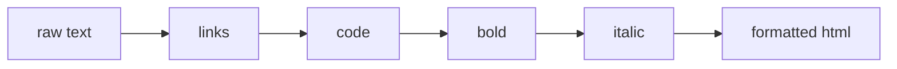

# Inline Formatting

Block rules decide what a line *is*. Inline rules decorate the text *within* it. A
heading can contain `**bold**`; a paragraph can contain a `[link](url)`. This phase
handles those spans, and it works the same regardless of which block the text came from.

The tool here is `String.replace` with a regex and a replacement string. Where capture
groups in Phase 2 told us what to wrap, here they get pasted straight into the output.

## Bold and italic

Bold is `**text**`, italic is `*text*`. The replacement uses `$1` to mean "whatever the
first capture group caught":

```js runnable
let text = "This is **bold** and this is *italic*.";

// \*\*(.+?)\*\*  ->  two literal stars, then capture, then two stars
text = text.replace(/\*\*(.+?)\*\*/g, "<strong>$1</strong>");

// \*(.+?)\*      ->  one star, capture, one star
text = text.replace(/\*(.+?)\*/g, "<em>$1</em>");

console.log(text);
```

Two things to notice. The `g` flag means *global* — replace every match, not only the
first. And `.+?` is **non-greedy**: the `?` tells it to grab as few characters as
possible. Without it, `*a* and *b*` would match from the first star all the way to the
last, swallowing the text between. Try removing the `?` and re-running to see the mess.

## Order matters: bold before italic

There is a trap hiding in those two patterns. `**bold**` is also four stars, and the
italic pattern `\*(.+?)\*` could chew into it. The fix is order: handle `**` *before*
`*`. By the time the italic rule runs, the bold has already become `<strong>` tags and
its stars are gone.

```js runnable
function inline(text) {
  text = text.replace(/\*\*(.+?)\*\*/g, "<strong>$1</strong>"); // bold FIRST
  text = text.replace(/\*(.+?)\*/g, "<em>$1</em>");             // italic second
  return text;
}

console.log(inline("**important** and *subtle*"));
console.log(inline("a *little* emphasis here"));
```

Run it. Both come out clean. Swap the two lines so italic runs first, re-run, and you will
see the bold break — the italic rule eats the inner stars and leaves a stray `**`. Order
is not cosmetic here; it is correctness.

## Inline code

Inline code is text between backticks: `` `code` ``. Same shape, different delimiter:

```js runnable
let text = "Call `mdToHtml(text)` to convert.";

text = text.replace(/`(.+?)`/g, "<code>$1</code>");

console.log(text);
```

In a fuller parser you would also want code spans to be *immune* to the other rules —
`` `**not bold**` `` should stay literal. We are keeping it small here, but it is worth
knowing that real parsers pull code out first and stitch it back last for exactly that
reason.

## Links

Links are the one with two captures. `[text](url)` becomes
`<a href="url">text</a>` — the text and the URL land in different places, so we capture
both and reorder them:

```js runnable
let text = "Read the [docs](https://example.com) for more.";

// \[(.+?)\]  capture the text inside square brackets
// \((.+?)\)  capture the url inside parens
text = text.replace(/\[(.+?)\]\((.+?)\)/g, '<a href="$2">$1</a>');

console.log(text);
```

`$1` is the link text, `$2` is the URL. Notice they swap places in the output — that
reordering is something a plain find-and-replace could never do, but a capture group makes
trivial.

## All inline rules together

Here is the complete inline pass — the function we will plug into the converter next
phase. Order is deliberate: links and code first (they have distinctive delimiters), then
bold, then italic.

```js runnable
function inline(text) {
  return text
    .replace(/\[(.+?)\]\((.+?)\)/g, '<a href="$2">$1</a>') // links
    .replace(/`(.+?)`/g, "<code>$1</code>")                // inline code
    .replace(/\*\*(.+?)\*\*/g, "<strong>$1</strong>")      // bold
    .replace(/\*(.+?)\*/g, "<em>$1</em>");                 // italic
}

const sample =
  "See the **important** `config` setting in the [guide](https://docs.dev), *please*.";

console.log(inline(sample));
```

Run it. One line of mixed Markdown, and every span comes out as the right tag: a link, a
code span, bold, and italic, all in one pass. Chaining `.replace` calls like this reads
top to bottom as a list of rules, which is about as clear as text transformation gets.



## Where we are

You now have two halves of a converter. `toBlocks` from Phase 2 builds the structure;
`inline` from this phase decorates the text. They do not talk to each other yet — that is
the final phase, where we wire them together, add HTML escaping, and end up with one
function you can throw a whole document at.
