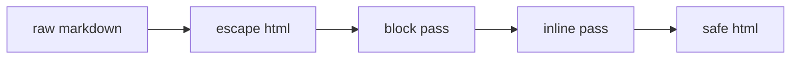

# Putting It Together

You have the two halves. `toBlocks` builds structure from lines; `inline` formats the
spans within text. This phase joins them into a single `mdToHtml(text)` function, adds the
one piece we have been deferring — escaping — and hardens it against a few edge cases.

## The escaping problem

Here is a question that decides whether your converter is a toy or a tool: what happens
when the Markdown source itself contains HTML?

```js runnable
const evil = "Hello <script>alert('gotcha')</script>";

// Our converter so far would pass that <script> straight through into the page.
console.log("Output would contain a live script tag:");
console.log(`<p>${evil}</p>`);
```

If you drop that output into a real page, the script runs. That is the classic injection
hole, and it is why **escaping is not optional**. Before we interpret any Markdown, we
convert the dangerous HTML characters into their harmless display forms: `<` becomes
`&lt;`, `>` becomes `&gt;`, and `&` becomes `&amp;` (the `&` first, so we do not double-
escape the ones we added).

```js runnable
function escapeHtml(text) {
  return text
    .replace(/&/g, "&amp;")   // must run first
    .replace(/</g, "&lt;")
    .replace(/>/g, "&gt;");
}

console.log(escapeHtml("Hello <script>alert('x')</script> & friends"));
```

Run it. The `<script>` is now inert text — it will *display* as `<script>` on the page
instead of executing. That ordering matters: escape `&` first, or you turn your own
`&lt;` into `&amp;lt;`.

## The order of operations

So the full pipeline, start to finish, is:

1. **Escape** the raw input — neutralize any HTML in the source.
2. **Block pass** — split into lines, build headings, lists, paragraphs.
3. **Inline pass** — format bold, italic, code, links within each block's text.

Escape first, always. If you formatted first and escaped after, you would escape your own
`<strong>` tags right back into text. Escaping has to happen while the angle brackets are
still the *source's*, before any of yours exist.



## The complete converter

Here is everything, in one place, working. The inline pass runs on the *text* of each
block, not on the tags we generate — that is why `inline` is called on the captured
heading text and list text, not on the whole output string.

```js runnable
function escapeHtml(text) {
  return text
    .replace(/&/g, "&amp;")
    .replace(/</g, "&lt;")
    .replace(/>/g, "&gt;");
}

function inline(text) {
  return text
    .replace(/\[(.+?)\]\((.+?)\)/g, '<a href="$2">$1</a>')
    .replace(/`(.+?)`/g, "<code>$1</code>")
    .replace(/\*\*(.+?)\*\*/g, "<strong>$1</strong>")
    .replace(/\*(.+?)\*/g, "<em>$1</em>");
}

function mdToHtml(markdown) {
  const lines = escapeHtml(markdown).split("\n"); // escape first, then split
  const out = [];
  let inList = false;

  const closeList = () => {
    if (inList) { out.push("</ul>"); inList = false; }
  };

  for (const line of lines) {
    const heading = line.match(/^(#{1,6})\s(.*)/);
    const item = line.match(/^-\s(.*)/);

    if (item) {
      if (!inList) { out.push("<ul>"); inList = true; }
      out.push(`  <li>${inline(item[1])}</li>`);
    } else if (heading) {
      closeList();
      const level = heading[1].length;
      out.push(`<h${level}>${inline(heading[2])}</h${level}>`);
    } else if (line.trim() === "") {
      closeList();
    } else {
      closeList();
      out.push(`<p>${inline(line)}</p>`);
    }
  }

  closeList();
  return out.join("\n");
}

const doc = `# Weekend Build

We made a converter with **bold**, *italic*, and \`code\`.

Things it handles:

- [links](https://example.com)
- raw <tags> that get escaped
- mixed **emphasis** in lists

That's a wrap.`;

console.log(mdToHtml(doc));
```

Run it. That is a full Markdown document going in and clean, safe HTML coming out. The
heading is formatted, the list items carry their links and bold, and the `<tags>` in the
source show up as escaped text instead of breaking anything. Every piece you built across
four phases is in that one function.

## Edge cases worth knowing

What you built is real, but it is deliberately small. A few rough edges to be aware of:

| Edge case                        | What happens now              | The grown-up fix                          |
| -------------------------------- | ----------------------------- | ----------------------------------------- |
| Unclosed `**bold`                | left as literal text          | match leniently or warn                   |
| Nested `**a *b* c**`             | works, since order is right   | a real grammar handles deep nesting       |
| `` `**not bold**` `` in code     | the bold *would* still apply  | extract code spans first, restore last    |
| `# ` with no text                | empty heading tag             | trim and skip if blank                    |
| Links with `)` in the URL        | regex stops at the first `)`  | a stricter URL pattern                    |

None of these are flaws in your understanding — they are the line between a weekend build
and a production library. The real parsers (marked, markdown-it) spend most of their code
on exactly these corners.

## Extend it

You have a working base. Here are the next moves, roughly easiest to hardest:

- **Ordered lists.** Match `^\d+\.\s(.*)` and wrap in `<ol>` the same way you did `<ul>`.
- **Blockquotes.** Lines starting with `> ` become `<blockquote>` content.
- **Horizontal rules.** A line of `---` on its own becomes `<hr>`.
- **Code blocks.** Lines fenced by triple backticks become `<pre><code>` — and skip
  inline formatting inside them.
- **Render it live.** Drop `mdToHtml` into a page, wire a `<textarea>` to a `<div>`, and
  set the div's `innerHTML` on every keystroke. Now you have a live preview editor.

## Where we landed

You started with a string and a plan. You now have `mdToHtml` — a converter that splits
lines, builds blocks, formats inline spans, and escapes anything dangerous. It is the
same architecture the big libraries use, small enough to hold in your head and yours to
grow.

That is the whole weekend, in one function. Go feed it a README.
