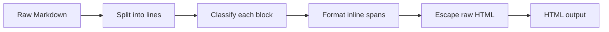

# Build a Markdown-to-HTML Converter (JS)

Every README you have ever read started life as Markdown. Some library turned those
hashes and asterisks into headings and bold text. This weekend, you are going to be
that library.

We will build a small Markdown-to-HTML converter in plain JavaScript. You feed it text
like `# Hello` and it hands back `<h1>Hello</h1>`. No frameworks, no installs, no build
step — you write a function, you call it, you see HTML come out the other side.

## What you'll build

A function called `mdToHtml(text)` that takes a Markdown string and returns an HTML
string. By the end it handles:

- **Blocks** — headings (`#`), paragraphs, and bullet lists (`-`).
- **Inline formatting** — `**bold**`, `*italic*`, `` `code` ``, and `[links](url)`.
- **Escaping** — raw `<` and `>` in the source get neutralized so they show up as text
  instead of breaking your page.

It is the same shape as the real tools (marked, markdown-it). Smaller, yes — but the
core idea is identical, and once you have built one you will never look at a Markdown
renderer the same way again.

## The stack

JavaScript and regular expressions. That is the whole list. Everything runs in the
browser on this page — the code blocks below are live. You edit them, you hit run, you
watch the output change.

## This one runs in the browser

This is a **run-along** project. Every code block here is executable right where it
sits. You do not need to set up a project on your machine or install anything. Read a
phase, run its block, tweak it, run it again. That tight loop — change, run, see — is
how this stuff actually sinks in.

## Rough time

Two to three hours if you run every block and poke at them. Less if you skim, but the
poking is the point.

## What you'll learn

- How Markdown maps onto HTML, one rule at a time.
- The difference between **block-level** parsing (whole lines) and **inline** parsing
  (spans inside a line) — the single most useful idea in this whole guide.
- Writing regular expressions that capture parts of a match and reuse them.
- Why escaping HTML is not optional, and how a converter that skips it becomes a
  security hole.

## The shape of the journey

Phase 1 splits the input into lines and frames the loop. Phase 2 turns those lines into
block elements. Phase 3 handles the inline formatting inside them. Phase 4 stitches it
all together, adds escaping, and leaves you with one working converter you can extend.

Grab a coffee. Let's build a thing.
