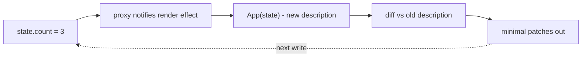

# Wiring It Together

You have all three machines: reactivity that knows *when* data changes (phases 1-2), a describer
that says *what* the UI should be (phase 3), and a diff that finds *the least* to do about it
(phase 4). A framework is these three in a loop. Today: the loop - and then the satisfying part,
mapping your 120 lines onto the four frameworks' vocabularies.

## The whole framework, assembled

Read top to bottom - every line is something you built - then run it:

```js runnable
// ══ 1. REACTIVITY (phases 1-2) ══════════════════════════════
const ledger = new WeakMap(); let activeEffect = null;
function track(t, k) { if (!activeEffect) return; let m = ledger.get(t); if (!m) ledger.set(t, m = new Map()); let s = m.get(k); if (!s) m.set(k, s = new Set()); s.add(activeEffect); }
function notify(t, k) { const s = ledger.get(t)?.get(k); if (s) for (const f of [...s]) f(); }
function reactive(o) { return new Proxy(o, { get(t, k) { track(t, k); return t[k]; }, set(t, k, v) { if (t[k] === v) return true; t[k] = v; notify(t, k); return true; } }); }
function effect(fn) { activeEffect = fn; fn(); activeEffect = null; }

// ══ 2. DESCRIPTION (phase 3) ════════════════════════════════
function h(t, p, ...c) { return { type: t, props: p || {}, children: c.flat() }; }
function renderToString(v) {
  if (v == null || v === false) return '';
  if (typeof v !== 'object') return String(v);
  const attrs = Object.entries(v.props).filter(([, x]) => x !== false && x != null)
    .map(([k, x]) => (x === true ? ` ${k}` : ` ${k}="${x}"`)).join('');
  return `<${v.type}${attrs}>${v.children.map(renderToString).join('')}</${v.type}>`;
}

// ══ 3. DIFF (phase 4, compact) ══════════════════════════════
function diff(o, n, path = 'root') {
  const P = [];
  if (o == null) { P.push(`CREATE ${path}`); return P; }
  if (n == null) { P.push(`REMOVE ${path}`); return P; }
  if (typeof o !== 'object' || typeof n !== 'object') { if (o !== n) P.push(`TEXT ${path}: "${o}" -> "${n}"`); return P; }
  if (o.type !== n.type) { P.push(`REPLACE ${path}`); return P; }
  for (const k of new Set([...Object.keys(o.props), ...Object.keys(n.props)]))
    if (o.props[k] !== n.props[k]) P.push(`PROP ${path}: ${k} -> ${n.props[k]}`);
  const len = Math.max(o.children.length, n.children.length);
  for (let i = 0; i < len; i++) P.push(...diff(o.children[i], n.children[i], `${path}[${i}]`));
  return P;
}

// ══ 4. THE LOOP: mount() ties them together ═════════════════
function mount(component, state) {
  let oldTree = null;
  effect(() => {                        // ← re-runs whenever state it reads changes
    const newTree = component(state);   // describe (reads state → subscribes!)
    if (oldTree === null) {
      console.log('MOUNT:', renderToString(newTree));
    } else {
      const patches = diff(oldTree, newTree);
      console.log(patches.length ? 'PATCH: ' + patches.join(' | ') : 'PATCH: (nothing)');
    }
    oldTree = newTree;
  });
}

// ══ 5. AN APP - just a component and state ══════════════════
const state = reactive({ count: 0, title: 'Clicks' });

function App(s) {
  return h('main', null,
    h('h1', null, s.title),
    h('button', { disabled: s.count >= 3 }, `Clicked ${s.count} times`),
  );
}

mount(App, state);

// Simulate three "clicks" and a rename - watch the patches:
state.count = 1;
state.count = 2;
state.count = 3;      // count hits the limit: TEXT change AND disabled flips - one write, two patches
state.title = 'Total';
```

*What just happened,* and it's worth savoring: `mount` wraps the component call in an `effect`.
Rendering *reads* `s.count` and `s.title` through the proxy - so the render effect subscribes to
exactly the state the UI uses, automatically. Every later write re-runs the effect, which
re-describes the UI, diffs against the previous description, and reports the minimal change. The
third click is the beauty shot: **one state write produced two coordinated patches** (button text
plus `disabled` flipping) because the description derived both from the same value.

That's a UI framework. State in, minimal updates out, nothing manual in between.



## The map: your 120 lines → their million

Now every framework term from our frontend guides has a line number in your own code:

| You built | React calls it | Vue calls it | Svelte calls it | Angular calls it |
|---|---|---|---|---|
| `reactive()` proxy | - (state via setters instead) | `reactive()` / `ref` | `$state` proxies | `signal()` |
| `activeEffect` tracking | - | template/effect tracking | rune auto-tracking | signal graph |
| `effect()` | `useEffect` (cousin) | `watchEffect` | `$effect` | `effect()` |
| `computed()` + dirty flag | `useMemo` | `computed` | `$derived` | `computed()` |
| `h()` / vnodes | `createElement` / JSX | template → vnodes | - (compiled away) | template → instructions |
| `renderToString` | server rendering | SSR | SSR | Angular SSR |
| `diff()` | reconciliation | patching | - (precompiled updates) | change detection |
| keys exercise | `key` | `:key` | keyed `{#each}` | `track` |

The dashes teach as much as the entries. React has no reactive proxy - it re-runs components
wholesale and leans entirely on the diff (which is why it insists on immutable updates: identity
is its only change signal). Svelte has no runtime diff - its compiler knows the dependencies at
build time, so it ships direct updates (your phase 2 ledger, resolved ahead of time). Vue and
Angular sit in between: reactive tracking chooses *which* components re-render, then templates
update efficiently. Four frameworks, one design space - and you've now built enough of it to
place any future framework on the map in an afternoon.

## Where to take it

Stretch goals, each a real weekend project on this foundation:

- **Real DOM.** Replace `renderToString` + patch logs with `document.createElement` and actual
  patch application - the same walk, mutating nodes. (Do it in a scratch HTML file; the logic
  transfers line for line.)
- **Effect re-tracking.** Fix phase 2's stale-subscription exercise properly: clear an effect's
  subscriptions before each run.
- **Keyed diff in the main algorithm.** Merge your phase 4 exercise into `diff` so keyed children
  move instead of rewriting.
- **Read the giants.** Vue's `@vue/reactivity` package is your phases 1-2 with production
  hardening - and it's readable now. So is Preact's diff (a famously compact real-world
  reconciler).

## Recap

1. A framework is a loop: reactive state → render effect describes UI → diff finds minimal
   change. `mount` is fifteen lines.
2. Rendering inside an effect is the keystone: reading state during render *is* the subscription.
3. One write can coordinate many patches because the description derives everything from state.
4. The comparison table is yours now - including why React demands immutability and Svelte
   ships no diff.
5. The magic box is empty. It was code all along - about 120 lines of it.

---

[← Phase 4: The Diff](04-the-diff.md) · [Guide overview](_guide.md)
