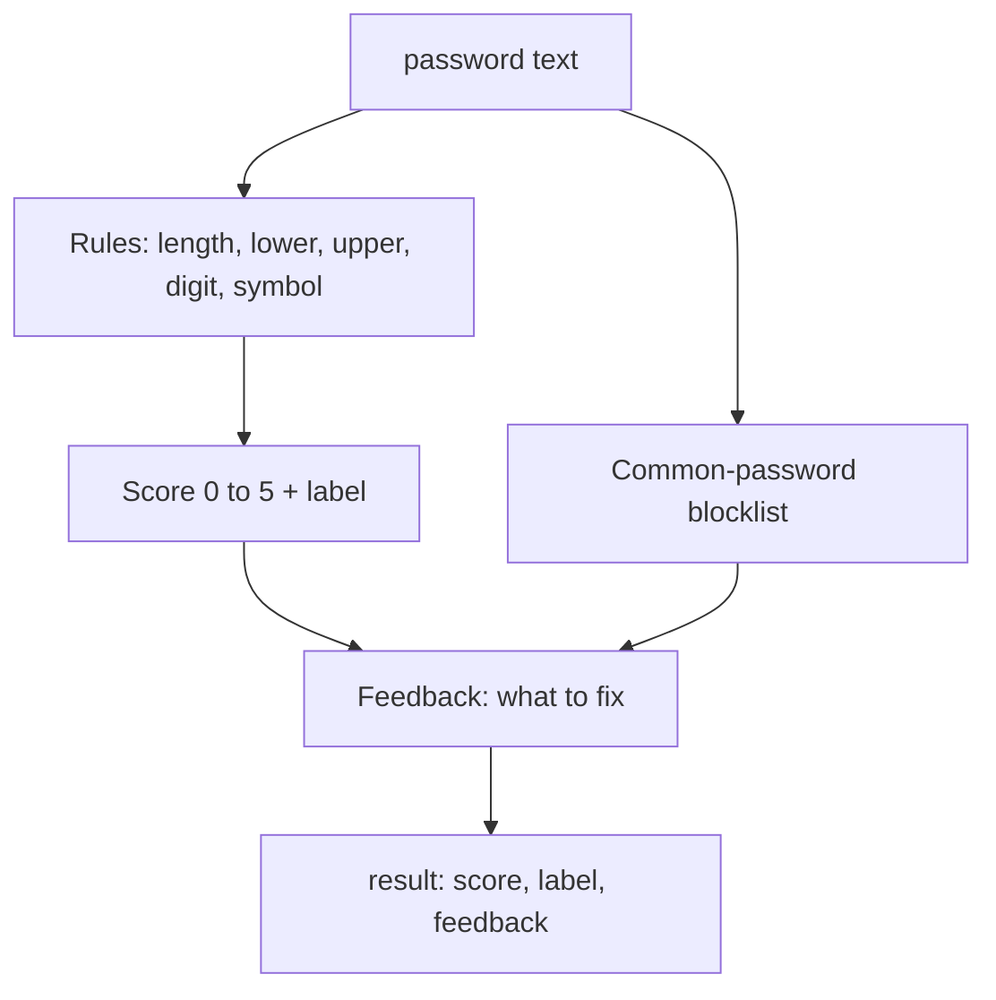

# Build a Password Strength Checker (Python)

We're going to build the thing that lives behind every "your password is weak" message you've ever seen. By the end you'll have a single Python function: hand it a password, get back a score, a label, and a short list of what to fix. It's the kind of code that ships in real signup forms, and it's small enough to finish in an afternoon.

Here's the good part: every block of code in this project runs right here in your browser. You don't install anything. You don't open a terminal. You hit run, you see output, you change a value, you run it again. That tight loop is the whole point - you'll feel each rule working before we glue them together.

## What you'll build

A password checker with four parts, built one phase at a time:

1. **The rules** - small functions that each answer one yes/no question: is it long enough? Does it have a digit? A symbol?
2. **A score** - combine those answers into a number from 0 to 5 and a human label like "weak" or "strong".
3. **Feedback** - tell the user exactly what to add, in plain words.
4. **A blocklist** - catch the passwords everyone already uses (`password`, `123456`) and reject them no matter how the rules score them.

Stack-wise this is pure Python - no libraries, no frameworks. We use the standard library and nothing else, on purpose: a strength checker that depends on a pile of packages is a strength checker nobody trusts. The whole thing fits on one screen when we're done.

## The shape of it

Here's how the pieces connect. Each phase fills in one box, and the last phase wires them into a single `check_password` call.

## What you'll learn

Real, reusable stuff, not toy stuff:

- How to break a fuzzy idea ("strong password") into testable rules.
- How to turn boolean checks into a score and a label without a tangle of `if` statements.
- How to write feedback a normal person can act on.
- Where a hobby checker stops and a production one begins - entropy, breach databases, and why length beats clever substitutions.

## How to work through it

| Phase | You'll end with |
|-------|-----------------|
| 1. The Rules | Functions that test each property of a password |
| 2. Turning Rules into a Score | A 0–5 score and a weak/ok/strong label |
| 3. Useful Feedback | A list of specific fixes per password |
| 4. Catching Common Passwords | A blocklist and the full `check_password` function |

Rough time: 60 to 90 minutes if you run every block and poke at the inputs. Don't skim - change the sample passwords and rerun. The bugs you'll hit (a rule that's too strict, a symbol set that misses `@`) are exactly the ones real teams argue about.

This is a **run-along** project: everything runs in your browser. Let's go build the rules.
