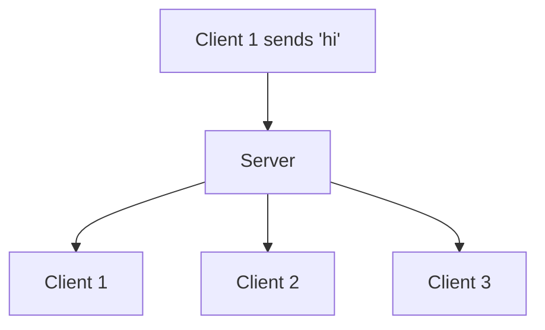

# Broadcasting Messages

Right now your server hears a message and logs it. A real chat does something more useful: it takes that message and sends it back out to everyone in the room. One person types, everyone reads. That fan-out is called **broadcasting**, and it's the single most important pattern in the whole project.

This phase turns your logger into a relay. By the end, two connected clients will see each other's messages — and you'll prove it with two test clients before we ever touch a browser.

Built on your machine, same as before. Keep that server terminal handy.

## The idea

When a message lands on one socket, you want to send it to all the *other* sockets. To do that, the server needs to know who's connected. The good news: `ws` already keeps that list for you.

Your `WebSocketServer` has a `.clients` property — a `Set` of every socket currently connected. To broadcast, you loop over that set and call `.send()` on each one.



There's one decision to make: do you echo the message back to the sender too? Most chat UIs *do* show your own message, but they usually render it locally the moment you hit send rather than waiting for it to round-trip. To keep the server honest and the client lean, we'll broadcast to **everyone except the sender**, and let each client show its own messages. You can flip this later in two lines.

## Update the server

Open `server.js` and change the `"message"` handler so it relays instead of only logging:

```javascript
import { WebSocketServer } from "ws";

const PORT = 8080;
const wss = new WebSocketServer({ port: PORT });

console.log(`Chat server listening on ws://localhost:${PORT}`);

function broadcast(message, sender) {
  for (const client of wss.clients) {
    const isOpen = client.readyState === client.OPEN;
    if (isOpen && client !== sender) {
      client.send(message);
    }
  }
}

wss.on("connection", (socket) => {
  console.log("A client connected.");

  socket.on("message", (data) => {
    const text = data.toString();
    console.log("Relaying:", text);
    broadcast(text, socket);
  });

  socket.on("close", () => {
    console.log("A client disconnected.");
  });
});
```

The new part is the `broadcast` function. Walk through it:

- `wss.clients` is the set of every connected socket. We loop over all of them.
- `client.readyState === client.OPEN` checks the socket is actually ready to receive. A connection that's mid-close will throw if you `send()` to it, so we skip anything that isn't open. This guard prevents real crashes — don't drop it.
- `client !== sender` skips the person who sent the message, so they don't get their own words bounced back.

That's the broadcast pattern in full. Every chat server you've ever used has a version of this loop at its core.

## Why the readyState check matters

It's tempting to write `for (const client of wss.clients) client.send(message)` and call it done. Then someone closes their tab at the exact moment another person sends a message, and your server tries to write to a half-dead socket. Depending on timing, that's an exception that can take the whole process down.

Checking `readyState === OPEN` before sending is the cheap insurance. The set can contain sockets that are connecting or closing, not only open ones, and only open ones can take a message.

## Test it with two clients

This is where it gets satisfying. We'll run two test clients at once and watch a message cross from one to the other.

Replace `test-client.js` with this. It takes a label and a message from the command line, listens for anything the server relays to it, then sends its own message:

```javascript
import { WebSocket } from "ws";

const label = process.argv[2] || "client";
const message = process.argv[3] || "hello";

const socket = new WebSocket("ws://localhost:8080");

socket.on("open", () => {
  console.log(`[${label}] connected`);
  setTimeout(() => socket.send(`${label} says: ${message}`), 300);
});

socket.on("message", (data) => {
  console.log(`[${label}] received:`, data.toString());
});

setTimeout(() => process.exit(0), 2000);
```

Make sure the server is running (`node server.js` in its own terminal). Then, in two more terminals, start two clients close together:

In terminal A:

```bash
node test-client.js alice "good morning"
```

And quickly, in terminal B:

```bash
node test-client.js bob "morning back"
```

Because both connect within a couple of seconds, each one's message reaches the other. You'll see something like this in terminal A:

```
[alice] connected
[alice] received: bob says: morning back
```

And in terminal B:

```
[bob] connected
[bob] received: alice says: good morning
```

Notice what *didn't* happen: alice never received "alice says: good morning" back. That's the `client !== sender` guard doing its job.

In the **server** terminal you'll see it relaying both:

```
A client connected.
A client connected.
Relaying: alice says: good morning
Relaying: bob says: morning back
```

## What you have now

A working relay. Whatever one client sends, every other client receives. That is, functionally, a chat server — the only thing missing is a pleasant way for humans to use it instead of throwaway scripts.

That's the next phase: a browser page with an input box and a message list, talking to this exact server over a WebSocket. The server you've got won't change at all — it already does the hard part.
