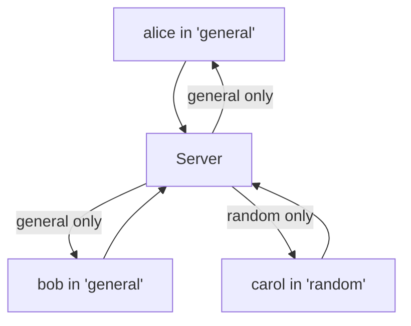

# Rooms, and Running It

One big room is fine until two conversations want to happen at once. The fix is **rooms** — named channels where a message only reaches the people in the same channel. This phase adds them, then we run the finished app start to finish and look at the honest next steps if you want to keep going.

By the end you'll have a small but real chat server: named users, join and leave notices, and separate rooms, all running on your machine.

Built on your machine, last time.

## How rooms work

A room is a label. Every socket belongs to one room, and broadcasting goes to "everyone in *this* room" instead of "everyone." You already store state on the socket — `socket.username` — so you'll add one more field, `socket.room`, the same way.

The only real change is the broadcast: it now filters by room.



bob and alice hear each other. carol's in another room and hears neither.

## Update the server

Open `server.js`. The `join` message gains a `room`, and `broadcast` gains a room filter:

```javascript
import { WebSocketServer } from "ws";

const PORT = 8080;
const wss = new WebSocketServer({ port: PORT });

console.log(`Chat server listening on ws://localhost:${PORT}`);

function broadcast(payload, room, sender) {
  const message = JSON.stringify(payload);
  for (const client of wss.clients) {
    const isOpen = client.readyState === client.OPEN;
    if (isOpen && client !== sender && client.room === room) {
      client.send(message);
    }
  }
}

wss.on("connection", (socket) => {
  socket.username = null;
  socket.room = null;
  console.log("A client connected.");

  socket.on("message", (data) => {
    let msg;
    try {
      msg = JSON.parse(data.toString());
    } catch {
      return;
    }

    if (msg.type === "join") {
      socket.username = String(msg.name || "anonymous").slice(0, 24);
      socket.room = String(msg.room || "general").slice(0, 24);
      console.log(`${socket.username} joined room "${socket.room}".`);
      broadcast(
        { type: "system", text: `${socket.username} joined #${socket.room}` },
        socket.room,
        socket
      );
      return;
    }

    if (msg.type === "chat" && socket.username) {
      broadcast(
        { type: "chat", name: socket.username, text: String(msg.text) },
        socket.room,
        socket
      );
    }
  });

  socket.on("close", () => {
    if (socket.username) {
      console.log(`${socket.username} left room "${socket.room}".`);
      broadcast(
        { type: "system", text: `${socket.username} left #${socket.room}` },
        socket.room,
        socket
      );
    }
  });
});
```

The differences from phase 4:

- `socket.room` is set on join, defaulting to `"general"` and clamped to 24 characters, same treatment as the name.
- `broadcast` takes a `room` and adds `client.room === room` to its filter. That one clause is the entire room feature — a message only reaches sockets tagged with the matching room.
- Join and leave notices go to the room, not the whole server, so people in other rooms aren't bothered by your comings and goings.

This is the whole point of keeping state on the socket: rooms cost you one extra field and one extra condition.

## Update the client

The page needs to ask which room. Replace the two lines near the top of the `<script>` where the username and join are handled. First, the prompts:

```javascript
const username = (prompt("Pick a username:") || "anonymous").trim().slice(0, 24);
const room = (prompt("Which room? (e.g. general)") || "general").trim().slice(0, 24);
```

Then update the `open` handler to send the room and show it:

```javascript
socket.addEventListener("open", () => {
  status.textContent = `Connected as ${username} in #${room}`;
  socket.send(JSON.stringify({ type: "join", name: username, room }));
});
```

Everything else in the client stays the same — the message handling and form don't care about rooms, because the server already scoped the messages before they arrived.

## Run the whole thing

Here's the complete startup, from a clean terminal:

```bash
# Terminal 1 — the server
cd realtime-chat
node server.js
```

Leave that running. Then open `index.html` in your browser — double-click it, or open it however you like — and do it in **three tabs.**

- Tab 1: name "alice", room "general"
- Tab 2: name "bob", room "general"
- Tab 3: name "carol", room "random"

Now test the boundary. Type in alice's tab: bob sees it, carol does not. Type in carol's tab: nobody in general sees a thing. Each room is its own conversation on the same server. When bob joins, only alice gets the "bob joined #general" notice — carol's window stays quiet.

That's the finished app: a Node WebSocket server broadcasting attributed messages within rooms, and a browser client to use it. You built the whole pipe.

## Where to take it next

You've got the core. These are the real directions to extend it, roughly in the order most people want them:

| Want | What it takes |
|------|--------------|
| **History** | Right now a fresh tab sees nothing that happened before it joined. Keep the last N messages per room in an array on the server and send them to a client right after it joins. |
| **Persistence** | That history vanishes when the server restarts. Write messages to SQLite or a file so they survive a restart. |
| **A real name form** | `prompt()` is a placeholder. Swap it for an HTML form before connecting — nicer, and you can validate names. |
| **Authentication** | Anyone can claim any name. Add login (a token the client sends in the `join` message, checked by the server) so identities are real. |
| **Typing indicators** | Send a lightweight `typing` message type, broadcast to the room, and clear it after a short timeout. The message-type pattern you built handles this with no new plumbing. |
| **Deploying** | Run it on a host so others can connect. You'll serve the HTML over HTTP, put the WebSocket behind the same domain, and switch the client to `wss://` (secure WebSocket) since browsers block plain `ws://` from HTTPS pages. |

Each of those builds on what's here without rearchitecting. The message-type design from phase 4 is what makes adding features cheap — a new type, a new branch, done.

## What you built

A real-time chat server and client, from an empty folder: a server that accepts connections and broadcasts within rooms, a browser client that sends and renders live messages, named users, join and leave announcements, and channels. You wrote every line of the mechanism that makes chat feel instant — the open socket, the fan-out, the per-connection state.

That same shape — keep a connection open, push when something changes, scope it to who should see it — is behind live dashboards, multiplayer games, collaborative editors, and notifications. You now know how it actually works, because you built one.
