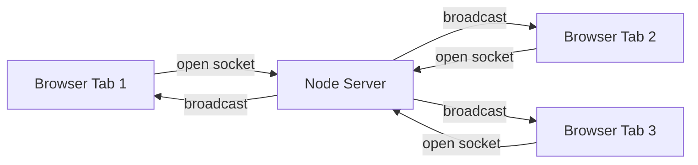

# Build a Real-Time Chat (Node + WebSockets)

You've used chat apps your whole life. A message you type shows up on someone else's screen a heartbeat later, no refresh, no waiting. This weekend you're going to build that yourself - the actual mechanism - and watch two browser tabs talk to each other in real time.

We're building a chat app with **Node** on the server and **WebSockets** as the wire between browsers. By the end you'll have a server that relays messages to everyone connected, a browser page to send and read them, named users, join and leave notices, and separate rooms so two conversations don't bleed into each other.

This one runs **on your machine.** You'll install Node, run a real server process, and open the client in your own browser. Nothing here lives in a sandbox - it's a program you start with `node` and stop with Ctrl+C, the same way you'd run anything in production.

## Why WebSockets

Regular web requests are one-shot: the browser asks, the server answers, the line goes dead. That's fine for loading a page. It's wrong for chat, because the server has no way to push you a message that arrived after your last request. You'd have to keep asking "anything new? anything new?" - wasteful and laggy.

A WebSocket is different. The browser and server shake hands once, then keep the connection open. After that, **either side can send a message at any time.** The server can shove a new chat line down to you the instant it arrives. That open, two-way pipe is the whole reason chat feels instant, and it's what you'll wire up.

## The stack

| Piece | What it is | Why we use it |
|-------|-----------|---------------|
| Node.js | JavaScript runtime outside the browser | Runs the server; one language front to back |
| `ws` | A small WebSocket library for Node | Handles the handshake and framing so you don't |
| Plain HTML + JS | The client | Browsers speak WebSocket natively - no client library needed |

That's the entire dependency list: one package, `ws`. The browser side uses the built-in `WebSocket` object, so there's nothing to install there at all.

## What you'll need

- **Node.js 18 or newer.** Check with `node --version` in a terminal. If you don't have it, grab the LTS build from nodejs.org.
- A text editor and a terminal.
- A modern browser. Any of them works.

Rough time: a focused afternoon, maybe three to four hours if you read as you go.

## What you'll learn

- How a WebSocket connection opens and stays open
- The broadcast pattern - taking one incoming message and fanning it out to many clients
- Sending structured data (JSON) over a socket instead of raw strings
- Tracking per-connection state, like which user owns which socket and what room they're in
- How to run a server and a client together and debug when they don't connect

## The phases

1. **Setup and a WebSocket Server** - get Node going, install `ws`, stand up a server that accepts connections and logs what it hears.
2. **Broadcasting Messages** - relay a message from one client to everyone else. This is the heart of it.
3. **The Browser Client** - a real HTML page with an input box and a scrolling message list.
4. **Usernames and Join/Leave** - let people pick a name, and announce when someone arrives or drops.
5. **Rooms, and Running It** - split the chat into channels, run the whole thing end to end, and look at where you'd take it next.

Each phase leaves you with something that works. By phase 3 you can already type in one tab and see it in another. By phase 5 you've got a small but genuine chat server. Let's set it up.
