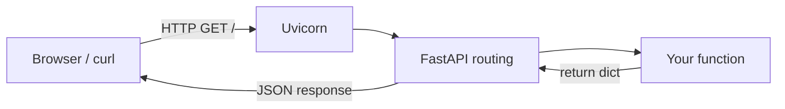

# Setup and Hello, API

This phase is the boring-but-essential part: a clean project folder, an isolated
Python environment, the two packages we need, and a single endpoint you can hit
in your browser. Get this running and the rest of the weekend is downhill.

You're building this **on your own machine**, so open a real terminal. I'll show
the commands for macOS/Linux and for Windows where they differ.

## Make a project folder

Pick a spot you'll remember and create the folder:

```bash
mkdir notes-api
cd notes-api
```

## Create a virtualenv

A virtualenv is a private copy of Python for this one project. It keeps the
packages you install here from colliding with anything else on your machine.
You make it once per project.

```bash
# macOS / Linux
python3 -m venv .venv
source .venv/bin/activate
```

```bash
# Windows (PowerShell)
python -m venv .venv
.\.venv\Scripts\Activate.ps1
```

After activating, your prompt should show `(.venv)` at the front. That's how you
know commands like `pip` and `python` are pointing at the project's environment
and not the system one. If you open a new terminal later, run the activate
command again — the virtualenv doesn't follow you between windows.

> If PowerShell refuses to run the activate script with a "running scripts is
> disabled" error, run
> `Set-ExecutionPolicy -Scope CurrentUser RemoteSigned` once and try again.

## Install FastAPI and Uvicorn

Two packages. FastAPI is the framework; Uvicorn is the server that runs it.

```bash
pip install fastapi uvicorn
```

That pulls in Pydantic too (FastAPI depends on it), which we'll use heavily in
the next phase. Confirm it landed:

```bash
pip show fastapi
```

You should see a version and a location inside your `.venv`. Good.

## Write your first endpoint

Create a file called `main.py` in the project folder:

```python
from fastapi import FastAPI

app = FastAPI()


@app.get("/")
def read_root():
    return {"message": "Hello, API"}
```

Three things are happening here, and they're worth slowing down for because
every endpoint you write follows this pattern:

- `app = FastAPI()` creates the application object. Everything attaches to it.
- `@app.get("/")` is a decorator. It tells FastAPI: when an HTTP `GET` request
  arrives for the path `/`, call the function right below me.
- The function returns a plain Python dict. FastAPI turns that into a JSON
  response automatically — you don't serialize anything by hand.

## Run the server

Start Uvicorn and point it at your app:

```bash
uvicorn main:app --reload
```

Read `main:app` as "the object named `app`, inside the file `main.py`". The
`--reload` flag tells Uvicorn to restart whenever you save a change — leave it
on while you're developing so you're not bouncing the server by hand all
weekend.

You'll see output like:

```
INFO:     Uvicorn running on http://127.0.0.1:8000 (Press CTRL+C to quit)
INFO:     Application startup complete.
```

Open `http://127.0.0.1:8000/` in your browser. You should see:

```json
{"message":"Hello, API"}
```

You served a real HTTP response from your own machine.

## The part that sells FastAPI

Now visit `http://127.0.0.1:8000/docs`.

That page isn't something you wrote. FastAPI read your code and generated
interactive API documentation for you — every endpoint, the methods, the shapes
of the data. Right now there's only the one root endpoint, but as you add routes
this page fills in automatically. You can click an endpoint, hit "Try it out",
and fire a real request without touching `curl`.

There's a second one at `http://127.0.0.1:8000/redoc` — same information, a
different layout. Pick whichever you like. I lean on `/docs` constantly while
building because the "Try it out" button is faster than typing curl commands.

## A mental model of the request flow

Here's what happens on every request from now on:



Uvicorn accepts the raw connection, FastAPI figures out which of your functions
matches the method and path, your function runs and returns a dict, and FastAPI
hands the JSON back. You'll add more functions, but the pipe stays the same.

## Where we are

You have a project folder, an isolated environment, a running server, one
working endpoint, and free interactive docs. Leave the server running with
`--reload` — in the next phase we'll add real routes that take input, and you'll
watch the docs update as you save. That's the build step done.
