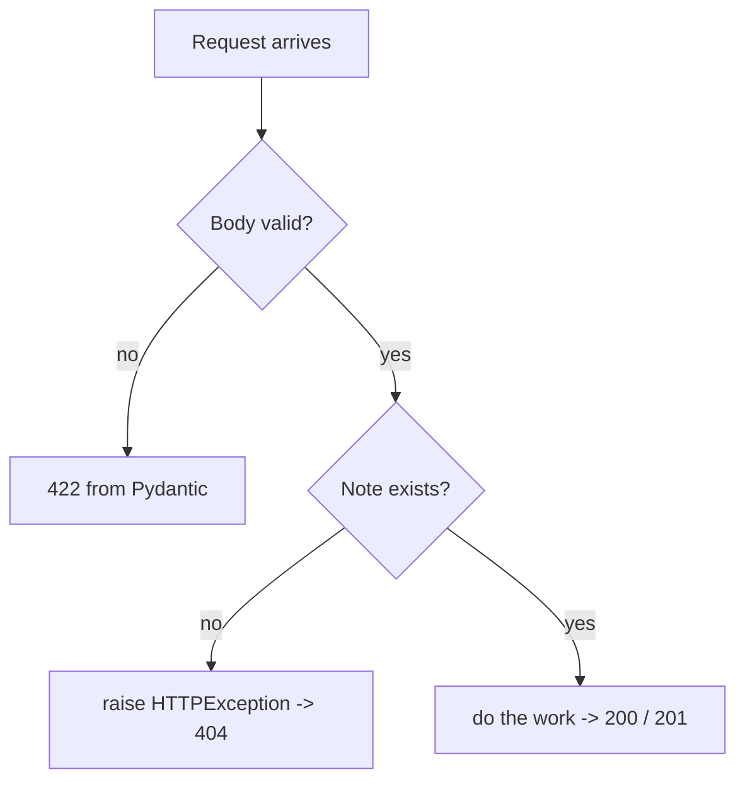

# Validation, Errors, and Status Codes

Right now, ask the API for note 999 and it throws a `KeyError`, which FastAPI
turns into a 500 Internal Server Error and a stack trace. To anyone calling your
API, a 500 means "the server is broken" — but the server isn't broken, the
caller asked for something that doesn't exist. That's a 404, and saying so
plainly is the difference between an API people can build against and one they
have to guess at.

This phase fixes the error behavior and tightens the input rules. Keep editing
`main.py`.

## The right status code carries meaning

HTTP status codes are how an API tells the caller what happened without them
reading the body. The ones you care about here:

| Code | Name | When you return it |
|------|------|--------------------|
| 200 | OK | a normal successful GET, PUT, or DELETE |
| 201 | Created | you created a resource (POST) |
| 404 | Not Found | the requested resource doesn't exist |
| 422 | Unprocessable Entity | the input failed validation (FastAPI sends this automatically) |

You're already getting 200 and 422 for free. The two to add by hand are **404**
when a note is missing and **201** when a note is created.

## Raise HTTPException for missing notes

FastAPI gives you `HTTPException` for exactly this. You `raise` it, and FastAPI
turns it into a proper HTTP response with your status code and message — no
stack trace, no 500.

Update the import at the top of `main.py`:

```python
from fastapi import FastAPI, HTTPException, status
```

Now add a small helper and use it in every route that looks a note up by id.
Here are the three read/update/delete routes rewritten:

```python
def get_or_404(note_id: int) -> dict:
    note = notes.get(note_id)
    if note is None:
        raise HTTPException(status_code=404, detail=f"Note {note_id} not found")
    return note


@app.get("/notes/{note_id}")
def get_note(note_id: int):
    return get_or_404(note_id)


@app.put("/notes/{note_id}")
def update_note(note_id: int, note: NoteIn):
    get_or_404(note_id)  # 404 if it isn't there
    record = {"id": note_id, **note.model_dump()}
    notes[note_id] = record
    return record


@app.delete("/notes/{note_id}")
def delete_note(note_id: int):
    get_or_404(note_id)
    del notes[note_id]
    return {"deleted": note_id}
```

The `get_or_404` helper is the kind of small thing that pays off fast: the
existence check lives in one place, and every route that needs a real note calls
it. Try it now — ask for a note that doesn't exist:

```bash
curl -i http://127.0.0.1:8000/notes/999
```

The `-i` flag shows the response headers. You'll see `HTTP/1.1 404 Not Found`
and a clean body:

```json
{"detail": "Note 999 not found"}
```

No stack trace. The caller knows exactly what went wrong.

## Return 201 on create

A successful POST should return 201 Created, not a generic 200. You set that on
the decorator:

```python
@app.post("/notes", status_code=status.HTTP_201_CREATED)
def create_note(note: NoteIn):
    global next_id
    record = {"id": next_id, **note.model_dump()}
    notes[next_id] = record
    next_id += 1
    return record
```

`status.HTTP_201_CREATED` is the integer 201 with a readable name — easier
to read in six months than a bare number. Create a note and check the status:

```bash
curl -i -X POST http://127.0.0.1:8000/notes \
  -H "Content-Type: application/json" \
  -d '{"title": "Test", "content": "hi"}'
```

The first line now reads `HTTP/1.1 201 Created`.

## Richer input validation

So far `title: str` accepts any string — including an empty one. A note with a
blank title isn't useful. Pydantic lets you tighten the rules right in the model
with `Field`, and the failures still come back as clean 422s.

Update the model and its import:

```python
from pydantic import BaseModel, Field


class NoteIn(BaseModel):
    title: str = Field(min_length=1, max_length=120)
    content: str = Field(min_length=1)
    pinned: bool = False
```

Now `title` must be 1–120 characters and `content` can't be empty. Send a blank
title and watch the 422:

```bash
curl -i -X POST http://127.0.0.1:8000/notes \
  -H "Content-Type: application/json" \
  -d '{"title": "", "content": "body"}'
```

```json
{
  "detail": [
    {
      "type": "string_too_short",
      "loc": ["body", "title"],
      "msg": "String should have at least 1 character",
      "input": ""
    }
  ]
}
```

The message names the field, the rule, and the bad input. A caller can read that
and fix their request without emailing you.

## How an error flows through

Here's the whole picture of what happens when something's wrong, whether it's
bad input or a missing note:



Two gates: Pydantic checks the shape of the input before your function even runs,
and your `get_or_404` checks existence inside it. Pass both and you do the real
work and return a success code.

## Where we are

Your API now behaves like one you'd trust: missing things return 404 with a
readable message, creates return 201, and bad input is rejected with a specific
422 instead of slipping through. The only weakness left is that everything still
lives in a dictionary that empties on restart. Last phase: give it a real
database and get it ready to run for real.
