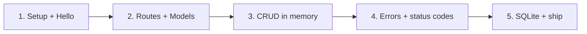

# Build a REST API with FastAPI (Python)

We're going to build a working REST API together this weekend. Not a toy that
prints "hello" and falls over the moment you send it real data - an actual API
with routes, input validation, the four CRUD operations, sensible error
responses, and a database behind it. The kind of thing you'd be comfortable
opening a pull request for at work.

You'll run all of this **on your own machine**. There's no browser sandbox here:
you'll set up a virtualenv, install a couple of packages, and start a real
server you can hit with `curl` or your browser. By the end you'll have a small
project folder that you understand line by line.

## What you'll build

A "notes" API. It's deliberately small so the shape of the thing stays clear,
but it touches every part you'd find in a production service:

- `GET /notes` - list notes
- `GET /notes/{id}` - fetch one note
- `POST /notes` - create a note (with validated input)
- `PUT /notes/{id}` - update a note
- `DELETE /notes/{id}` - delete a note

We start with the data living in a Python dictionary so you can see the logic
without database noise, then swap that dictionary for SQLite so the data
survives a restart.

## The stack

| Piece | What it does |
|-------|--------------|
| **Python 3.10+** | The language. Type hints are part of how FastAPI works, so a recent version matters. |
| **FastAPI** | The web framework. It turns Python functions into HTTP endpoints and reads your type hints to validate input. |
| **Pydantic** | Comes with FastAPI. Defines the shape of your request and response data, and validates it for you. |
| **Uvicorn** | The server that actually listens on a port and runs your app. |
| **SQLite** | The database. It ships with Python as the `sqlite3` module - no separate install, no server to run. |

## Rough time

About a weekend, taken in pieces. Each phase is 30–60 minutes and ends with
something you can run and poke at. You can stop after any phase and come back -
the project grows one file at a time.

## What you'll learn

- How a framework maps URLs and HTTP methods to your functions
- Path params, query params, and request bodies - and the difference between them
- Why a type hint can replace a wall of `if` checks for validation
- The four CRUD operations and the status codes that go with each
- How to return clean errors (404s, 422s) instead of stack traces
- How to move from in-memory data to a real database without rewriting your routes

## How the phases fit together

Each phase edits the same `main.py` (and, near the end, adds a `db.py`). You're
not building five separate demos - you're growing one API. Open a terminal,
make yourself a coffee, and let's set up.
