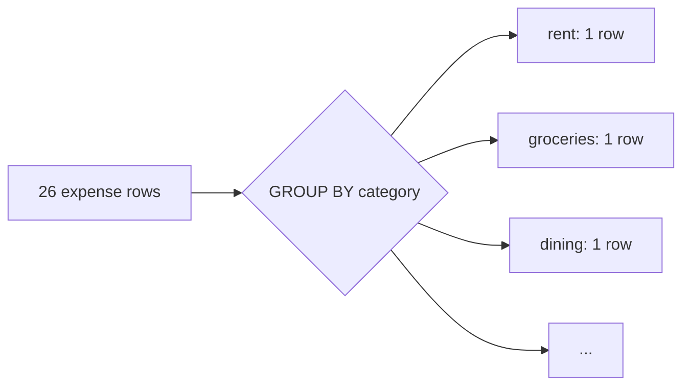

# Totals and Groups

Twenty-six rows is a list, not a report. Nobody wants to read every expense to
find out you spent too much on dining. They want the number: dining, total.
That's what this phase builds - spend rolled up by category, then by month -
and the tool for both is `GROUP BY`.

## The mental shift: from rows to buckets

A plain `SELECT` gives you one output row per input row. `GROUP BY` changes the
deal: it sorts your rows into buckets that share a value, then hands you **one
output row per bucket**. The individual rows vanish into the bucket; what
survives is whatever you compute across them - a `SUM`, a `COUNT`, an `AVG`.



The rule that trips everyone up: once you `GROUP BY category`, every column in
your `SELECT` must either be the thing you grouped by (`category`) or be wrapped
in an aggregate (`SUM(amount)`). You can't select `description`, because a
category bucket holds many descriptions and SQL wouldn't know which to show.

## Spend by category

Here's the first real report query. Which categories ate the most money?

Run it. As promised, the block re-creates the table and data first, then the new
query is the part at the bottom.

```sql runnable
CREATE TABLE expenses (
  id          INTEGER PRIMARY KEY,
  spent_on    TEXT    NOT NULL,
  category    TEXT    NOT NULL,
  description TEXT    NOT NULL,
  amount      REAL    NOT NULL
);

INSERT INTO expenses (spent_on, category, description, amount) VALUES
  ('2026-01-01', 'rent',          'January rent',        1450.00),
  ('2026-01-02', 'subscriptions', 'Streaming service',      15.99),
  ('2026-01-03', 'groceries',     'Corner market',          54.20),
  ('2026-01-05', 'dining',        'Lunch with Sam',         28.75),
  ('2026-01-07', 'transport',     'Metro card refill',      40.00),
  ('2026-01-09', 'groceries',     'Weekly shop',            96.40),
  ('2026-01-12', 'utilities',     'Electricity',            72.10),
  ('2026-01-14', 'dining',        'Pizza night',            34.50),
  ('2026-01-16', 'subscriptions', 'Music service',           9.99),
  ('2026-01-18', 'groceries',     'Farmers market',         61.30),
  ('2026-01-21', 'transport',     'Rideshare home',         18.40),
  ('2026-01-24', 'dining',        'Dinner out',             52.00),
  ('2026-01-27', 'groceries',     'Weekly shop',            88.15),
  ('2026-01-30', 'utilities',     'Water bill',             31.25),
  ('2026-02-01', 'rent',          'February rent',        1450.00),
  ('2026-02-02', 'subscriptions', 'Streaming service',      15.99),
  ('2026-02-04', 'groceries',     'Corner market',          49.80),
  ('2026-02-06', 'travel',        'Weekend flights',       312.00),
  ('2026-02-07', 'dining',        'Airport food',           22.60),
  ('2026-02-10', 'groceries',     'Weekly shop',           102.55),
  ('2026-02-13', 'dining',        'Valentine dinner',       96.00),
  ('2026-02-15', 'subscriptions', 'Music service',           9.99),
  ('2026-02-17', 'transport',     'Metro card refill',      40.00),
  ('2026-02-20', 'groceries',     'Weekly shop',            79.90),
  ('2026-02-23', 'utilities',     'Electricity',            68.40),
  ('2026-02-26', 'dining',        'Takeout',                31.20);

SELECT
  category,
  COUNT(*)            AS num_expenses,
  ROUND(SUM(amount), 2) AS total
FROM expenses
GROUP BY category
ORDER BY total DESC;
```

Read the output top to bottom. Rent dominates, as rent does. Groceries pile up
across many small trips - notice `num_expenses` is high there while each visit
is modest. Dining is the one to watch: lots of rows, and they add up.

Two things to notice in the query:

- `COUNT(*)` counts the rows in each bucket. It's how you tell "one big charge"
  from "death by a thousand cuts."
- `ROUND(SUM(amount), 2)` keeps the dollars to two decimal places. `SUM` over
  `REAL` can produce a trailing `.0000001`; `ROUND` tidies that up. This is the
  rounding caveat from phase 1, handled.

`ORDER BY total DESC` sorts the buckets biggest-first. `GROUP BY` doesn't
guarantee any order on its own, so if you want the worst offender at the top,
you say so.

## Spend by month

Categories tell you *what*. Months tell you *when*. To group by month you need
to turn each date into a month label, and SQLite's `strftime` does that:
`strftime('%Y-%m', spent_on)` turns `'2026-01-14'` into `'2026-01'`.

Group by that label and you get one row per month.

```sql runnable
CREATE TABLE expenses (
  id          INTEGER PRIMARY KEY,
  spent_on    TEXT    NOT NULL,
  category    TEXT    NOT NULL,
  description TEXT    NOT NULL,
  amount      REAL    NOT NULL
);

INSERT INTO expenses (spent_on, category, description, amount) VALUES
  ('2026-01-01', 'rent',          'January rent',        1450.00),
  ('2026-01-02', 'subscriptions', 'Streaming service',      15.99),
  ('2026-01-03', 'groceries',     'Corner market',          54.20),
  ('2026-01-05', 'dining',        'Lunch with Sam',         28.75),
  ('2026-01-07', 'transport',     'Metro card refill',      40.00),
  ('2026-01-09', 'groceries',     'Weekly shop',            96.40),
  ('2026-01-12', 'utilities',     'Electricity',            72.10),
  ('2026-01-14', 'dining',        'Pizza night',            34.50),
  ('2026-01-16', 'subscriptions', 'Music service',           9.99),
  ('2026-01-18', 'groceries',     'Farmers market',         61.30),
  ('2026-01-21', 'transport',     'Rideshare home',         18.40),
  ('2026-01-24', 'dining',        'Dinner out',             52.00),
  ('2026-01-27', 'groceries',     'Weekly shop',            88.15),
  ('2026-01-30', 'utilities',     'Water bill',             31.25),
  ('2026-02-01', 'rent',          'February rent',        1450.00),
  ('2026-02-02', 'subscriptions', 'Streaming service',      15.99),
  ('2026-02-04', 'groceries',     'Corner market',          49.80),
  ('2026-02-06', 'travel',        'Weekend flights',       312.00),
  ('2026-02-07', 'dining',        'Airport food',           22.60),
  ('2026-02-10', 'groceries',     'Weekly shop',           102.55),
  ('2026-02-13', 'dining',        'Valentine dinner',       96.00),
  ('2026-02-15', 'subscriptions', 'Music service',           9.99),
  ('2026-02-17', 'transport',     'Metro card refill',      40.00),
  ('2026-02-20', 'groceries',     'Weekly shop',            79.90),
  ('2026-02-23', 'utilities',     'Electricity',            68.40),
  ('2026-02-26', 'dining',        'Takeout',                31.20);

SELECT
  strftime('%Y-%m', spent_on) AS month,
  COUNT(*)                     AS num_expenses,
  ROUND(SUM(amount), 2)        AS total
FROM expenses
GROUP BY month
ORDER BY month;
```

Two rows, January and February. February runs higher - that travel splurge and
the Valentine dinner did their work. This is the bones of a trend, and in the
next phase you'll measure that month-to-month jump precisely instead of
squinting at it.

## Filtering buckets vs filtering rows

One more tool you'll want. `WHERE` filters rows *before* grouping. `HAVING`
filters buckets *after* grouping. They're not interchangeable - use the one that
matches what you're filtering on.

Say you only care about categories where you spent more than $150 total. That's
a filter on the bucket's `SUM`, so it's `HAVING`:

```sql runnable
CREATE TABLE expenses (
  id          INTEGER PRIMARY KEY,
  spent_on    TEXT    NOT NULL,
  category    TEXT    NOT NULL,
  description TEXT    NOT NULL,
  amount      REAL    NOT NULL
);

INSERT INTO expenses (spent_on, category, description, amount) VALUES
  ('2026-01-01', 'rent',          'January rent',        1450.00),
  ('2026-01-02', 'subscriptions', 'Streaming service',      15.99),
  ('2026-01-03', 'groceries',     'Corner market',          54.20),
  ('2026-01-05', 'dining',        'Lunch with Sam',         28.75),
  ('2026-01-07', 'transport',     'Metro card refill',      40.00),
  ('2026-01-09', 'groceries',     'Weekly shop',            96.40),
  ('2026-01-12', 'utilities',     'Electricity',            72.10),
  ('2026-01-14', 'dining',        'Pizza night',            34.50),
  ('2026-01-16', 'subscriptions', 'Music service',           9.99),
  ('2026-01-18', 'groceries',     'Farmers market',         61.30),
  ('2026-01-21', 'transport',     'Rideshare home',         18.40),
  ('2026-01-24', 'dining',        'Dinner out',             52.00),
  ('2026-01-27', 'groceries',     'Weekly shop',            88.15),
  ('2026-01-30', 'utilities',     'Water bill',             31.25),
  ('2026-02-01', 'rent',          'February rent',        1450.00),
  ('2026-02-02', 'subscriptions', 'Streaming service',      15.99),
  ('2026-02-04', 'groceries',     'Corner market',          49.80),
  ('2026-02-06', 'travel',        'Weekend flights',       312.00),
  ('2026-02-07', 'dining',        'Airport food',           22.60),
  ('2026-02-10', 'groceries',     'Weekly shop',           102.55),
  ('2026-02-13', 'dining',        'Valentine dinner',       96.00),
  ('2026-02-15', 'subscriptions', 'Music service',           9.99),
  ('2026-02-17', 'transport',     'Metro card refill',      40.00),
  ('2026-02-20', 'groceries',     'Weekly shop',            79.90),
  ('2026-02-23', 'utilities',     'Electricity',            68.40),
  ('2026-02-26', 'dining',        'Takeout',                31.20);

SELECT
  category,
  ROUND(SUM(amount), 2) AS total
FROM expenses
GROUP BY category
HAVING SUM(amount) > 150
ORDER BY total DESC;
```

The small categories - subscriptions, transport - drop off, leaving the ones
that actually move your budget.

You now have totals by category and by month. That's a report a person can read.
Next, we make it tell a story over time: a running total and how each month
compares to the one before - without losing the detail rows. That's what window
functions are for.
