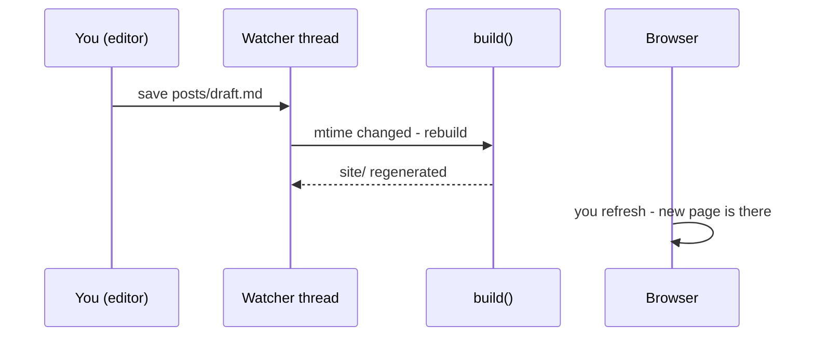

# A Dev Server with Auto-Rebuild

Right now your writing loop is: edit a post, switch to the terminal, run `python build.py`, switch to the browser, refresh. Four steps to see one typo fixed. Every serious static site tool ships a dev server that collapses this to "save, refresh" - and in this phase you build that: one script that serves `site/` and rebuilds automatically whenever a source file changes.

First, a question you may have been sitting on since phase 3.

## Why not just double-click the HTML file?

Try it: open `site/index.html` straight from your file manager. The text is there - and the styling is gone.

The page isn't broken. The stylesheet link is `/style.css`, a root-relative path meaning "from the root of the site." Served over HTTP, the root is your `site/` folder, and the link resolves to `http://localhost:8000/style.css`. Opened as a file, the "root" is the root of your *disk*, so the browser looks for `C:\style.css` or `/style.css` on your drive - which doesn't exist.

You could switch every link to relative paths, but then pages inside `site/tags/` would need `../style.css` while pages at the top level need `style.css`, and every template would have to know how deep its page lives. Root-relative paths plus a real server is the arrangement every static site tool settles on. So: a real server, always - it's one import away.

## The plan

`serve.py` does three things:

1. Build the site once at startup.
2. Start a background thread that checks the source folders twice a second and rebuilds when anything changed.
3. Serve `site/` over HTTP in the foreground until you press Ctrl+C.



The "did anything change?" trick is modification times. Every file has an **mtime** - the timestamp of its last write, which `path.stat().st_mtime` reads. Snapshot every source file's mtime into a dict; if a later snapshot differs in any way - a file edited, added, or deleted - something changed, rebuild.

This is *polling*: asking "anything new?" on a timer, the approach we dismissed for chat apps. For a dev tool watching a few dozen local files, it's the right call - checking 20 mtimes twice a second is work your machine won't notice, and the alternative (OS-level file notifications via the `watchdog` package) buys you a dependency and platform quirks for no visible gain at this size. If your blog ever has thousands of files, that's when `watchdog` earns its slot.

## serve.py

Create `serve.py` next to `build.py`:

```python
import http.server
import threading
import time
from functools import partial

import build

WATCH_DIRS = [build.POSTS_DIR, build.TEMPLATES_DIR, build.STATIC_DIR]
PORT = 8000


def snapshot():
    stamps = {}
    for folder in WATCH_DIRS:
        for path in folder.rglob("*"):
            if path.is_file():
                stamps[path] = path.stat().st_mtime
    return stamps


def watch():
    last = snapshot()
    while True:
        time.sleep(0.5)
        current = snapshot()
        if current != last:
            last = current
            print("Change detected - rebuilding...")
            try:
                build.build()
            except Exception as error:
                print("Build failed:", error)


def main():
    build.build()
    threading.Thread(target=watch, daemon=True).start()

    handler = partial(http.server.SimpleHTTPRequestHandler,
                      directory=str(build.SITE_DIR))
    server = http.server.ThreadingHTTPServer(("127.0.0.1", PORT), handler)
    print(f"Serving on http://127.0.0.1:{PORT} - Ctrl+C to stop")
    try:
        server.serve_forever()
    except KeyboardInterrupt:
        print("\nStopped.")


if __name__ == "__main__":
    main()
```

The load-bearing lines:

- **`import build`** - your generator is now a *library* as well as a script. This works cleanly because of the `if __name__ == "__main__":` guard you wrote back in phase 1: importing a module runs its top-level code, and without the guard, `import build` would kick off a build as a side effect of the import itself. With it, `serve.py` gets the functions and constants (`build.build`, `build.SITE_DIR`) and stays in control of *when* building happens. That guard you've been dutifully typing finally cashes its check.
- **`snapshot()`** walks every file under the three source folders (`rglob("*")` is glob, recursive) and maps each path to its mtime. Comparing two dicts with `!=` catches edits (value differs), new files (new key), and deletions (missing key) in one honest comparison.
- **`watch()` wraps the rebuild in try/except** - and this one matters. Mid-edit, your post *will* be momentarily malformed; you'll save half-written frontmatter and `parse_post` will raise, exactly as designed. Without the except, that kills the watcher thread silently and rebuilds just... stop, with no clue why. With it, you see `Build failed: draft.md: no frontmatter block at the top`, finish your edit, save, and the next cycle rebuilds cleanly.
- **`daemon=True`** marks the watcher as a background thread that Python should *not* wait for at exit. When Ctrl+C stops the server, the process ends and the daemon thread dies with it. Without it, the process would hang at exit, waiting forever on a thread whose loop never returns.
- **`partial(SimpleHTTPRequestHandler, directory=...)`** - the standard library's file server, told to serve `site/` instead of the current folder. `ThreadingHTTPServer` handles each request in its own thread so a slow request can't block the rest; both have shipped with Python since 3.7.

One constraint to know: `build.py` uses relative paths (`Path("posts")`), so run `serve.py` from the project root - `python serve.py` while sitting in `myblog/`, not from elsewhere.

## Run it

```console
(.venv) $ python serve.py
built  site/2026-07-02-why-static-sites.html
built  site/2026-06-28-hello-world.html
built  site/index.html
built  site/tags/meta.html
built  site/tags/web.html
built  site/feed.xml
Serving on http://127.0.0.1:8000 - Ctrl+C to stop
```

Open `http://127.0.0.1:8000`, then - leaving the server running - edit a post: change the title in `posts/2026-06-28-hello-world.md` to `Hello, World (edited)` and save. Within half a second, the server terminal prints:

```console
Change detected - rebuilding...
built  site/2026-07-02-why-static-sites.html
built  site/2026-06-28-hello-world.html
built  site/index.html
built  site/tags/meta.html
built  site/tags/web.html
built  site/feed.xml
127.0.0.1 - - [06/Jul/2026 14:32:07] "GET / HTTP/1.1" 200 -
```

Refresh the browser: the new title is on the index and the post page. (Those `GET ... 200` lines are the request log `SimpleHTTPRequestHandler` prints for every page it serves - normal, and occasionally useful.)

*What just happened:* the watcher noticed the post's mtime change, called the same `build()` your command line calls, and the server - which knows nothing about builds, it serves whatever's in `site/` - handed out the fresh files on your next refresh. Save, refresh. The loop you'll actually write in.

Change the title back, watch it rebuild again, and leave the server running - you'll write with it from now on.

## What you have now

A writing workflow: `python serve.py`, open localhost, and edit - the site rebuilds itself as you save, and broken saves report themselves instead of silently jamming the loop. The blog is done and pleasant to work on. All that's left is the part your friends can see: putting `site/` on the internet.

Three questions - the first one explains a bug you'll hit in other projects too:

```quiz
[
  {
    "q": "Why does the CSS vanish when you open site/index.html directly from the file system?",
    "choices": ["Browsers refuse to load CSS from local disk", "Root-relative paths like /style.css resolve against the root of your drive under file://, not against the site folder", "The build forgot to copy the stylesheet"],
    "answer": 1,
    "explain": "Over HTTP, / means \"top of the served site.\" Under file://, it means \"top of the disk\" - where there is no style.css. That's why static site tools always ship a dev server."
  },
  {
    "q": "Why doesn't `import build` at the top of serve.py trigger a site build by itself?",
    "choices": ["Python never executes code during an import", "build() is only called inside `if __name__ == \"__main__\":`, which is false when the module is imported", "serve.py suppresses build's output"],
    "answer": 1,
    "explain": "Importing runs a module's top-level code. The __main__ guard keeps the build call out of that path, so importers get the functions and decide when to call them."
  },
  {
    "q": "What does daemon=True on the watcher thread change?",
    "choices": ["The thread gets higher CPU priority", "Python exits without waiting for it - so Ctrl+C stops the server and the watcher dies with the process instead of hanging it", "The thread restarts automatically if it crashes"],
    "answer": 1,
    "explain": "The watcher's loop never returns. As a normal thread it would keep the process alive forever after Ctrl+C; as a daemon it's abandoned at exit."
  }
]
```
