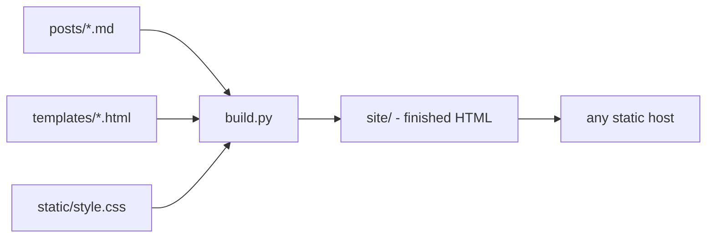

# Build a Static Blog Generator (Python)

Jekyll, Hugo, Eleventy, Astro - the static site generator is one of the most-reinvented tools in software, and there's a reason: the idea is small enough to hold in your head, and the result is a real website you actually own. This project is you joining that tradition. You'll write a Python program that reads a folder of Markdown posts and produces a complete, deployable blog - every page, the index, tag pages, and an RSS feed - as plain HTML files.

No framework. No magic. When you're done, there won't be a single line of your blog's machinery you didn't write and can't explain.

This one runs **on your machine.** You'll create a real project folder, install one library into a virtual environment, and run your generator from the terminal - the same way you'd run any tool you ship.

## Why build one instead of downloading one

Because a static site generator is the rare project where the *concepts* are worth more than the artifact. Building one teaches you, hands-on:

- how frontmatter and Markdown parsing actually work (the format half the dev world writes in),
- what a template engine really does under the hood (it's smaller than you think),
- why "build once, serve files" beats "run code on every request" for most content sites,
- and what a deploy actually *is* when there's no server involved.

And unlike a toy, you can genuinely use the result. Plenty of real blogs run on a build script about this size.

## The stack

| Piece | What it is | Why we use it |
|-------|-----------|---------------|
| Python 3.10+ | The language you already know | The whole generator is one script |
| `markdown` | A Markdown-to-HTML library | Writing a Markdown parser is its own project; converting is not the lesson here |
| Python's standard library | `pathlib`, `datetime`, `http.server`, `email.utils` | Everything else - templates, the feed, the dev server - needs nothing extra |

That's the entire dependency list: one package. The template engine, the RSS feed, and the dev server are all things you'll build from the standard library, because seeing how small they really are is half the point.

## What you'll need

- **Python 3.10 or newer.** Check with `python --version` (or `python3 --version` on macOS/Linux). If you don't have it, grab it from python.org.
- A text editor and a terminal.
- For the final phase: a free GitHub or Netlify account, if you want the blog on the actual internet.

Rough time: a focused afternoon or two evenings, four to five hours if you read as you go.

## What you'll learn

- The build-time vs request-time mental model that explains the entire static site world
- Parsing structured text: frontmatter blocks, key-value metadata, Markdown bodies
- How template substitution works - by writing a template engine in four lines
- Generating derived pages: an index, per-tag pages, and a standards-compliant RSS feed
- Running a local dev server with an automatic rebuild loop
- Deploying a folder of files to free hosting, and the one path gotcha that bites everyone

## The phases

1. **What a Generator Actually Is, and Setup** - the build-time mental model, the project folder, your first posts, and a script that finds them.
2. **Parsing Posts: Frontmatter and Markdown** - split metadata from body, turn Markdown into HTML, and fail loudly on bad posts.
3. **Templates Without a Framework** - write a four-line template engine and generate a real HTML page per post.
4. **The Index, Tags, and an RSS Feed** - the pages that make it a blog instead of a pile of files.
5. **A Dev Server with Auto-Rebuild** - serve the site locally and rebuild the moment you save a file.
6. **Deploying, and Where to Take It** - put the folder on the internet for free, and the honest list of what to build next.

Each phase ends with something that runs. By phase 3 you can open a generated post in your browser. By phase 6 your blog has a URL. Let's set it up.
