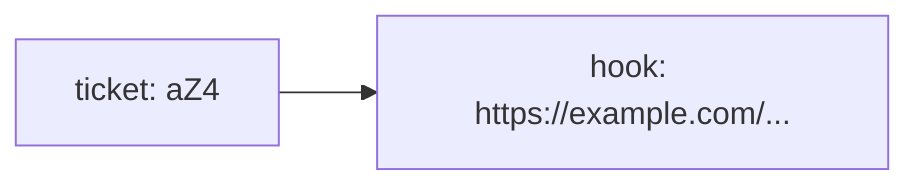

# The Plan and the Data Model

Before we write a generator or a CLI, let's get crisp about what this thing is. Strip away the branding and a URL shortener does exactly one job:

> It remembers that a **short code** stands for a **long URL**, so it can give you the long one back later.

That's it. `aZ4` means `https://example.com/some/very/long/path?ref=newsletter`. When someone visits `short.ly/aZ4`, the service looks up `aZ4`, finds the long URL, and sends them there. The whole product is a memory with two operations: *store this pair*, and *fetch the URL for this code*.

## A map, not a math problem

People sometimes assume a shortener does something clever to the URL - compresses it, hashes it, encrypts it. It doesn't have to. The long URL isn't squeezed into the short code; it's **filed under** the short code.

Think of a coat check. You hand over your coat, you get a numbered ticket. The number doesn't contain your coat - it's a label pointing at a hook where the coat hangs. The short code is the ticket. The long URL is the coat.



That framing tells us the data structure immediately. We need something that maps a key (the code) to a value (the URL) and lets us look the value up fast. In Python, that's a dictionary.

## The store

A Python dictionary is a set of key-to-value pairs with instant lookup. We'll use the short code as the key and the long URL as the value:

```python
store = {}
store["aZ4"] = "https://example.com/some/very/long/path"
```

Now `store["aZ4"]` hands back the long URL. That single dictionary is the heart of the entire service. Everything we build after this - the code generator, the two functions, the CLI - exists to feed and query this one dictionary.

Why a dictionary and not, say, a list? Because lookup needs to be by code, not by position. With a list you'd scan every entry asking "is this the one?" With a dictionary you ask for the key and get the value directly, no matter how many entries you've stored. For a service that might hold millions of links, that difference is the whole game.

## Store one, fetch one

Let's make it real. The block below creates the store, files one URL under a code, and reads it back. Press **Run** and watch the long URL come out the other side.

```python runnable
# our entire "database": short code -> long URL
store = {}

# file a long URL under a short code
code = "aZ4"
long_url = "https://example.com/some/very/long/path?ref=newsletter"
store[code] = long_url

# later: someone visits short.ly/aZ4, we look it up
visited = "aZ4"
print("Looking up code:", visited)
print("Sends you to:   ", store[visited])

# proof it's just a dictionary
print("The whole store:", store)
```

Run that and you'll see the lookup resolve. The output shows the code, the URL it points to, and the raw dictionary underneath - three lines that, between them, contain the entire idea of the product.

## What happens if the code doesn't exist?

There's a sharp edge here. If you ask the dictionary for a code it's never seen, indexing it with `store["nope"]` raises a `KeyError` and your program crashes. A real shortener gets garbage requests constantly - typos, expired links, people guessing codes - so it can't crash on every miss.

The standard-library answer is `dict.get()`, which returns a fallback instead of exploding.

Before you run it, guess what prints for the code we've never stored. Then check.

```python runnable
store = {"aZ4": "https://example.com/some/very/long/path"}

# a code we know about
print("aZ4 ->", store.get("aZ4", "NOT FOUND"))

# a code we've never stored - no crash, just the fallback
print("zzz ->", store.get("zzz", "NOT FOUND"))
```

`store.get("zzz", "NOT FOUND")` checks for the key and, finding nothing, returns the fallback string instead of raising. That `get` pattern is how `resolve()` will stay calm when someone hands it a code that doesn't exist - we'll lean on it again in Phase 3.

## Where we are

You now have the data model: a dictionary that maps codes to URLs, with a safe way to read from it. That's a working store. What it can't do yet is *invent* the short codes - right now we typed `aZ4` by hand. A real shortener generates a fresh, unused code for every new URL, automatically.

That's the next piece. In Phase 2 we'll build a generator that turns a plain counter into compact codes like `a`, `b`, `c`, … `Z`, `ba`, and so on - and I'll show you why a counter is a better starting point than reaching for random strings.
