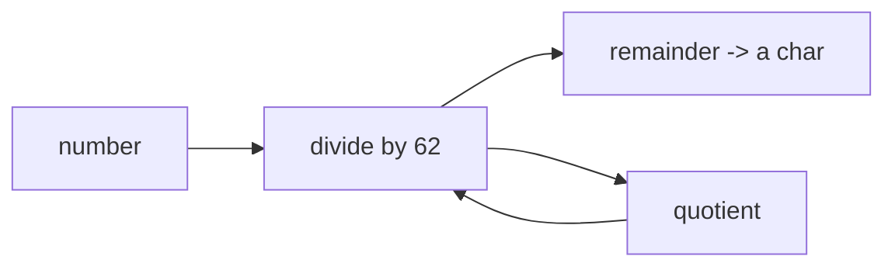

# Making Short Codes

Last phase we typed `aZ4` by hand. That doesn't scale - a shortener has to mint a fresh code for every URL on its own, and every code has to be different from every other one. This phase builds the generator.

The trick is to count. We keep a number that goes up by one every time we add a URL: the first link is 1, the second is 2, the third is 3. A counter never repeats, so codes built from it never collide. The only problem is that `1000000` is a long, ugly code. We want something short.

## From a number to a short string

Here's the insight. The number `1000000` looks long because we're writing it with only ten symbols - the digits `0` through `9`. Give yourself more symbols per position and the same value gets shorter.

You already know this from hexadecimal: programmers write `255` as `ff` because base 16 packs more value into each character. We're going to push it further. Use **62** symbols - the digits `0-9`, the lowercase `a-z`, and the uppercase `A-Z` - and numbers collapse into very short strings. That's **base62**, and it's why short codes are short.

The reason for exactly these 62 characters: they're the letters and digits that are safe and unambiguous in a URL. No spaces, no slashes, no punctuation that a browser might mangle.

| Number | Base 10 | Base 16 (hex) | Base 62 |
|-------:|:--------|:--------------|:--------|
| 9      | `9`     | `9`           | `9`     |
| 61     | `61`    | `3d`          | `Z`     |
| 1000   | `1000`  | `3e8`        | `g8`    |
| 1000000| `1000000`| `f4240`     | `4c92`  |

A million links and the code is still four characters. That's the payoff.

## How base62 conversion works

Converting a number to base62 is repeated division. You divide by 62, the remainder picks one character, then you divide the quotient by 62 again, and so on until there's nothing left. Each remainder is an index into our 62-character alphabet.



The remainders come out in reverse order - least significant first - so we build the string and flip it at the end. Here it is in code. Run it and watch a few numbers turn into codes:

```python runnable
ALPHABET = "0123456789abcdefghijklmnopqrstuvwxyzABCDEFGHIJKLMNOPQRSTUVWXYZ"
BASE = len(ALPHABET)  # 62

def encode(number):
    if number == 0:
        return ALPHABET[0]
    chars = []
    while number > 0:
        number, remainder = divmod(number, BASE)
        chars.append(ALPHABET[remainder])
    return "".join(reversed(chars))

# turn the first several counter values into codes
for n in [0, 1, 2, 10, 61, 62, 1000, 1000000]:
    print(f"{n:>8}  ->  {encode(n)}")
```

`divmod(number, BASE)` does the division and grabs the remainder in one step - it returns both the quotient and the remainder together. Run the block and you'll see `0 -> 0`, `61 -> Z` (the last single character), then `62 -> 10` (the first that needs two), all the way up to a million landing at four characters.

## Wiring the counter to the generator

The encoder turns a number into a code. The counter supplies the numbers. Put them together and you have an automatic code factory: bump the counter, encode it, hand back the code.

```python runnable
ALPHABET = "0123456789abcdefghijklmnopqrstuvwxyzABCDEFGHIJKLMNOPQRSTUVWXYZ"
BASE = len(ALPHABET)

def encode(number):
    if number == 0:
        return ALPHABET[0]
    chars = []
    while number > 0:
        number, remainder = divmod(number, BASE)
        chars.append(ALPHABET[remainder])
    return "".join(reversed(chars))

# the counter starts at zero and climbs
counter = 0
print("Minting codes for five new links:")
for _ in range(5):
    code = encode(counter)
    print("  link", counter + 1, "gets code", repr(code))
    counter += 1

print("Counter is now at:", counter)
```

Every call gives a code that no earlier call produced, because the counter never hands out the same number twice. No bookkeeping, no checking "is this code taken?" - uniqueness is free, baked into the counting.

## Why not random codes?

It's tempting to skip the counter and generate random strings instead - pick six random characters and call it a code. For a weekend build, the counter is the better choice, and here's why.

A random generator can produce the same code twice. The chance is small, but "small" isn't "never," and a collision means one link silently overwrites another - a real bug that's miserable to track down. To use random codes safely you'd have to generate one, check the store to see if it's already taken, and retry if so. That's more code and more failure modes than counting.

The counter sidesteps all of it. Sequential numbers are unique by construction, so there's nothing to check and nothing to retry.

Random codes do have a genuine upside: they're unguessable. With sequential codes, anyone who has `b` can try `c` and `d` and walk through your links. If that matters - private links, anything sensitive - you'd add randomness later. We'll list that under "where to take it" in the final phase. For now, counting gives us correct, unique, short codes with the least code, which is exactly what a first version wants.

## Where we are

You've got a generator that turns counter values into short base62 codes, guaranteed unique. Phase 1 gave you a store; this phase gives you the codes to fill it with. In Phase 3 we connect them: `shorten()` will take a long URL, mint the next code, file the pair, and return the code - and `resolve()` will turn a code back into its URL, handling the misses safely with the `get` trick from Phase 1.
