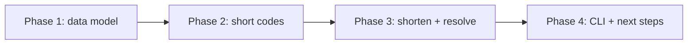

# Build a URL Shortener (Python)

You've pasted one of those monstrous URLs into a chat before — the kind with forty characters of tracking junk after the actual address. Then someone sends you a tidy little `short.ly/aZ4` instead, and it lands you at the same place. That tidy link is a URL shortener at work, and you're about to build one.

This is a build-along. By the last phase you'll have a small Python program that takes any long URL, hands you back a short code, and resolves that code back to the original — the same core trick TinyURL and Bitly run on, minus the servers and the marketing.

## What you'll build

A URL shortener with three moving parts:

- A **store** that remembers which short code points to which long URL.
- A **code generator** that turns a counter into a compact, URL-safe string like `b` or `Cx`.
- Two functions — `shorten()` and `resolve()` — that tie it together: give it a long URL, get a short code; give it the code, get the URL back.

We'll finish with a tiny command loop so you can type URLs at it and watch it answer, plus a clear list of where to take it next.

## The stack

Plain Python, standard library only. No frameworks, no database, no `pip install`. The whole thing fits in one file and lives in memory while it runs. That's deliberate — the point is to see the mechanism naked, with nothing hiding it.

## This runs in your browser

Every code block in this project has a **Run** button. You don't install anything, you don't open a terminal — you read a few lines, press Run, and see the output right there on the page. Each block is self-contained, so you can run them in any order and re-run them as much as you like.

When you're ready to take it off the page and onto your own machine, the last phase shows you exactly how.

## Rough time

About 45 minutes to an hour if you run every block and read along. Less if you're quick; more if you stop to poke at the code, which I'd encourage.

## What you'll learn

- How a lookup table (a dictionary) becomes the heart of a real service.
- **Base62 encoding** — how to squeeze a plain number into a short string of letters and digits, and why that's how short codes stay short.
- Why a sequential counter beats random codes for a first version.
- How to handle the awkward cases: an unknown code, the same URL submitted twice.
- How to wrap working logic in a small interface people can actually use.

## How the phases fit together

Each phase ends with a working piece. By the end they're one program. Let's start with the simplest version of the idea that still earns the name.
