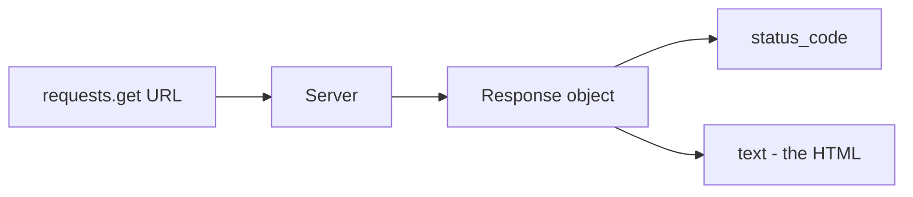

# Setup and Fetch a Page

Before we parse anything, we need two things: a tidy place for this project to
live, and proof that we can pull a page off the internet at all. This phase
gets you both. By the end you'll run a script and watch a real HTML document
land in your terminal.

A quick note since you're building this on your machine: everything here
assumes you can open a terminal (Terminal on macOS, PowerShell or Git Bash on
Windows, your shell of choice on Linux) and that `python --version` prints
something that starts with `3.10` or higher. If it doesn't, install a current
Python from python.org first, then come back.

## Make a home for the project

Create a folder and step into it. A scraper is a project, not a one-off snippet,
and it'll grow over the weekend.

```bash
mkdir book-scraper
cd book-scraper
```

## The virtual environment, and why you want one

A virtual environment is a private copy of Python's package area that belongs to
this project alone. Install `requests` into it and you haven't touched the
Python your operating system relies on, and you haven't left a mess for the next
project. It's a habit worth keeping for every Python project you start.

Create one and turn it on:

```bash
python -m venv .venv
```

Now activate it. The command differs by platform:

```bash
# macOS / Linux
source .venv/bin/activate

# Windows PowerShell
.venv\Scripts\Activate.ps1

# Windows Git Bash
source .venv/Scripts/activate
```

Once it's active your prompt picks up a `(.venv)` prefix. That prefix is your
sign that `pip` and `python` now point inside the project. Any time you come
back to work on this, activate it again first.

## Install the two libraries

With the environment active, install what we need:

```bash
pip install requests beautifulsoup4
```

`requests` handles the talking-to-servers part. `beautifulsoup4` (you import it
as `bs4`) handles the reading-the-HTML part — we'll meet it properly in Phase 2,
but installing it now keeps us from a second trip to pip.

It's worth recording exactly what you installed so you — or anyone you share
this with — can recreate the environment:

```bash
pip freeze > requirements.txt
```

That writes a file listing every package and its version. Later, on another
machine, `pip install -r requirements.txt` rebuilds the same setup.

## Fetch your first page

Now the part you came for. Create a file called `fetch.py` and put this in it:

```python
import requests

URL = "https://books.toscrape.com/"

response = requests.get(URL)

print("Status code:", response.status_code)
print("Content type:", response.headers.get("Content-Type"))
print("Body length:", len(response.text), "characters")
print("First 300 characters:")
print(response.text[:300])
```

Run it:

```bash
python fetch.py
```

You should see something like a `200` status code, a content type mentioning
`text/html`, a body that's many thousands of characters long, and the opening of
an HTML document. That `200` is the whole point of this phase — the server
heard you and sent back the page.

## Read what came back

Let's slow down on `response`, because it's the object every later phase builds
on. A few of its parts you'll use constantly:

| Attribute | What it gives you |
|-----------|-------------------|
| `response.status_code` | the HTTP result number (200 = OK) |
| `response.text` | the page body as a string (decoded for you) |
| `response.content` | the raw bytes, if you need them |
| `response.headers` | a dict-like of response headers |
| `response.url` | the final URL, after any redirects |

Here's the flow of what happens when you call `requests.get`:



## Don't trust a 200 you didn't check

Right now our script prints the status and moves on. In a real run you want to
*stop* if the page didn't come back. A 404 means the page is gone; a 500 means
the server broke; a 403 might mean you're being blocked. `requests` gives you a
one-line way to turn any of those into an error you can't ignore.

Update `fetch.py` to guard the request:

```python
import requests

URL = "https://books.toscrape.com/"

response = requests.get(URL, timeout=10)
response.raise_for_status()   # raises an exception on 4xx / 5xx

print("OK:", response.status_code)
print("Got", len(response.text), "characters of HTML")
```

Two changes earn their keep here. `timeout=10` means the request gives up after
ten seconds instead of hanging your program forever when a server goes quiet —
never make a real request without a timeout. And `raise_for_status()` turns a
bad status into a loud crash, so you find out something's wrong immediately
rather than parsing an error page as if it were data.

Run it again. A clean `OK: 200` and a character count means your environment is
solid and the network path works.

## Where we are

You have a project folder, an isolated environment with both libraries, a
recorded `requirements.txt`, and a script that fetches a live page and refuses
to continue on a bad response. That's the foundation. Next we take that big
string of HTML and turn it into something we can actually search through.
