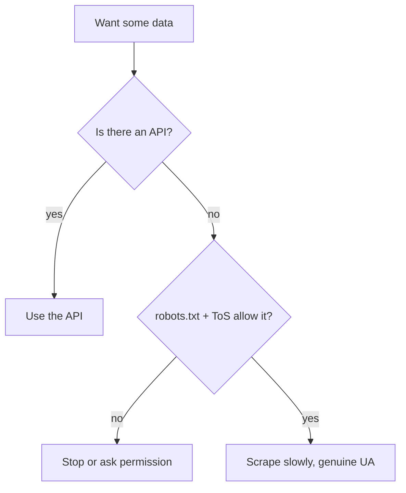

# Pagination and Being Polite

We've been scraping one page. The catalog has fifty. This phase teaches the
scraper to walk from page to page until there are no more - and, equally important, to do it in a way that doesn't hammer the server or get you blocked.
By the end you'll have a loop that collects the whole catalog at a respectful
pace.

I'm putting the manners and the law in the same phase as the loop on purpose.
The mechanics of pagination take ten minutes. Knowing how *not* to be a problem
is the part that keeps you out of trouble, and it's the part a lot of tutorials
skip. We won't.

## Find the "next" link

Open the site and scroll to the bottom - there's a "next" button. Inspect it.
On `books.toscrape.com` it's a `<li class="next">` containing an `<a>` whose
`href` points at the following page. When you're on the last page, that element
isn't there at all. That presence-or-absence is exactly the signal we need: keep
going while there's a next link, stop when there isn't.

```python
next_link = soup.select_one("li.next a")
if next_link:
    next_href = next_link["href"]   # e.g. "catalogue/page-2.html"
else:
    next_href = None                # we're on the last page
```

One wrinkle: that `href` is *relative*. From the catalogue pages it might be
`page-2.html`, meaning "relative to where I am now." Python's standard library
has the right tool so you don't guess: `urljoin` combines the current page's URL
with a relative link and gives you a correct absolute URL.

```python
from urllib.parse import urljoin

current = "https://books.toscrape.com/catalogue/page-1.html"
print(urljoin(current, "page-2.html"))
# -> https://books.toscrape.com/catalogue/page-2.html
```

## Set a User-Agent first

Before we loop, one courtesy and one practicality. Every request carries a
`User-Agent` header that says who's calling. By default `requests` sends
something like `python-requests/2.x`, which is genuine but anonymous. Many servers
treat the default Python agent with suspicion or block it outright.

Set a real one that identifies you and, ideally, how to reach you. This is both
polite (the site owner can see who you are) and effective (you're less likely to
be filtered). A shared session attaches the header to every request:

```python
import requests

session = requests.Session()
session.headers.update({
    "User-Agent": "weekend-book-scraper/1.0 (you@example.com)"
})
```

Don't impersonate a real browser to sneak past defenses. If a site plainly
doesn't want bots, that's information, not a challenge - more on that below.

## The pagination loop

Now the full walk. Start at page one, parse it, find the next link, sleep a
moment, repeat - until there's no next link.

```python
import time
import requests
from bs4 import BeautifulSoup
from urllib.parse import urljoin

START = "https://books.toscrape.com/catalogue/page-1.html"
DELAY = 1.0   # seconds between requests

session = requests.Session()
session.headers.update({
    "User-Agent": "weekend-book-scraper/1.0 (you@example.com)"
})


def parse_book(book):
    link = book.select_one("h3 a")
    raw_price = book.select_one("p.price_color")
    rating_el = book.select_one("p.star-rating")
    return {
        "title": link["title"].strip() if link else "Unknown",
        "price": float(raw_price.text.replace("£", "")) if raw_price else None,
        "rating": rating_el["class"][1] if rating_el else None,
    }


def scrape_all(start_url):
    records = []
    url = start_url
    page = 1
    while url:
        print(f"Fetching page {page}: {url}")
        response = session.get(url, timeout=10)
        response.raise_for_status()
        soup = BeautifulSoup(response.text, "html.parser")

        for book in soup.select("article.product_pod"):
            records.append(parse_book(book))

        next_link = soup.select_one("li.next a")
        url = urljoin(url, next_link["href"]) if next_link else None
        page += 1
        time.sleep(DELAY)      # be a good guest

    return records


all_books = scrape_all(START)
print(f"Collected {len(all_books)} books across all pages")
```

Run it. It walks every page, printing as it goes, pausing a second between
fetches, and ends with all thousand books in one list. The `while url:` loop is
the engine: `url` becomes `None` the moment there's no next link, and the loop
ends on its own.

## Why the delay matters

That `time.sleep(DELAY)` isn't decoration. Without it, a fast loop fires
requests as quickly as Python can manage - dozens per second - and to the server
that's indistinguishable from an attack. You can knock a small site over, and
you will absolutely get your IP blocked. A one-second pause makes you a normal
visitor. Slow is polite, and polite is what keeps you scraping.

A second knob worth knowing for bigger jobs: retries with backoff. If a request
fails, wait a bit and try again - and wait *longer* each time rather than
pounding a struggling server. For this project a fixed delay is enough; keep
backoff in your back pocket for production.

## robots.txt - read it, respect it

Most sites publish a file at `/robots.txt` saying which paths automated clients
may and may not touch. It's a request, not a wall, but ignoring it is rude and,
depending on where you are and what you're doing, can be a factor against you
legally. Python's standard library reads it for you:

```python
from urllib.robotparser import RobotFileParser

rp = RobotFileParser()
rp.set_url("https://books.toscrape.com/robots.txt")
rp.read()

agent = "weekend-book-scraper/1.0"
print(rp.can_fetch(agent, "https://books.toscrape.com/catalogue/page-1.html"))
```

`can_fetch` returns `True` or `False`. The straightforward move is to check it before you
scrape a path and skip what's disallowed. (Our practice site allows everything;
real sites often disallow `/search`, `/cart`, login areas, and the like.)

## The ethics and the law, plainly

I'm not your lawyer, and this isn't legal advice - but here's the working
understanding a careful person operates with:

- **Public, factual data is the safe ground.** Facts (prices, titles, public
  listings) generally aren't copyrightable. Re-publishing someone's *creative*
  content wholesale is a different matter.
- **Terms of Service exist.** Many sites' ToS forbid automated access. Violating
  them can be a breach of contract even when the data itself is public. Read them
  for anything you'll do more than once.
- **Don't scrape personal data carelessly.** Names, emails, profiles - privacy
  law (GDPR, CCPA, and friends) applies regardless of whether data is "public."
- **Don't degrade the service.** Hammering a server can cross from rude into
  unlawful (computer-misuse statutes). The delay isn't only manners.
- **Logins and paywalls change everything.** Scraping behind authentication, or
  bypassing access controls, is a sharp escalation. Don't, unless you have clear
  permission.
- **Prefer an API.** If the site offers one, use it. It's faster, more stable,
  and it's them *inviting* you in.

The short version: scrape public facts, slowly, with a genuine User-Agent, while
respecting robots.txt and ToS, and never for personal data or behind a login.
That posture covers the vast majority of legitimate scraping.



## Where we are

The scraper now collects an entire catalog, page by page, at a pace that won't
get you blocked or sued - with a real User-Agent and a robots.txt check in the
toolkit. The data's all in memory, though, and memory vanishes when the program
exits. Last phase: write it to disk, then look at where you'd take this next.
