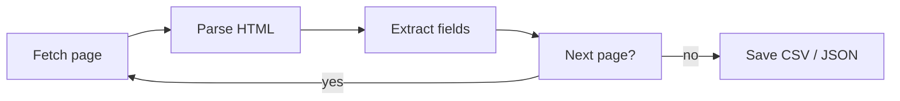

# Build a Web Scraper (Python)

This weekend you and I are going to build a web scraper that actually pulls
data off real pages and saves it to a file you can open in a spreadsheet. Not
a toy that prints "hello" - a small program you'd be comfortable pointing at a
catalog of books, a list of quotes, or a directory of listings, and walking
away while it does the boring work.

You build this **on your own machine**. The code here is meant to be saved to
files and run from your terminal with `python script.py`. There's no browser
sandbox doing the work for you, because real scraping needs the network, the
filesystem, and a couple of libraries that don't live in your browser. That's
the honest version of the skill, and it's the version that's useful on Monday.

## What you'll build

A command-line scraper, built up one piece at a time, that:

- fetches a web page over HTTP and checks it actually came back OK,
- parses the HTML into something you can search,
- pulls named fields (title, price, rating) into clean Python dictionaries,
- walks from one page to the next, with delays so you're a good guest,
- and writes everything to CSV and JSON.

By the last phase it's one working program. Each phase before that leaves you
with a real, runnable piece of it.

## The stack

| Piece | What it does | Why this one |
|-------|--------------|--------------|
| Python 3.10+ | the language | batteries-included, great for this |
| `requests` | fetches pages | the friendliest HTTP client around |
| `beautifulsoup4` | parses HTML | forgiving with messy real-world markup |
| `csv` / `json` | save the output | both ship with Python, nothing to install |

We use a practice site built for exactly this - `https://books.toscrape.com`
and `https://quotes.toscrape.com`. They exist so people can learn scraping
without bothering anyone's production servers. We'll talk about why that
matters in Phase 4.

## Rough time

A focused weekend. Call it three to four hours if you type along. Phases 1–3
are the core and move quickly; Phase 4 is where the judgment lives; Phase 5 is
the satisfying part where data lands in a file.

## What you'll learn

- How an HTTP request and response actually work, in code you can read.
- How to find the elements you want using both BeautifulSoup's `find` family
  and CSS selectors - and when to reach for which.
- How to write extraction that doesn't crash the moment a field is missing.
- The etiquette and the law of scraping: robots.txt, rate limits, terms of
  service, and what "be polite" means in practice.
- How to persist structured data and where you'd take this next - a database,
  a schedule, or a headless browser for sites that build themselves with
  JavaScript.

## The shape of it

That loop is the whole game. Everything we build hangs off those five boxes.
Let's get a machine ready and pull down our first page.
