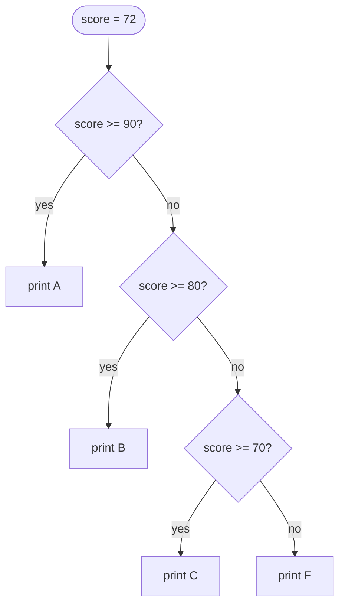

# Control Flow & Functions

So far your programs run straight down, every line once. Real programs *make choices* ("if the user is
logged in, show the dashboard") and *repeat work* ("for each order, send an email"). And once you've
written a useful chunk of logic, you want to *name it and reuse it* instead of copy-pasting. Those three
abilities — deciding, repeating, and packaging — are control flow and functions. This is where code
starts to feel powerful.

Remember the indentation rule from [Phase 2](02-syntax-values-and-types.md): the `:` opens a block and
the indented lines beneath belong to it. Every structure here uses it.

## `if` / `elif` / `else` — making a decision

**What it actually is.** An `if` runs a block *only when* a condition is true. Add `elif` ("else if")
for more conditions to check in turn, and `else` for "none of the above." Python checks them top to
bottom and runs the **first** matching block, then skips the rest.
```python
score = 72
if score >= 90:
    print("A")
elif score >= 80:
    print("B")
elif score >= 70:
    print("C")
else:
    print("F")
```
*What just happened:* Python checked `score >= 90` (false), then `>= 80` (false), then `>= 70` (true) —
ran that block and stopped, never reaching `else`:
```console
C
```
Here's the decision as a picture — Python falls through the checks until one matches:



📝 **Terminology.** A **condition** is any expression that evaluates to `True` or `False` — usually a
comparison like `>=`, `==`, `!=` (not equal), `<`, `>`. The block under `if` runs when the condition is
`True`.

## Truthiness — what counts as "true"

**What it actually is.** Python lets you use *any* value as a condition, not only `True`/`False`. When
it does, it asks "is this value *truthy* or *falsy*?" The falsy values are the "empty or nothing" ones;
almost everything else is truthy.
```python
print(bool(0), bool(""), bool([]), bool(None))
print(bool(42), bool("hi"), bool([1, 2]))
```
*What just happened:* `bool()` shows how Python would judge each value in a condition. Zero, the empty
string, the empty list, and `None` are all **falsy**; a nonzero number, a non-empty string, and a
non-empty list are **truthy**:
```console
False False False False
True True True
```
This lets you write natural checks. Instead of `if len(items) > 0:`, you can write:
```python
items = []
if items:
    print("There are items")
else:
    print("The list is empty")
```
*What just happened:* The empty list is falsy, so the condition was false and the `else` ran:
```console
The list is empty
```

💡 **Key point.** "Empty or zero or nothing" is falsy; everything else is truthy. `if my_list:` reads as
"if the list has anything in it" — clean and Pythonic.

## `for` — do something for each item

**What it actually is.** A `for` loop walks through a collection and runs its block *once per item*,
with each item handed to a name you choose.
```python
for fruit in ["apple", "banana", "cherry"]:
    print(fruit)
```
*What just happened:* The loop took each item from the list in turn, pointed `fruit` at it, and ran the
block — three items, three runs:
```console
apple
banana
cherry
```
To repeat a fixed number of times, loop over `range(n)`, which produces the numbers `0` up to (but not
including) `n`:
```python
for i in range(3):
    print(i)
```
*What just happened:* `range(3)` yielded `0`, `1`, `2` — note it stops *before* 3, the same "stop is
exclusive" rule as slicing:
```console
0
1
2
```

## `while` — repeat until a condition turns false

**What it actually is.** A `while` loop repeats its block *as long as* a condition stays true. You reach
for it when you don't know in advance how many times you'll loop — you loop until something changes.
```python
n = 3
while n > 0:
    print(n)
    n = n - 1
```
*What just happened:* The loop ran while `n > 0`: printed `n`, then shrank it by 1 each pass, until `n`
hit 0 and the condition went false:
```console
3
2
1
```

⚠️ **The infinite loop.** A `while` only stops when its condition becomes false — so *something inside
the loop must move it toward false*. Forget the `n = n - 1` line above and `n` stays 3 forever, printing
without end. If a program ever "hangs" and won't return to the prompt, an infinite loop is the usual
suspect; press **Ctrl-C** to stop it.

## Functions — name a piece of logic and reuse it

**What it actually is.** A **function** is a named, reusable block of instructions. You *define* it once
with `def`, then *call* it whenever you need it — possibly with different inputs each time. It's how you
avoid copy-pasting the same logic and how you give a chunk of code a meaningful name.
```python
def greet(name):
    return f"Hello, {name}!"

print(greet("Ada"))
print(greet("Linus"))
```
*What just happened:* `def greet(name):` defined a function taking one **parameter**, `name`. `return`
hands a value back to whoever called it. Each call supplied a different name, so we got two different
results:
```console
Hello, Ada!
Hello, Linus!
```

📝 **Terminology.** A **parameter** is the name in the definition (`name`); an **argument** is the actual
value you pass in when calling (`"Ada"`). `return` sends a value back out of the function.

**Defaults** let a parameter be optional by giving it a fallback value:
```python
def greet(name, greeting="Hello"):
    return f"{greeting}, {name}!"

print(greet("Ada"))
print(greet("Ada", "Hi"))
```
*What just happened:* When you don't pass `greeting`, it falls back to `"Hello"`. When you do pass it,
yours wins:
```console
Hello, Ada!
Hi, Ada!
```

**`return` vs printing — a crucial difference.** A function that *prints* shows text on screen but hands
back nothing usable; a function that *returns* gives you a value you can store and work with. A function
with no `return` hands back `None`:
```python
def show(x):
    print(x)

result = show(5)
print(result)
```
*What just happened:* `show(5)` printed `5`. But it has no `return`, so the call evaluated to `None` —
which is what got stored in `result` and printed on the second line:
```console
5
None
```
If you want to *use* a function's output later, it must `return` it, not just `print` it. Printing is for
showing a human; returning is for feeding the rest of your program.

## The classic trap: mutable default arguments

This one bites *experienced* developers, not only beginners — so it's worth meeting head-on.

**What goes wrong.** When you give a parameter a default that is a **mutable** value (like a list), that
default is created **once**, when the function is defined — and then *shared across every call* that uses
it. It does **not** get a fresh list each time, which is almost never what you want.
```python
def add_item(item, basket=[]):
    basket.append(item)
    return basket

print(add_item("apple"))
print(add_item("banana"))
```
*What just happened:* You'd expect each call to start with an empty basket. Instead, both calls share the
*same* default list, so the second call sees the first call's leftovers:
```console
['apple']
['apple', 'banana']
```
That `['apple', 'banana']` on the second line is the bug — `"apple"` shouldn't be there. The shared
default accumulates across calls, silently.

**The fix** is a fixed pattern to adopt every time: default to `None`, then create a fresh value
*inside* the function.
```python
def add_item(item, basket=None):
    if basket is None:
        basket = []
    basket.append(item)
    return basket

print(add_item("apple"))
print(add_item("banana"))
```
*What just happened:* Now each call with no basket gets a brand-new list, so they don't bleed into each
other:
```console
['apple']
['banana']
```

⚠️ **Never use a mutable default (`[]`, `{}`, `set()`) directly.** Default to `None` and build the real
value inside the function. Memorize this pattern — it's one of Python's genuine sharp edges, and it comes
straight from the aliasing idea in [Phase 3](03-collections.md): the default list is one object, shared.

## Recap

1. **`if` / `elif` / `else`** runs the *first* matching block. Conditions are expressions that evaluate
   to `True`/`False`.
2. **Truthiness:** empty/zero/`None` are falsy, everything else truthy — so `if my_list:` means "if it
   has items."
3. **`for`** loops once per item (use `range(n)` for a count); **`while`** loops until its condition goes
   false — make sure something moves it there.
4. **`def`** defines a function; **parameters** name its inputs, **`return`** hands a value back.
   **Defaults** make parameters optional.
5. `return` gives a usable value; a function with no `return` yields `None`. Return what you want to
   reuse.
6. **Never use a mutable default argument.** Default to `None` and build the list/dict inside the
   function.

Next, we move beyond one file: importing code, the standard library, writing your own modules, and
laying out a real project.

---

[← Phase 3: Collections](03-collections.md) · [Guide overview](_guide.md) · [Phase 5: Modules & Project Layout →](05-modules-and-project-layout.md)
