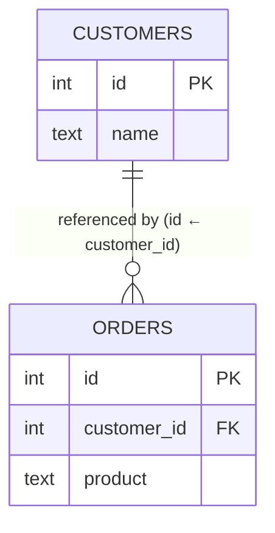
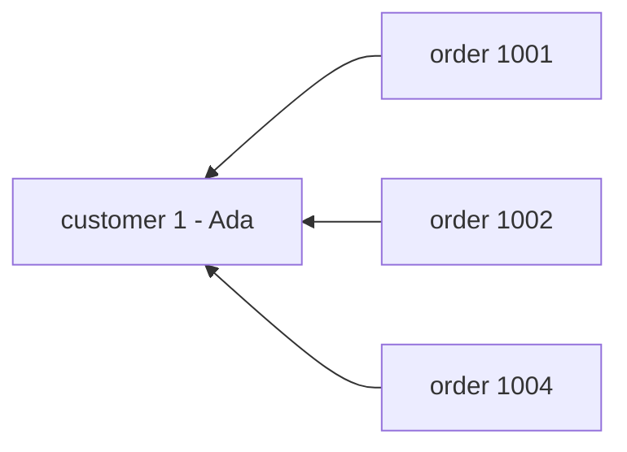
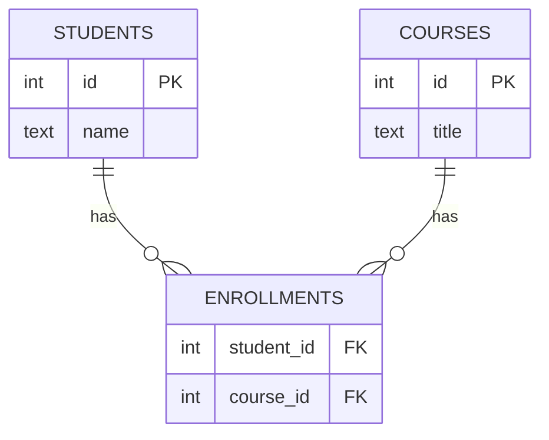

# Foreign Keys & Referential Integrity

In Phase 1 you put a number in each order — `customer 1` — to say which customer it belonged to. In
Phase 2 you made sure `customer 1` was a stable, unique name. But so far that number is just a number.
Nothing stops you from typing `customer 999` into an order when there is no customer 999. The link is a
*convention*, not a *guarantee*.

The **foreign key** is what upgrades the convention into a guarantee. It's the second half of a
relationship — and the moment you declare one, the database stops trusting you to keep your links honest
and starts enforcing it itself.

## What a foreign key actually is

**What it actually is.** A foreign key is a column in one table whose job is to hold a **primary key
value from another table**. It's a pointer — `orders.customer_id` holds the `id` of a row over in
`customers` — and you tell the database it's a pointer so the database can protect it.



The `customers.id` is the **primary key** (the name); `orders.customer_id` is the **foreign key**
(a pointer at a customer's `id`). Orders 1001, 1002, and 1004 all carry `customer_id = 1`, so they all
point at Ada.

📝 **Terminology.** The table being pointed *at* (`customers`) is the **referenced** or **parent** table.
The table doing the pointing (`orders`) is the **referencing** or **child** table. The foreign key always
lives on the child.

You declare it when you create the child table:

```sql
CREATE TABLE orders (
    id          SERIAL PRIMARY KEY,
    customer_id INTEGER NOT NULL REFERENCES customers(id),
    product     TEXT NOT NULL,
    amount      NUMERIC NOT NULL
);
```

*What just happened:* `REFERENCES customers(id)` is the line that matters. It tells the database
"`customer_id` is not a free-floating number — it must always equal some real `id` in `customers`." From
this point on, the database itself stands guard over that promise.

## What "referential integrity" means — the database refuses orphans

📝 **Referential integrity** is the rule that *every foreign key value must point at a row that actually
exists.* No order may belong to a customer who isn't there. A child with a missing parent is called an
**orphan**, and referential integrity is the database's standing refusal to create one.

Watch it enforce the rule. We try to add an order for customer 999, who doesn't exist:

```sql
INSERT INTO orders (customer_id, product, amount)
VALUES (999, 'Desk lamp', 35.00);
```

```text
  ERROR:  insert or update on table "orders" violates foreign key constraint
  DETAIL: Key (customer_id)=(999) is not present in table "customers".
```

*What just happened:* the database checked `customers` for an `id` of 999, found nothing, and rejected
the order before it existed. Without the foreign key, that bad row would have slipped in silently and
shown up months later as a crash or a blank name in a report. With it, the mistake is caught at the exact
moment it's made. The database is doing your data-quality checking for you, every single write, forever.

## How foreign keys model the two relationship shapes

Almost every relationship in real data is one of two shapes, and foreign keys express both.

### One-to-many — the everyday case

**One** customer has **many** orders; each order has exactly **one** customer. That's the shape we've had
all along, and it's the most common relationship there is. The pattern is simple:

> Put the foreign key on the **"many" side**, pointing at the **"one" side**.

Each order carries one `customer_id`. A customer can be pointed at by any number of orders. That
asymmetry — many pointers in, one pointer out — *is* one-to-many.



### Many-to-many — when both sides multiply

Now a harder shape. A `student` takes **many** courses; a `course` has **many** students. You can't put
the foreign key on either side — a single `student_id` column on `courses` could only hold *one* student
per course, and vice versa. Neither table has room.

The fix is a third table that exists purely to hold the pairings:

📝 **Junction table** (also: *join table*, *bridge table*, *association table*). A small table whose rows
are the connections themselves. Each row holds two foreign keys — one to each side — and each row means
"this student is in this course."



One row per pairing in `enrollments`: "Ada is in Calculus," "Ada is in Logic," "Grace is in Calculus."
Each row holds two foreign keys — one to each side.

```sql
CREATE TABLE enrollments (
    student_id INTEGER NOT NULL REFERENCES students(id),
    course_id  INTEGER NOT NULL REFERENCES courses(id),
    PRIMARY KEY (student_id, course_id)
);
```

*What just happened:* the junction table turns one many-to-many relationship into two ordinary
one-to-many relationships (students→enrollments and courses→enrollments). The `PRIMARY KEY (student_id,
course_id)` — a primary key made of two columns together — also quietly prevents enrolling the same
student in the same course twice. Whenever you hear "many-to-many," reach for a junction table; there is
essentially always one hiding in the middle.

## The gotcha that bites everyone: what happens on delete?

You've protected the *creation* of orphans — no order can point at a nonexistent customer. But there's a
back door. What if the customer exists when the order is created, and you delete the customer *later*? All
their orders would instantly become orphans.

The database won't allow that silently. When you declare a foreign key, you also choose what should
happen if someone tries to delete a parent that still has children. The two choices you'll meet first:

⚠️ **`ON DELETE RESTRICT` — block the delete (the safe default).** If a customer still has orders, the
database refuses to delete the customer at all. You must deal with the orders first. This is the cautious
choice, and it's what you get by default if you don't specify — the database would rather stop you than
let data quietly disappear.

```sql
DELETE FROM customers WHERE id = 1;
```

```text
  ERROR:  update or delete on table "customers" violates foreign key constraint
          on table "orders"
  DETAIL: Key (id)=(1) is still referenced from table "orders".
```

*What just happened:* Ada still has orders pointing at her, so the database blocked the deletion entirely.
Nothing was orphaned because nothing was deleted. The error is the database protecting you from a mistake.

⚠️ **`ON DELETE CASCADE` — delete the children too.** If you delete the customer, the database
automatically deletes all their orders in the same breath. Convenient — and genuinely dangerous. One
`DELETE` on a parent can wipe out thousands of child rows you never mentioned, with no second
confirmation. Reach for `CASCADE` only when the children truly have no meaning without the parent (e.g.
deleting a user should remove their draft posts), and never on data you'd grieve.

```sql
CREATE TABLE orders (
    id          SERIAL PRIMARY KEY,
    customer_id INTEGER NOT NULL REFERENCES customers(id) ON DELETE CASCADE,
    product     TEXT NOT NULL,
    amount      NUMERIC NOT NULL
);
```

*What just happened:* with this declaration, `DELETE FROM customers WHERE id = 1` would succeed *and*
silently delete orders 1001, 1002, and 1004 along with Ada. That's the behavior you want for a user and
their drafts; it's a catastrophe for a customer and their financial order history. The whole risk lives
in that one `ON DELETE` clause — read it carefully on any table you didn't write.

(There are gentler options too, like `ON DELETE SET NULL`, which leaves the child but blanks its pointer.
The two above are the ones to understand first.)

## Why this all sets up JOINs

Step back and look at what you've built. Your data is split into clean tables (Phase 1). Every row has a
stable name (Phase 2). And those names are connected by enforced, trustworthy links (this phase). You
have a small web of related tables where the relationships are *guaranteed correct* — no orphans, no
dangling pointers.

That guarantee is precisely what makes the next step safe. When you want "every order *with* its
customer's name," you follow the foreign keys back to their primary keys and stitch the tables together.
That stitching is the **JOIN**, and because referential integrity ensures every `customer_id` really does
match a customer, your joins return whole, sensible rows instead of gaps. Here's that payoff on a
built-in pair of tables — `books` each carry an `author_id` foreign key pointing at `authors.id`:

```sql runnable
SELECT books.title, authors.name AS author
FROM books
JOIN authors ON books.author_id = authors.id;
```
*What just happened:* Each book carried an `author_id`; the JOIN followed that foreign key back to the
matching `authors` row and stitched the two tables into one result — every book shown beside its author's
name. Because each `author_id` really points at a real author, no row came back with a gap.

You're ready for [SQL JOINs Explained](/guides/sql-joins-explained) — it's the natural payoff of everything here.

## Recap

1. **A foreign key is a column holding another table's primary key** — a pointer from a child row to a
   parent row.
2. **Referential integrity is the database refusing orphans** — every foreign key value must point at a
   row that actually exists; bad pointers are rejected at write time.
3. **One-to-many:** put the foreign key on the "many" side, pointing at the "one." (Orders → customer.)
4. **Many-to-many:** add a **junction table** whose rows are the pairings, each holding two foreign keys.
5. **On delete, you choose:** `RESTRICT` blocks deleting a parent that still has children (the safe
   default); `CASCADE` deletes the children with it (convenient and dangerous — read it carefully).
6. **This is the foundation JOINs stand on** — trustworthy links are what let you reassemble the tables
   correctly.

---

[← Phase 2: Primary Keys](02-primary-keys.md) · [Guide overview](_guide.md) · [Next guide: SQL JOINs Explained →](/guides/sql-joins-explained)
