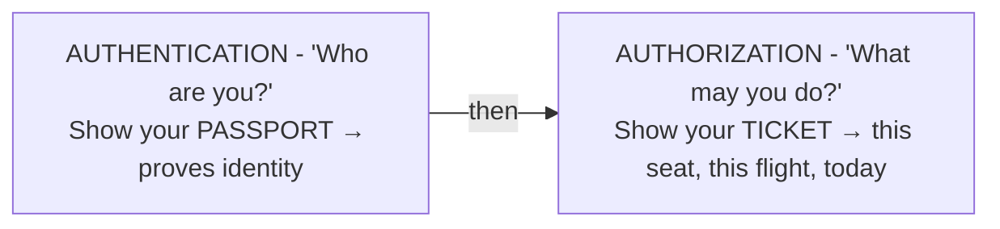
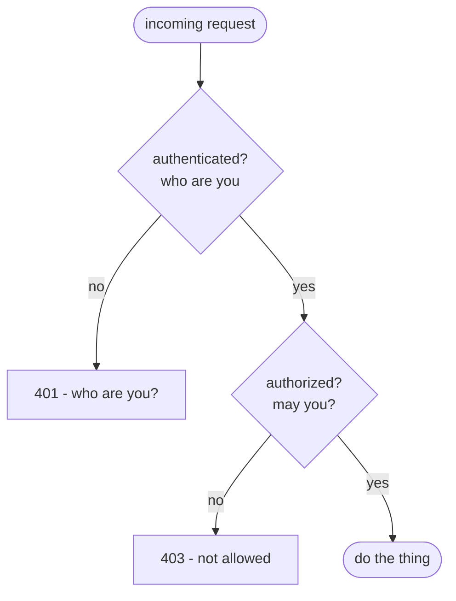

# Authentication vs Authorization

Two words, almost the same spelling, abbreviated to *authn* and *authz* - which helps nobody. People use them interchangeably, ship the wrong check in the wrong place, and end up with a bug where a logged-in user can read someone else's invoices. But the *ideas* underneath are clean and separate. Once you see the split, you'll never blur them again.

Here's the whole thing in one sentence: **authentication proves who you are; authorization decides what you're allowed to do.** Different questions, different answers, and they happen in that order.

## The mental model: passport and ticket

Picture boarding a flight.



Your **passport** proves you are who you claim to be. That's authentication. It says nothing about *where* you're allowed to go.

Your **ticket** says you may board *this* flight, in *this* seat, *today*. That's authorization. The ticket doesn't prove your identity - anyone holding it could try to use it - which is exactly why the gate checks both: passport first to confirm you're you, then ticket to confirm you're allowed on this particular plane.

You need both. A passport with no ticket gets you into the terminal and no further. A ticket with no passport gets you stopped at the gate. Software works the same way.

## Authentication - proving who you are

**What it actually is.** Authentication is the act of a user *proving an identity claim*. You claim "I am alice@example.com," and you back it up with something only Alice should have: a password, a one-time code from her phone, a fingerprint, a hardware key. The server checks the proof and, if it holds up, now believes you're Alice.

**Why people get this wrong.** It's tempting to think authentication is "the login form." But the form is just where the proof is collected. Authentication is the *verification* - comparing what you supplied against what the server has on record. (How the server stores that record safely, so a database leak doesn't hand attackers everyone's password, is its own subject: see [How Passwords Are Stored](/guides/how-passwords-are-stored).)

**What it does in real life.** You submit credentials; the server verifies them and, on success, establishes that *this request now belongs to Alice*. From this moment on, the system has an answer to "who are you?"

**A real example.**
```console
$ curl -i -X POST https://api.example.com/login \
       -d 'email=alice@example.com&password=correct-horse'
HTTP/2 200
set-cookie: session=8f3b...; HttpOnly; Secure; SameSite=Lax
content-type: application/json

{"user":"alice@example.com","authenticated":true}
```
*What just happened:* Alice proved her identity, and the server confirmed it (`"authenticated":true`). It also handed back a cookie so it can recognize her on the *next* request without making her log in again - that "how do we stay logged in" piece is the whole of [Phase 2](02-sessions-vs-tokens.md). For now, the key point is narrow: authentication just answered *who*.

⚠️ **Gotcha - authentication says nothing about permissions.** A successful login does *not* mean "this person can do anything." It means "we know who this person is." A brand-new user with zero privileges authenticates exactly as successfully as an admin. Confusing "logged in" with "allowed" is the root of a whole class of security bugs.

## Authorization - what you're allowed to do

**What it actually is.** Authorization is the act of *deciding whether a known identity may perform a specific action on a specific thing*. It always runs *after* authentication, because you can't decide what someone's allowed to do until you know who they are.

**Why people get this wrong.** People check authorization too coarsely - "are they logged in? then let them in" - and skip the part that matters: *is this particular user allowed to touch this particular resource?* Alice being logged in does not mean Alice may read Bob's invoice.

**What it does in real life.** For each protected action, the server asks a permission question: does this user have the role, the ownership, or the grant required? If yes, proceed. If no, refuse - typically with `403 Forbidden`.

**A real example.**
```console
$ curl -i https://api.example.com/invoices/777 \
       --cookie 'session=8f3b...'
HTTP/2 403
content-type: application/json

{"error":"forbidden","reason":"invoice 777 belongs to another user"}
```
*What just happened:* Alice is fully authenticated - the server knows it's her, and her session cookie is valid. But invoice 777 isn't hers, so the authorization check fails and the server returns `403 Forbidden`. Notice the status code tells the story: not `401` ("we don't know who you are"), but `403` ("we know exactly who you are, and the answer is no").

📝 **Terminology - 401 vs 403.** These two HTTP status codes map cleanly onto our two concepts, and getting them right makes your API clear about what failed. `401 Unauthorized` means *authentication* failed or is missing - "I don't know who you are." `403 Forbidden` means *authorization* failed - "I know who you are, and you may not do this." (Yes, `401` is literally named "Unauthorized" while meaning authentication - a historical naming wart. Read it as "unauthenticated" and you'll stay sane.)

## How they fit together

Every protected request runs both checks, in order:



Authentication is the front door: it establishes identity once. Authorization is every interior door: it gets checked again and again, per action, because the answer changes depending on *what* you're trying to do and *which* resource you're touching.

**Why this saves you later.** Keep these two separate in your head and real bugs become obvious before you ship them. "Any logged-in user can delete any comment" is an *authorization* hole - authentication was fine, you just forgot to check ownership. "Our public API leaks data to anyone with the URL" is an *authentication* hole - no identity was ever required. Naming which check is missing tells you where to look.

## Recap

1. **Authentication (authn) = who you are.** You prove an identity claim with something only you have; the server verifies it.
2. **Authorization (authz) = what you're allowed to do.** Given a known identity, the server decides if you may perform a specific action on a specific resource.
3. **Order matters:** authenticate first, then authorize. You can't decide permissions for someone you can't identify.
4. **Both are required, and they fail differently:** `401` means authentication failed ("who are you?"); `403` means authorization failed ("you may not").
5. **"Logged in" is not "allowed."** Conflating the two is the source of a whole family of access-control bugs.

Now that you know how the server *figures out* who you are and what you can do, the next question is practical: after that first login, how does it remember you across every following request without asking for your password each time? That's sessions versus tokens.

Watch it animated: [authentication vs. authorization](/explainers/AuthAuthz.dc.html)

---

[← Guide overview](_guide.md) · [Phase 2: Keeping You Logged In →](02-sessions-vs-tokens.md)
