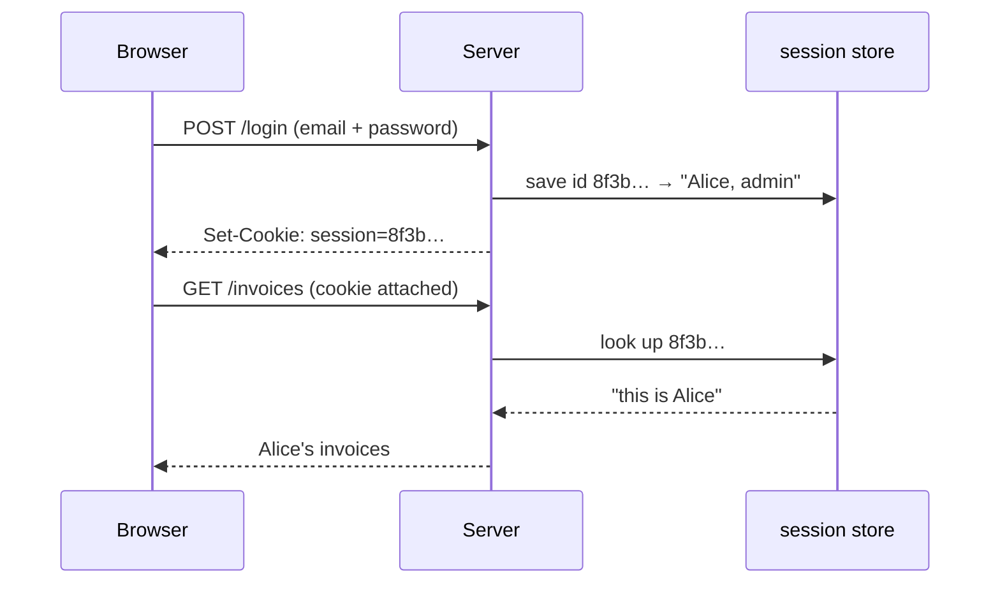

# Keeping You Logged In: Sessions vs Tokens

HTTP has no memory. Every request arrives at the server like a stranger walking in for the first time - it has no built-in idea that *this* request came from the person who logged in two seconds ago. That's by design (it's what lets the web scale), but it means the server needs a way to answer "who is this again?" on every request after login.

There are two mainstream ways to solve it, and the difference between them - *where the state lives* - is the single idea this phase rests on. Get that and the trade-offs fall out naturally.

## The one idea: where does the state live?

When you log in, *something* has to be remembered so the next request can be tied back to you. The two approaches differ only in **who keeps it**:

```text
  SERVER-SIDE SESSION                  STATELESS TOKEN (JWT)
  ───────────────────                  ─────────────────────
  Client holds: a random ID            Client holds: ALL the data, signed
  Server holds: the real data          Server holds: nothing (just a secret key)

  cookie: session=8f3b9c...            token: eyJhbGci...{user,role,exp}...sig
            │                                    │
            ▼                                    ▼
  server looks up 8f3b9c                server checks the signature is valid
  in its session store →                with its secret key →
  "ah, this is Alice"                   "this says Alice, and it's untampered"
```

A **session** hands the client a meaningless ticket stub (a random id) and keeps the actual facts ("this id belongs to Alice, role admin, logged in at 9am") in a store on the server. A **token** flips it: the facts are written *into* the token the client holds, and the server keeps only a secret key to check it wasn't forged.

## Server-side sessions

**What it actually is.** On login, the server generates a long random string - the **session id** - stores the real user data against that id in a session store (memory, a database, Redis), and sends the id to the browser in a cookie. On each later request the browser sends the cookie back and the server looks up the id.

**What it does in real life.** The cookie is a claim check, carrying nothing meaningful by itself - just an id. All the authority lives server-side.



**A real example.** Here's the cookie the server set, annotated:
```text
Set-Cookie: session=8f3b9c2e1a7d4b60; HttpOnly; Secure; SameSite=Lax; Max-Age=86400
                     └──────┬───────┘  └──┬──┘  └─┬──┘ └─────┬─────┘ └────┬────┘
                     random session id    │       │         │            │
   JS can't read it (blunts XSS theft) ───┘       │         │            │
   only sent over HTTPS ───────────────────────────┘        │            │
   not sent on cross-site requests (blunts CSRF) ────────────┘            │
   expires in 86400 seconds (24h) ───────────────────────────────────────┘
```
*What just happened:* The server gave the browser a random id plus a set of rules for handling it safely (annotated above). The id itself reveals nothing - its only power is that the server can look it up.

**The trade-offs, honestly.**
- *Revocation is easy and instant.* To log someone out everywhere - or kill a stolen session - delete the id from the server store. The next request with that cookie finds nothing and is rejected.
- *Every request needs a lookup.* The server hits its session store each time. Usually cheap, but it's real work, and it means the server holds state.
- *Scaling needs shared state.* Run ten server instances behind a load balancer, and they all need to reach the *same* session store (commonly Redis), or a user who logs in on instance A is a stranger to instance B.

## Stateless tokens (JWT)

📝 **Terminology - JWT.** A **JSON Web Token** (pronounced "jot") is a compact, signed string carrying a small bundle of facts ("claims") about the user, in three dot-separated parts: header, payload, signature.

**What it actually is.** Instead of storing your identity server-side, the server writes it *into* the token - id, maybe role, an expiry time - and signs the whole thing with a secret key. The client holds the token (often in a cookie or an `Authorization` header) and presents it on each request. The server re-computes the signature; if it matches, the token is trustworthy and the server reads your identity straight out of it - no store, no lookup.

**A real example.** A JWT looks like one opaque blob, but it's three Base64URL pieces joined by dots. Decoded, the middle piece is plain JSON:
```text
eyJhbGciOiJIUzI1NiJ9 . eyJzdWIiOiJhbGljZSIsInJvbGUiOiJ1c2VyIiwiZXhwIjoxNzE4ODAwMDAwfQ . 3pK_mN...sig
└────── header ──────┘  └──────────────────── payload ────────────────────┘  └─── signature ───┘

  header  (decoded): {"alg":"HS256","typ":"JWT"}
  payload (decoded): {"sub":"alice","role":"user","exp":1718800000}
  signature: HMAC-SHA256(header + "." + payload, server's secret key)
```
*What just happened:* The signature is a fingerprint computed over the header and payload with the server's secret key. Flip `"role":"user"` to `"role":"admin"` and the signature no longer matches, so the server rejects it. It doesn't *hide* anything; it *proves nobody tampered*.

⚠️ **Gotcha - a JWT is signed, not encrypted. The payload is readable by anyone.** That Base64URL middle section is not a secret - anyone holding the token can decode it and read every claim, no key required. So: **never put anything secret in a JWT** - no passwords, no private data, no API secrets. The signature stops forgery; it does not provide privacy. (Encrypted variants exist - JWE - but a plain JWT, the kind you'll meet everywhere, is readable.)

⚠️ **Gotcha - JWTs are hard to revoke.** This is the flip side of "no server-side state" - the server can't delete a token to log you out, so it stays valid until it *expires* on its own. Fire an employee or have a token stolen, and it keeps working until its `exp` time; there's no built-in off switch. The common fixes *re-introduce* server state: short token lifetimes plus refresh tokens (covered in [Phase 3](03-oauth-and-sign-in-with.md)), or a server-side denylist - at which point you've partly given back the statelessness that was the whole appeal.

**The trade-offs, honestly.**
- *No per-request lookup, easy to scale.* Any server instance with the secret key can verify a token on its own - no shared session store needed. Real for distributed systems and APIs.
- *Revocation is genuinely hard.* As above - you trade instant logout for statelessness.
- *Size and exposure.* A token carries its claims on *every* request, bigger than a tiny session id, and those claims are out in the open.

## So which one?

There's no universal winner - it depends on whether you value easy revocation or easy scaling more. A single web app? Server-side sessions are simple and let you log people out instantly. A fleet of services or a public API? Stateless tokens shine. Plenty of real systems use *both*: short-lived tokens for speed, plus server-side state to claw back revocation.

| | Server-side session | Stateless token (JWT) |
|---|---|---|
| Where state lives | On the server | In the token (client holds it) |
| Per-request cost | A lookup in the session store | A signature check (no lookup) |
| Revoke / force logout | Easy and instant (delete the id) | Hard (valid until it expires) |
| Scaling across servers | Needs a shared store (e.g. Redis) | Any node with the key can verify |
| Payload privacy | Nothing meaningful in the cookie | Claims are readable by anyone |

**Why this saves you later.** When someone says "just use JWTs, they're stateless and modern," ask the right question back: *how do we log a stolen token out?* You're choosing a trade-off on purpose instead of cargo-culting a default.

## Recap

1. **HTTP is stateless** - after login, the server needs a way to recognize you on every request.
2. **The core difference is where the state lives:** a session keeps data server-side behind a random id; a token writes the data into a signed string the client carries.
3. **Sessions** make revocation instant (delete the id) but need a per-request lookup and a shared store to scale.
4. **JWTs** scale beautifully (any node can verify with the key) but are hard to revoke (valid until expiry).
5. **A JWT is signed, not encrypted** - the payload is readable by anyone, so never put secrets in it.
6. **Many systems mix both**, pairing short-lived tokens with server state to regain control over logout.

You now understand how *your own* server remembers you. Last piece: how does a *third* app - Google, GitHub - let you log in or grant access without ever handing over your password? That's OAuth.

---

[← Phase 1: Authentication vs Authorization](01-authentication-vs-authorization.md) · [Guide overview](_guide.md) · [Phase 3: Delegated Access →](03-oauth-and-sign-in-with.md)
