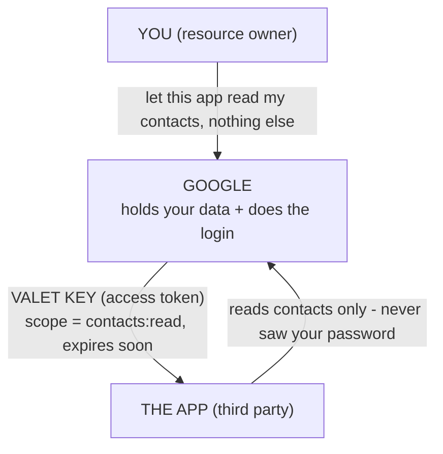
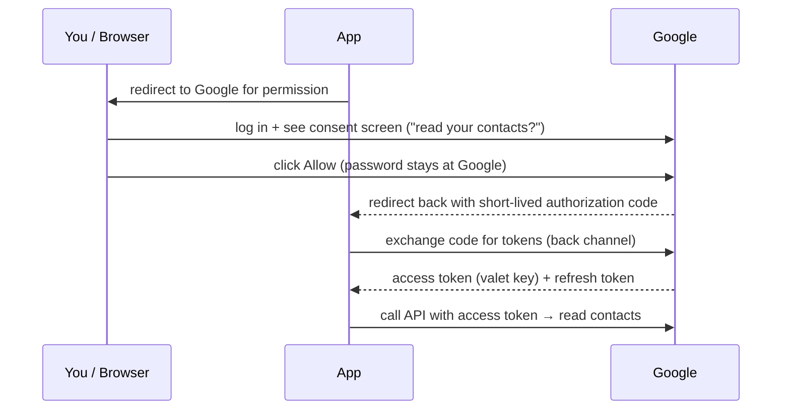

# Delegated Access: OAuth & "Sign in with…"

You've clicked "Sign in with Google" countless times. A screen pops up, you approve, and suddenly some app you've never given a password to knows your email. It feels like magic, or like you just handed Google your soul. Neither is true - and the actual mechanism is genuinely clever once you see it.

The problem OAuth solves is specific: *how do you let an app do something with your data on another service, without giving that app your password?* Before OAuth, the grim answer was "type your Gmail password into this third-party app and trust them." That's a disaster - you've handed over total, permanent access to a stranger. OAuth replaces that with something scoped, revocable, and password-free.

## The mental model: the valet key

Some cars come with a **valet key**. It starts the engine and opens the door - enough for the valet to park it - but it *won't* open the trunk or the glovebox, and you can stop honoring it later. You hand the valet limited, revocable access without giving them your real key.



That's OAuth. **You** own the data. **Google** holds it and is the one place you actually type your password. **The app** gets a valet key - an *access token* - that's limited to exactly what you approved and nothing more. The app never sees your password, and you can take the key back later from your Google account settings.

## The flow, walked through

When you click "Sign in with Google" (or "Connect your calendar"), here's the dance, with the real terms attached:



The crucial move is step 2: **you authenticate at Google, not at the app.** Your password never leaves Google. The app only ever receives tokens - and only after you explicitly consent to a specific scope.

📝 **Terminology - why the extra code-then-exchange step (steps 3–4)?** The browser-visible redirect carries only a short-lived *authorization code*, not the actual tokens. The app's *server* then exchanges that code for tokens over a direct, back-channel call. This keeps the powerful tokens out of the browser's URL bar and history. (This is the "authorization code" flow - the standard one for apps with a backend.)

## Access tokens and refresh tokens

Two tokens come back in step 5, and they do different jobs - this trips people up constantly.

**The access token** is the valet key. It's what the app sends to Google's API to actually read your contacts. It is deliberately **short-lived** - often minutes to an hour - so that if it leaks, the damage window is small.

**The refresh token** is the "get me a fresh valet key" coupon. It's **long-lived** and the app keeps it safely on its server. When the access token expires, the app quietly sends the refresh token to Google and gets a new access token - no need to interrupt you to log in again.

```text
   access token   ──►  used constantly, expires fast (minutes–1h)
   refresh token  ──►  used rarely, lives long; trades itself for new access tokens
                       and can be REVOKED by you to cut the app off entirely
```

*Why this split exists:* it's the same revocation trade-off from [Phase 2](02-sessions-vs-tokens.md), solved deliberately. Short-lived access tokens limit blast radius; the long-lived refresh token gives *you* an off switch - revoke it in your account settings and the app can no longer mint new access tokens. Continuous access, but you keep control.

## Scopes - the limits on the valet key

**What they actually are.** A **scope** is a named permission the app asks for: `contacts.read`, `calendar.events`, `email`. The consent screen you see is literally the list of scopes the app requested, in plain language. You're approving *exactly that list* - nothing broader.

**Why this matters.** Scopes are how OAuth stays the valet key instead of the master key. An app that asked for `contacts.read` cannot suddenly delete your files - it has no scope for that, and the API will refuse. When you connect an app and the consent screen asks for far more than the app should need, that's your cue to be suspicious; you're reading the exact extent of the valet key before you cut it.

## OAuth (authz) vs OpenID Connect (authn)

Here's the subtlety that ties this whole guide together, and it's worth slowing down for.

**OAuth 2.0 is about authorization** - *delegated access*. Strictly, it answers "may this app do X with the user's data?" It was designed to grant *access*, not to prove *identity*. Notice that nothing in the flow above actually tells the app *who you are* in a trustworthy way - it just gives the app a key to your contacts.

**OpenID Connect (OIDC) is a thin layer on top of OAuth that adds authentication.** When an app wants to *log you in* - to learn, reliably, "this is alice@example.com" - it uses OIDC, which rides the same flow but returns one extra thing: an **ID token** (a JWT) containing verified facts about *who you are*. That ID token is the part that makes "Sign in with Google" a genuine login rather than just a data-access grant.

```text
  OAuth 2.0  →  AUTHORIZATION  →  "this app may read your contacts"   → access token
  OIDC       →  AUTHENTICATION →  "this user IS alice@example.com"     → ID token (a JWT)
              (OIDC is built on top of OAuth - same flow, plus an ID token)
```

So when you see "Sign in with Google," that's **OIDC** (authentication) doing the login. When you see "Connect your Google Calendar so we can add events," that's plain **OAuth** (authorization) granting scoped access. Often both happen at once. And now the names from [Phase 1](01-authentication-vs-authorization.md) - authn and authz - pay off: OAuth is authz, OIDC adds authn, and you can tell which one an app is using by whether it's logging you *in* or reaching *into* your data.

## A few rules that keep you out of trouble

⚠️ **Store tokens safely, and only over HTTPS.** Access and refresh tokens are bearer credentials - whoever holds one can use it. They must only ever travel over encrypted connections, and refresh tokens in particular should live on your server, not in the browser. If tokens cross the network in the clear, anyone in the middle can grab them. (Why HTTPS is non-negotiable for anything like this: [HTTPS & TLS](/guides/https-and-tls).)

⚠️ **Don't put secrets in a JWT.** This is the [Phase 2](02-sessions-vs-tokens.md) rule, and it applies squarely to ID tokens, which *are* JWTs: their claims are readable by anyone holding the token. An ID token is fine for carrying "who you are"; it is not a place for anything that must stay private.

⚠️ **Don't roll your own auth.** OAuth and OIDC are full of small, security-critical details - validating the authorization code, checking token signatures and expiry, matching redirect URIs exactly, guarding against replay. Getting one of them subtly wrong opens a real hole. Use a well-maintained library or a hosted identity provider. Understanding the flow (which is what this guide gave you) is exactly what lets you use those tools correctly - not a license to hand-build the protocol from scratch.

**Why this saves you later.** The next time an app asks to connect to your Google account, you'll read the consent screen as a scope list and know precisely what you're granting. The next time you build a "Sign in with X" button, you'll know you want OIDC (you need identity), reach for a library (you won't roll it yourself), and keep refresh tokens server-side over HTTPS. The magic became a mechanism you can reason about.

## Recap

1. **OAuth 2.0 grants delegated access** - it lets an app use your data on another service without your password, like a valet key.
2. **You authenticate at the service** (Google), not at the app; the app only ever receives tokens, after you consent.
3. **The flow** hands the browser a short-lived authorization code, which the app's server exchanges for tokens over a back channel - keeping tokens out of the URL.
4. **Access tokens are short-lived valet keys; refresh tokens are long-lived coupons** that mint new access tokens and can be revoked to cut an app off.
5. **Scopes are the limits on the key** - the consent screen is the exact list of permissions you're approving.
6. **OAuth is authorization; OpenID Connect adds authentication** via an ID token (a JWT). "Sign in with Google" is OIDC; "connect my calendar" is plain OAuth.
7. **Keep tokens on HTTPS, keep secrets out of JWTs, and don't roll your own auth** - understand the flow, then use a trusted library or provider.

That's the whole landscape: who you are versus what you can do (Phase 1), how a server remembers you (Phase 2), and how access gets delegated across services (Phase 3). You can now reason about any auth system you meet instead of half-understanding it.

---

[← Phase 2: Keeping You Logged In](02-sessions-vs-tokens.md) · [Guide overview](_guide.md)
