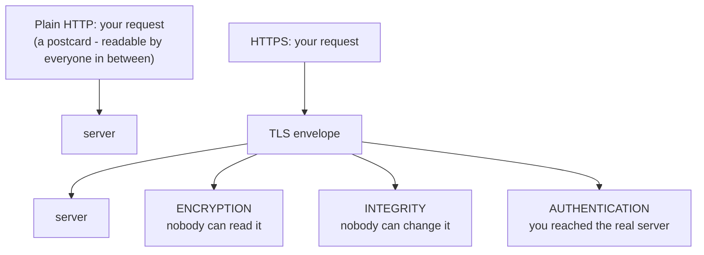

# What HTTPS Protects (and Doesn't)

Picture sending a postcard through the mail. Anyone who handles it - the mail carrier, the sorting office, a nosy neighbor - can read every word, and a determined one could erase a line and write their own before passing it along. Plain **HTTP** is that postcard: every page you load, every password you type, every form you submit travels as readable text through a dozen machines you don't control - your router, your internet provider, the coffee-shop Wi-Fi, the backbone routers in between.

**HTTPS** is the same postcard, sealed in an opaque, tamper-evident envelope that only you and the intended recipient can open - and stamped in a way that proves who sealed it. The "S" stands for *secure*, and the security comes from a layer underneath called **TLS**. Let's make that concrete, because the whole guide rests on it.

📝 **TLS** (Transport Layer Security) is the protocol that does the actual securing. You'll also hear **SSL** - that's TLS's older name. SSL itself is obsolete and broken, but the word stuck around in habits and product names ("SSL certificate"). When someone says SSL today, they almost always mean TLS. We'll say TLS.

## The three things TLS actually gives you

HTTPS is just HTTP carried inside a TLS-protected connection. TLS adds exactly three guarantees. Hold onto these three words - *encryption, integrity, authentication* - and most of HTTPS follows.

### 1. Encryption - eavesdroppers can't read it

**What it actually is.** The data is scrambled before it leaves your machine and only unscrambled at the other end. Anyone in the middle sees gibberish.

**What it does in real life.** On open coffee-shop Wi-Fi, the person two tables over running a packet sniffer can see *that* you're talking to your bank (the destination address isn't hidden), but not your username, password, or balance. With plain HTTP, they'd see all of it in clear text.

### 2. Integrity - nobody can tamper with it undetected

**What it actually is.** Each chunk of data carries a cryptographic seal. If even one byte is altered in transit, the seal no longer matches and the receiver rejects the message.

**What it does in real life.** A malicious Wi-Fi hotspot can't silently inject ads into the page you're reading, swap a download link for malware, or flip a "transfer $10" into "transfer $10,000." Any tampering breaks the seal, and your browser refuses the data rather than showing you something forged.

### 3. Authentication - you're talking to the real server

**What it actually is.** Before any data flows, the server proves it controls the domain you asked for, using a **certificate** (Phase 3). Your browser checks that proof.

**What it does in real life.** When you type `yourbank.com`, you can be confident the encrypted tunnel actually terminates at the real `yourbank.com` and not at an impostor who hijacked your connection. Without this, encryption alone would be useless - you might be perfectly, securely talking to a thief.

💡 **The key point:** encryption without authentication is a sealed envelope handed to a stranger. Authentication is what makes sure the envelope reaches the right hands. TLS does both, and that pairing is the whole point.

## The mental model - and the dangerous misread

Here is the single most important sentence in this guide:

> The padlock means **"this connection is encrypted, and the other end is whoever the certificate is for."** It does **not** mean "this website is safe, honest, or run by good people."

⚠️ **The gotcha that gets people phished.** A scammer can register `paypaI-login.com` (that's a capital *I* dressed up to look like an *l*), get a free, perfectly valid certificate for it in minutes, and serve their fake login page over HTTPS. Your browser shows a padlock. Everything *is* encrypted - securely, all the way to the scammer's server. The padlock is telling the literal truth: your connection to this site is private. It has no opinion whatsoever about whether the site itself deserves your password.

This is why the old advice "look for the padlock to know it's safe" is not just incomplete - it's actively dangerous. The padlock answers "is this conversation private and reaching the named server?" It does not answer "is this the server I *meant*?" That second question is on you: read the actual domain name, character by character.

**Why people get this wrong.** Browsers used to show a big green bar with the company's legal name for expensive "Extended Validation" certificates, training a generation to equate the padlock with legitimacy. Browsers have since dropped most of that fanfare precisely because it gave false confidence - today, a padlock is the baseline for *every* site, good and bad.

🪖 **War story.** A teammate once approved a vendor invoice from a site that had a padlock and looked exactly like the vendor's portal - same logo, same layout. The domain was off by one hyphen. The padlock was real; the site was not. Encryption did its job flawlessly: it privately and reliably delivered his credentials to the attacker. The lesson stuck: *the padlock protects the pipe, not the destination.*

## What HTTPS does NOT do

To round out the model, here's what the padlock stays silent about:

- **It doesn't vouch for the site's honesty.** Covered above. Read the domain.
- **It doesn't hide *who* you're talking to.** Observers can still see the destination domain and IP, just not the content. HTTPS gives you privacy of *contents*, not invisibility.
- **It doesn't protect data once it arrives.** TLS guards data *in transit*. Once it lands on the server, how that server stores and handles it is a separate problem entirely.
- **It doesn't fix a compromised endpoint.** If malware is running on your laptop, it reads your data before TLS ever encrypts it. TLS protects the wire, not the machines at each end.

## Why this saves you later

Once the model is right, two things get easier. You'll never be fooled by a padlock on a phishing page again - you'll instinctively read the domain instead. And when you build something, you'll know HTTPS is table stakes (it protects credentials and session tokens in transit - see [Authentication vs. Authorization](/guides/auth-vs-authz)) but *not* the finish line: you still owe your users honest behavior and safe storage on the server side.

## Recap

1. Plain HTTP is a postcard - readable and editable by everyone in the path.
2. TLS wraps HTTP in three guarantees: **encryption** (can't read it), **integrity** (can't tamper undetected), **authentication** (you reached the real server).
3. SSL is the old, broken name for TLS; "SSL certificate" really means a TLS certificate.
4. The padlock means *encrypted to whoever holds the certificate* - **not** *this site is safe or honest*.
5. A scammer can get a valid padlock for a lookalike domain in minutes. Read the domain name yourself.
6. HTTPS protects data **in transit only** - not the servers at the ends, not your own compromised laptop.

---

[← Guide overview](_guide.md) · [Phase 2: The Handshake & Keys →](02-the-handshake-and-keys.md)
