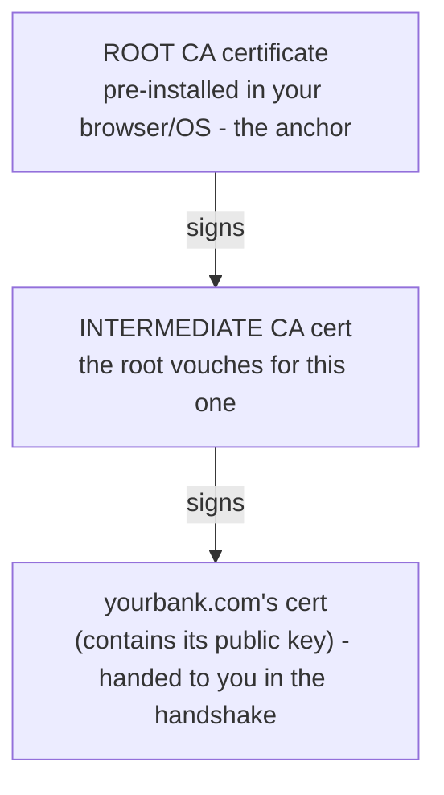

# Certificates & Trust

Phase 2 left one promise unkept. During the handshake, the server hands you a **certificate** containing its public key - and you're supposed to *verify* it before trusting anything. But verify against what? If a stranger hands you an ID badge, how do you know it isn't forged? You can't just take their word for it - that's the whole problem we're trying to solve.

This phase answers that: what a certificate is, who signs it, why your browser believes that signature, and exactly what each error means - so the next warning is information, not a panic.

## When a warning appears: the calm cheat-card

People reach this page while staring at a red error, so here's the quick reference first - explanations underneath.

| What the warning says | What it actually means | Calm response |
|---|---|---|
| **Certificate expired** | The cert was valid but its date passed; nobody renewed it in time. | Usually an ops mistake - but you can't tell expired from a stale attack, so don't enter anything sensitive. Wait, or contact them. |
| **Name mismatch** (`NET::ERR_CERT_COMMON_NAME_INVALID`) | The cert is valid but for a *different* domain than the one in your address bar. | Treat as untrusted. Often a misconfiguration, but also exactly what an interception looks like. |
| **Self-signed / unknown issuer** | The cert wasn't signed by a CA your browser trusts - the server vouched for itself. | Fine on your own dev machine. **Never** click through on a public site you didn't set up. |
| **Revoked** | The CA has officially cancelled this cert (often after a key compromise). | Do not proceed - a strong signal something is wrong. |

⚠️ **The one rule that matters:** On a real site - your bank, your email, your company's tools - **do not click through a certificate warning.** The warning is your browser saying "I cannot prove this is who it claims to be" - precisely the moment an attacker needs you to ignore it. The "Advanced → proceed anyway" link is for developers testing their own servers, not for getting past your bank's broken cert.

## What a certificate actually is

**What it actually is.** A certificate is a small file that makes one core claim and backs it with a signature:

> "The public key inside this file belongs to the owner of `yourbank.com`." - signed, a Certificate Authority.

It bundles together: the **domain name(s)** it's valid for, the server's **public key** (from Phase 2's handshake), a **validity period** (not-before/not-after dates), the **issuer**, and the CA's **digital signature** over all of that.

**Why people get this wrong.** It's tempting to think the certificate *is* the encryption, or some kind of license proving the site is legitimate. It's neither - a certificate does exactly one job: tie a *public key* to a *domain name*, with a trusted third party's signature as proof. (Recall Phase 1: this is why the padlock can't vouch for trustworthiness - the cert only ever claimed "this key belongs to this domain.")

## The chain of trust - why your browser believes the signature

The certificate is signed by a CA. But that's the same puzzle one level up: why trust the CA's signature? The answer is a deliberate, finite chain.

📝 A **Certificate Authority (CA)** is an organization whose business is verifying that whoever asks for a cert for `yourbank.com` actually controls `yourbank.com`, then signing a certificate to that effect. Examples: Let's Encrypt, DigiCert, Sectigo.

The trust is anchored by a short list your browser and OS ship with - the **root store**, a few hundred CA certificates the vendors have vetted:



*What just happened:* Your browser follows the chain upward. The server's cert was signed by an intermediate CA; the intermediate was signed by a root; and the root is one your browser *already* trusts because it shipped with it. If every link checks out and the chain ends at a trusted root, the browser accepts the certificate and the padlock appears. If the chain breaks anywhere - a signature doesn't verify, or it ends at a root nobody trusts - you get a warning. You don't have to trust the website; you only have to trust the handful of roots.

💡 **The key point:** you don't verify the world - you trust a small, vetted set of root CAs, and they extend that trust downward through signatures. That's the entire "chain of trust."

## Let's Encrypt - why HTTPS is everywhere now

For years, certificates cost money and took manual paperwork, so plenty of small sites stayed on plain HTTP. **Let's Encrypt**, a nonprofit CA launched to change that, issues certificates **free** and **automatically** over a protocol called ACME - a program on your server proves it controls the domain and gets a cert, no human in the loop.

**What it does in real life.** A tool like `certbot` requests, installs, and renews your certificate on a schedule:

```console
$ sudo certbot --nginx -d example.com
Requesting a certificate for example.com
Successfully received certificate.
Certificate is saved at: /etc/letsencrypt/live/example.com/fullchain.pem
This certificate expires on 2026-09-17.
Certbot has set up a scheduled task to automatically renew this certificate.
```

*What just happened:* certbot proved to Let's Encrypt that this server controls `example.com`, received a signed certificate valid for about 90 days, installed it, and - crucially - set up automatic renewal. The short lifetime is on purpose: if a key is ever compromised, the damage window is small. The automation is what makes a 90-day cert practical instead of a chore.

⚠️ **The gotcha: renew before expiry.** Let's Encrypt certs are short-lived *by design*. If automatic renewal silently breaks (a permissions change, a moved file, a firewall rule), the cert expires and **every visitor hits a full-page "certificate expired" warning**. This is one of the most common self-inflicted outages on the web - monitor your expiry dates; don't assume "set up auto-renew" means "never think about it again."

## Reading the errors calmly

Now the cheat-card makes sense: each error is the chain-of-trust check failing in a specific way. **Expired** means a validity date failed. **Name mismatch** means the domain binding - the *core* claim of a certificate (Phase 1) - doesn't match your address bar. **Self-signed/unknown issuer** means the chain never reaches a trusted root. None of these are things you can safely reason past on a real site; treat every one as "don't trust this connection."

🪖 **War story.** A team shipped a new subdomain, `api.theircompany.com`, but pointed it at a load balancer still serving the certificate for `www.theircompany.com`. Every API call failed with a name mismatch - nothing was hacked, the cert just didn't cover the new name. Reading the error *as information*, not a panic, is what turns a 2am page from dread into a checklist.

## Recap

1. A **certificate** binds a *domain name* to a *public key*, signed by a CA - not encryption, not a seal of legitimacy.
2. Your browser trusts a small **root store** of CAs; they sign **intermediates**, which sign site certs. Following that **chain of trust** to a known root is what makes the padlock appear.
3. **Let's Encrypt** made certs free and automatic (via ACME/`certbot`), which is why nearly everything is HTTPS now - its certs are short-lived on purpose.
4. **Renew before expiry** - broken auto-renewal causes a full-page expiry warning for every visitor, a common, avoidable outage.
5. Read errors as facts: **expired** = stale dates, **name mismatch** = wrong domain, **self-signed/unknown issuer** = chain doesn't reach a trusted root.
6. **Never click through a certificate warning on a real site** - that's exactly what an attacker needs you to ignore.

---

[← Phase 2: The Handshake & Keys](02-the-handshake-and-keys.md) · [Guide overview →](_guide.md)
