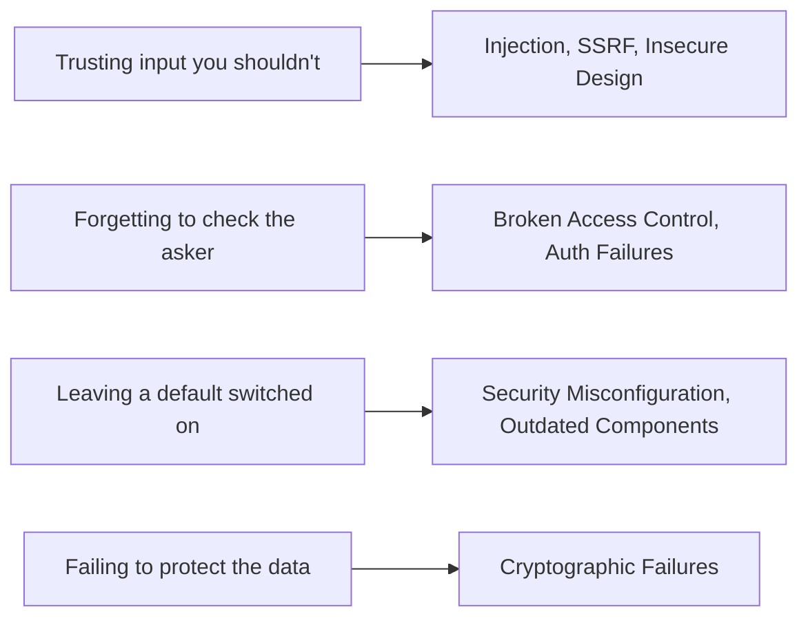

# The Big Categories, in Plain English

Now the payoff. These are the families you'll keep meeting for the rest of your career, and once you can describe each in a sentence, the whole list stops being intimidating. The good news is that almost every category comes down to one of a few human mistakes: *trusting input you shouldn't, forgetting to check who's asking, or leaving a default switched on.*

Skim the table first to get the shape, then read the notes underneath for the ones worth a little more.

> 💡 These are the recurring headings from the most recent published list at the time of writing. Names and ordering shift between editions - see [owasp.org](https://owasp.org) for the current version. We're not numbering them here on purpose, so you don't memorize an ordering that changes.

## The scannable table

| Category | What it is, in one line | The fix, in one line |
|---|---|---|
| **Broken Access Control** | A logged-in user can reach data or actions that aren't theirs (e.g. change `/orders/123` to `/orders/124` and see someone else's order). | Check *who's allowed* on the **server** for every request - never trust the client or a hidden field. |
| **Cryptographic Failures** | Sensitive data is left readable - not encrypted, weakly hashed, or sent in the clear. | Encrypt data in transit (HTTPS) and at rest; hash passwords with a strong, slow algorithm; don't roll your own crypto. |
| **Injection** | Untrusted input is fed straight into a query or command, so the attacker's text becomes part of your code (SQL injection, command injection, XSS). | Use parameterized queries and proper output encoding; never build commands by gluing strings together. |
| **Insecure Design** | The *design* is flawed before a line is written - a missing rate limit, a "recover password by guessing a 4-digit code" flow. | Threat-model early; design the security controls in, don't bolt them on after. |
| **Security Misconfiguration** | The software is fine but set up wrong - default passwords left on, debug mode in production, an open admin panel. | Harden defaults, turn off what you don't use, and keep environments configured the same way deliberately. |
| **Vulnerable & Outdated Components** | A library or dependency you pulled in has a known hole - and you never updated it. | Track your dependencies, patch promptly, and remove what you don't need. |
| **Identification & Authentication Failures** | The "who are you?" step is weak - guessable passwords, no protection against brute force, broken session handling. | Strong password rules, multi-factor auth, rate-limited logins, and safe session management. |
| **Server-Side Request Forgery (SSRF)** | Your server can be tricked into making requests *on the attacker's behalf* - fetching a URL they control, reaching internal systems they can't. | Validate and allow-list outbound URLs; don't let user input decide what your server connects to. |

That table is genuinely enough to follow most security conversations. The notes below add the mental model for the few that bite hardest.

## Broken Access Control - "are you allowed to do that?"

**What it actually is.** Two questions get confused constantly: *who are you?* (authentication) and *what are you allowed to do?* (authorization). Broken Access Control is the second one failing - you're correctly logged in, but the app lets you do something you shouldn't.

**A real example.**
```console
$ curl https://shop.example.com/api/orders/1042 -H "Authorization: Bearer <my-token>"
{"order_id":1042,"customer":"someone.else@example.com","total":"$240.00","items":[...]}
```
*What just happened:* You're logged in as yourself, but order `1042` belongs to a different customer. The server checked that you're *a* valid user, but never checked that you're the user who *owns this order*. Change the number, see somebody else's data. This is one of the most common and damaging categories precisely because it's so easy to leave the second check out.

**The gotcha.** Hiding a button in the UI is not access control. The attacker isn't using your UI - they're sending raw requests with `curl`. Every authorization decision has to happen on the **server**, on every request, no exceptions.

> ⏭️ The full "who are you vs. what can you do" distinction has its own home: [authentication vs. authorization](/guides/auth-vs-authz).

## Injection - "your input became my code"

**What it actually is.** Injection happens when data the user supplied gets treated as *instructions* instead of *content*. You meant their input to be a search term; the database read it as a command.

**A real example.**
```text
   Your code:    "SELECT * FROM users WHERE name = '"  +  input  +  "'"

   Normal:       input = "alice"
                 → SELECT * FROM users WHERE name = 'alice'

   Attack:       input = "' OR '1'='1"
                 → SELECT * FROM users WHERE name = '' OR '1'='1'
                                                        └─ always true → returns everyone
```
*What just happened:* By gluing user input directly into the query string, you let the attacker close your quote and add their own logic. `'1'='1'` is always true, so the query returns every row. The fix - **parameterized queries** - sends the input as a separate value the database always treats as data, never as SQL. Cross-site scripting (XSS) is the same idea aimed at the browser: untrusted input becomes executable HTML/JavaScript on the page.

> ⏭️ Both SQL injection and XSS get the full walkthrough in [SQL injection and XSS](/guides/sql-injection-and-xss).

## SSRF - "make my server do your bidding"

**What it actually is.** Server-Side Request Forgery is when your server fetches a URL, and the attacker controls that URL. They can't reach your internal network - but your server can, so they use *your server* as a proxy to poke at things they're not supposed to see (internal admin panels, cloud metadata endpoints, databases behind your firewall).

**The gotcha.** It looks innocent: a feature that fetches a user-supplied image URL, or a webhook that calls back to an address the user typed. The moment user input decides where your server connects, you have a potential SSRF. Allow-list the destinations; don't let arbitrary input steer outbound requests. SSRF is a good example of the list evolving - it earned its own top-level entry as cloud architectures made it far more dangerous than it used to be.

## The pattern underneath all of them

Step back and you'll see most of these rhyme:



You don't have to memorize ten unrelated facts. You have to internalize a few habits of suspicion - and the Top 10 is the checklist that reminds you which suspicions to have *where*.

## Recap

1. Most categories reduce to a few human mistakes: **trusting input**, **skipping the "are you allowed?" check**, or **leaving defaults on**.
2. **Broken Access Control** = you're logged in but reach things that aren't yours; check authorization on the server, every request.
3. **Injection** = user input becomes code; use parameterized queries and output encoding.
4. **SSRF** = your server is tricked into making requests for the attacker; allow-list outbound destinations.
5. The full table covers the rest - and the deeper dives live in linked guides on [injection/XSS](/guides/sql-injection-and-xss) and [auth vs. authz](/guides/auth-vs-authz).

---

[← Guide overview](_guide.md) · [Phase 3: How to Actually Use It →](03-how-to-use-it.md)
