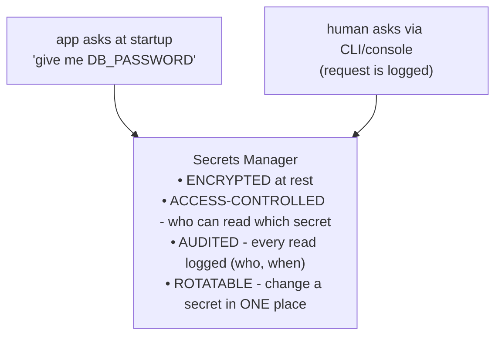
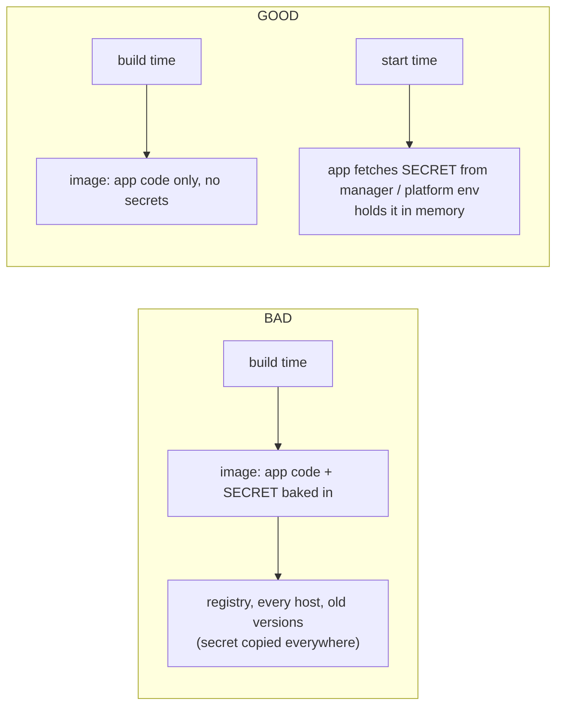

# Real Secrets Management

A `.env` file on your laptop is fine for one developer. But picture a team of twelve, three environments, and forty services that each need a key. Who has the production database password? How do you change it everywhere when someone leaves? How do you know who *read* it last week? `.env` files copied around in chat don't answer any of those questions - and on a real system, those questions are the whole job. This phase is how grown-up teams handle it. The relief here is structural: instead of secrets scattered across laptops, they live in one guarded place that knows who touched what.

But first, because you might be reading this *while a key is loose*, the cheat-card.

## The leaked-secret cheat-card

> **A secret got out. Stay calm and go in this order: revoke, rotate, audit. Speed beats perfection - kill the key first, investigate after.**

| Step | What you do | Why it's in this order |
|---|---|---|
| **1. Revoke** | Go to the service and **disable/delete the leaked key immediately.** | A dead key can't be abused while you figure out the rest. This is the lock change - do it first, before anything else. |
| **2. Rotate** | Issue a **new** key, put it in your secrets store, and redeploy so the app uses it. | Restores service on a clean credential. The old value is now worthless no matter who has it. |
| **3. Audit** | Check the service's **logs / access history** for use you didn't make, and find *how* it leaked so it can't recur. | Tells you whether damage was done, and closes the hole (a bad `.gitignore`, a logged header, a shared screenshot). |

Three more notes for the moment of panic: **assume it was seen** (don't gamble that nobody noticed - bots are fast, per Phase 1); **don't try to scrub Git history first** (revoking the key makes the leaked copy harmless instantly, which history-rewriting never can - see [Git Disaster Recovery](/guides/git-disaster-recovery)); and **tell your team** so nobody is surprised by the rotation or the new charges. Now, the system that makes all of this routine instead of frightening.

## A secrets manager: one guarded place

**What it actually is.** A **secrets manager** (or **vault**) is a dedicated service whose entire job is to hold secrets safely and hand them out carefully. Instead of secrets living in files on developer laptops and in environment variables typed into a dashboard, they live in one central system that does four things a flat file can't:

📝 **Terminology.** The category includes self-hosted **HashiCorp Vault** and the managed cloud offerings - **AWS Secrets Manager**, **Google Secret Manager**, **Azure Key Vault**. They differ in features and where they run, but the core promise is the same: encrypted central storage, fine-grained access control, an audit trail, and a single place to rotate.

**Why this beats `.env` for teams.** Every property maps to a question `.env` couldn't answer. *Who has the prod password?* → access control says exactly who can read it. *Did anyone use it suspiciously?* → the audit log shows every read. *How do I change it everywhere?* → rotate it once in the manager and every app picks up the new value. The secret stops being a thing you copy and starts being a thing you *request*.

## Inject at runtime - don't bake secrets into the image

**What it actually is.** **Runtime injection** means your application receives its secrets *when it starts up*, fetched fresh from the secrets manager (or set as environment variables by the platform), rather than having them written into the build.

**Why people get this wrong.** A tempting shortcut, especially with containers, is to copy the `.env` file or hardcode a key into the **Docker image** during the build so "it's all in one place." Don't. A built image is an artifact that gets pushed to a registry, pulled to many machines, and often kept around in old versions. A secret baked into it is now a secret copied into every layer, every pull, and every cached version of that image - the Phase 1 problem all over again, just in a different file format.

The image stays clean and shareable; the secret only ever lives in memory on the running machine, supplied at the last moment by something access-controlled and audited. Same code, but the secret never gets frozen into an artifact.

## Least privilege: a key should open one door

⚠️ **Gotcha - over-powered keys turn a small leak into a big one.** **Least privilege** means each key is granted *only* the permissions it actually needs, nothing more. The reporting service that only ever reads should get a **read-only** key - not an admin key that can also delete. A webhook handler that only writes to one table shouldn't hold credentials for the whole database.

The reason is blast radius. Possession is permission (Phase 1), so the damage a leaked key can do is exactly the set of permissions you gave it. A leaked read-only analytics key is an annoyance; a leaked god-mode admin key is a catastrophe. Scoping every key down means that *when* one leaks - and over enough time, one will - the worst case is small. You're not preventing the leak with least privilege; you're capping what it can cost.

## Rotation: assume every secret will eventually leak

Here's the mindset shift that separates anxious teams from calm ones. Don't treat a leak as a rare failure to be horrified by. Treat it as **inevitable over a long enough timeline**, and build so that handling it is routine.

**What it actually is.** **Rotation** is replacing a secret with a fresh one on a regular cadence (and immediately on any suspected leak). If a key is changed every ninety days regardless, then any copy an attacker quietly grabbed has a limited shelf life, and the *process* of changing it is something your team does often enough to be boring rather than terrifying.

💡 **Key point.** A team that has never rotated a secret will rotate slowly and nervously the day they're forced to - exactly when they can least afford to fumble. A team that rotates on a schedule treats an emergency rotation as "the Tuesday thing, done early." Rotation isn't only about shrinking the window an old key is useful; it's about *practicing the move so the emergency version is muscle memory.* Many secrets managers can even rotate certain credentials automatically. Make rotation routine, and the cheat-card at the top of this phase becomes a procedure you've run a dozen times, not a crisis you've never rehearsed.

**Why this saves you later.** Put the pieces together and a leak stops being a disaster. The key was **least-privileged**, so it couldn't do much. It was in a **secrets manager**, so you revoke and rotate it in one place and the **audit log** tells you if it was used. It was **injected at runtime**, so it isn't frozen into a dozen images you'd have to rebuild. And because you **rotate routinely**, the response is a familiar drill. That's the entire goal of this guide: not to make leaks impossible - nobody can - but to make them survivable and dull.

## Recap

1. **Leaked-secret response is revoke → rotate → audit**, in that order. Kill the key first; investigate after.
2. A **secrets manager** (Vault, AWS Secrets Manager, Google Secret Manager, Azure Key Vault) stores secrets centrally - **encrypted, access-controlled, and audited** - and lets you rotate in one place.
3. **Inject secrets at runtime**, fetched at startup; never bake them into a built image, where they get copied everywhere.
4. ⚠️ Apply **least privilege** to every key so a leak's blast radius stays small - read-only where read-only is all that's needed.
5. **Rotate routinely.** Assume any secret will eventually leak; regular rotation limits an old key's life and turns emergency rotation into a rehearsed, boring move.

---

## That's the whole skill

Look back at where you started: a hardcoded key and a sinking feeling. Now you can name what a secret is and why it matters, you keep keys out of your code and out of Git with a pattern you'll use on every project, you know that a committed secret means *rotate, not delete*, and you understand how teams store, scope, inject, and rotate secrets so that a leak is a contained, recoverable event. The fear that this topic starts as - the surprise bill, the security email - comes from not knowing where keys are supposed to live and what to do when one slips. Now you know both. Treat every secret like a house key, and you'll sleep fine.

---

[← Phase 2: Keep Them Out of Code](02-keep-them-out-of-code.md) · [Guide overview](_guide.md)
