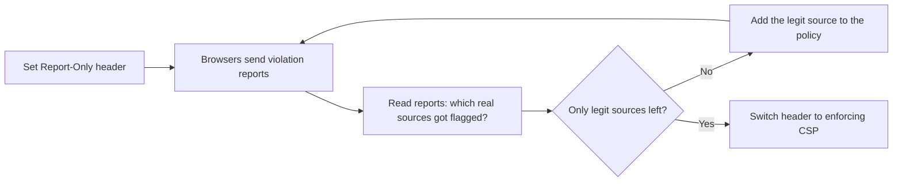

# Rolling Out CSP Without Breaking the Site

Content-Security-Policy is the most powerful header in this guide and the one most likely to break your own site if you slap it on blind. That's why it gets its own phase. The payoff is worth the care: a good CSP means that even when an XSS bug slips into your code, the injected script may never be allowed to run. We'll build the policy from a mental model, deploy it in a mode that *can't* break anything, read what it reports, and only then turn on enforcement.

## What CSP actually does

Reframe it like this: by default a browser will load a script, a stylesheet, an image, a font from *anywhere* a page tells it to. CSP flips that to **deny-by-default** and makes you list the sources you actually trust.

So when an attacker injects `<script src="https://evil.example/steal.js">` through an XSS bug, the browser checks your policy, sees `evil.example` isn't on the allow-list, and refuses to load it. The bug is still in your code - but the exploit can't pull off the part that does the damage. CSP doesn't prevent injection; it strips injection of its power.

```text
content-security-policy: default-src 'self'; script-src 'self' https://cdn.example.com; img-src 'self' data:; object-src 'none'; frame-ancestors 'none'
```
*What just happened:* read it as a list of rules separated by `;`. `default-src 'self'` is the fallback: load everything only from your own origin. Then specific overrides - scripts may also come from `cdn.example.com`, images may also be inline `data:` URIs, `object-src 'none'` kills legacy plugins entirely, and `frame-ancestors 'none'` is the clickjacking defense from Phase 2 living in its natural home. Anything not listed is blocked.

💡 **The directive you care about most is `script-src`.** That's the one standing between an XSS injection and a running exploit. `default-src` is the safety net for everything you didn't name explicitly.

## Why `'unsafe-inline'` defeats the point

Here's the trap. Most real sites have inline scripts - `<script>doStuff()</script>` right in the HTML, or `onclick="..."` attributes. A strict CSP blocks those, your site breaks, and the tempting fix is to add `'unsafe-inline'` to `script-src`.

⚠️ **`'unsafe-inline'` undoes most of CSP's XSS protection.** XSS *is* injected inline script. Allowing all inline script allows the attacker's inline script too. You've kept the header and thrown away the protection. If you only do one thing right with CSP, it's this: don't reach for `'unsafe-inline'` to make the errors go away.

The real fix is a **nonce** - a random value you generate per request, put on your legitimate inline scripts, and name in the header. The attacker, injecting blind, can't guess it.

```text
content-security-policy: script-src 'self' 'nonce-r4nd0mPerRequest'
```
```html
<script nonce="r4nd0mPerRequest">doStuff()</script>   <!-- runs: nonce matches -->
<script>stealCookies()</script>                        <!-- blocked: no nonce -->
```
*What just happened:* the browser runs only inline scripts whose `nonce` attribute matches the one in the header. Your own scripts get the per-request value stamped on them by your server; an injected script can't, because the attacker never sees that request's random value. Inline scripts work, XSS injection still dies.

## The safe way to deploy: report-only first

You will not get the policy right on the first try. Real sites pull from analytics scripts, embedded fonts, a CDN, a payment widget - and you'll forget half of them. Turn on enforcement blind and you'll black out parts of your own site for real users.

So you start with the twin header that **reports but never blocks**:

```text
content-security-policy-report-only: default-src 'self'; report-uri /csp-reports
```
*What just happened:* `Content-Security-Policy-Report-Only` runs your policy in observe mode. Nothing is blocked - the page works exactly as before - but every time something *would* have been blocked, the browser POSTs a JSON report to the `report-uri` you named. You collect those reports, see every legitimate source you forgot, and add them. You're tuning the policy against real traffic with zero risk to users.



A violation report looks roughly like this:

```text
{
  "csp-report": {
    "document-uri": "https://example.com/checkout",
    "violated-directive": "script-src",
    "blocked-uri": "https://analytics.example.net/tag.js"
  }
}
```
*What just happened:* the browser is telling you that on `/checkout`, your `script-src` would have blocked the analytics tag from `analytics.example.net`. That's a *legitimate* source you forgot - so you add `https://analytics.example.net` to `script-src`. Do this until the only violations left are things you actually *want* blocked (or none at all). Then, and only then, rename the header from `...-Report-Only` to `Content-Security-Policy` and it starts enforcing.

💡 **Keep `report-uri` even after you enforce.** Once live, those reports become an alarm: a sudden spike in violations can be the first sign of an attempted XSS attack hitting your policy - exactly the thing CSP exists to stop, now telling you it's working.

## A realistic rollout order

```text
1. Ship  frame-ancestors 'none'  alone        → safe, instant clickjacking win
2. Add   Content-Security-Policy-Report-Only   → observe, break nothing
3. Read reports for a week, add real sources   → tune against real traffic
4. Replace inline scripts with nonces          → so you never need 'unsafe-inline'
5. Flip Report-Only → enforcing                → protection is now live
6. Keep report-uri on                          → ongoing alarm
```
*What just happened:* this sequence gets you a hard clickjacking win on day one, then lets you build the script policy gradually with a safety net the whole way. The order matters - flipping to enforcing (step 5) is the last thing you do, after the reports have gone quiet.

CSP is one of the controls behind the injection and misconfiguration entries on the [OWASP Top 10](/guides/owasp-top-10), and its `connect-src` directive interacts with the cross-origin rules in [CORS, Explained](/guides/cors-explained) - CSP decides which origins your page may *connect to*, CORS decides which origins may *read your responses*.

**For builders:** generate the nonce in the same middleware that sets the header, expose it to your templating layer, and stamp it on every inline `<script>` you control. One source of truth for the nonce per request - don't hand-roll it in two places.

## Recap

1. CSP flips loading to **deny-by-default** and makes you allow-list trusted sources; an injected script from an unlisted origin won't run.
2. **`'unsafe-inline'` throws away most of the XSS protection** - use a per-request **nonce** for your legitimate inline scripts instead.
3. **Deploy with `Content-Security-Policy-Report-Only` first** so nothing breaks while you collect violation reports and discover the sources you forgot.
4. Tune until only unwanted things are flagged, **then flip to enforcing** - and keep `report-uri` on as a live alarm.

```quiz
[
  {
    "q": "Why does adding 'unsafe-inline' to script-src undermine CSP's main benefit?",
    "choices": ["It slows the page down", "XSS is injected inline script, so allowing all inline script allows the attacker's too", "It disables HSTS", "It only works in old browsers"],
    "answer": 1,
    "explain": "CSP's core XSS defense is blocking injected inline script. 'unsafe-inline' re-permits exactly that, including the attacker's payload."
  },
  {
    "q": "What does Content-Security-Policy-Report-Only do that the enforcing header does not?",
    "choices": ["It blocks more aggressively", "It encrypts the response", "It reports what would be blocked without actually blocking anything", "It only applies to images"],
    "answer": 2,
    "explain": "Report-Only runs the policy in observe mode: nothing is blocked, but violations are reported, so you can tune the policy safely before enforcing."
  },
  {
    "q": "How does a nonce let your legitimate inline scripts run while still blocking injected ones?",
    "choices": ["It encrypts each script", "Your server stamps a per-request random value on real scripts and names it in the header; an injected script can't guess it", "It allows all scripts from your origin", "It disables script-src for inline code"],
    "answer": 1,
    "explain": "Only inline scripts whose nonce matches the header value run. The attacker, injecting blind, never sees that request's random nonce."
  }
]
```

[← Phase 2: The Everyday Hardening Set](02-the-everyday-set.md) · [Guide overview](_guide.md)
