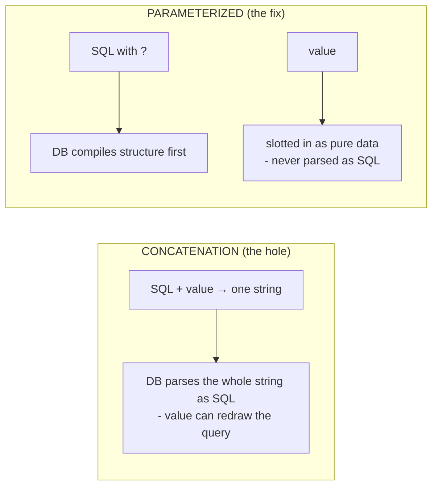

# SQL Injection

Here is the first interpreter from Phase 1: your database. It speaks SQL, and SQL is *code* - `SELECT`,
`WHERE`, `DROP` are all instructions it executes. SQL injection is what happens when user input meant as a
*value* in a query gets read as more of that code.

You already know the cause (gluing input into a string) and the cure (keep data as data) from Phase 1. This
phase makes both concrete: watch a normal query turn into a different one, see what that hands an attacker,
then build the query the right way.

> ⏭️ Shaky on what a `SELECT ... WHERE` query is or how `WHERE` filters rows? A quick read of
> [Querying Basics: SELECT & WHERE](/guides/querying-basics-select-where) will make this phase land harder.

## How a query loses control of its own meaning

Picture a login form. The app takes the username someone typed and looks them up. The tempting way to write
that is to build the SQL string by concatenation:

```text
   query = "SELECT * FROM users WHERE username = '" + input + "'"
            └──────────── your code ───────────────┘  └input┘ └┘
                                                       glued straight in
```

Type the username `alice` and you get exactly the query you intended:

```sql
SELECT * FROM users WHERE username = 'alice'
```

*What just happened:* The database sees `'alice'` as a text value inside the quotes, compares it against the
`username` column, and returns Alice's row - working as designed, because the input behaved like plain data.

Now an attacker types a single quote instead of a username - the exact character that *ends a text value in
SQL*:

```sql
SELECT * FROM users WHERE username = '' OR '1'='1'
```

*What just happened:* The leading `'` closed your `username` string early. Everything after it -
`OR '1'='1'` - landed *outside* the quotes, so the database read it as **more SQL**. And `'1'='1'` is always
true, so `WHERE` now matches *every* row. The query you wrote to fetch one user just returned the whole
table - the boundary between your code and their data only ever existed in your head.

⚠️ **Gotcha - the danger isn't the quote character, it's that input reached the parser as code.** Don't
conclude "so I'll just strip out quotes" - that's a blocklist, and blocklists lose: numeric contexts need no
quote at all, databases have different escape/comment syntax, and attackers have decades of tricks for
smuggling the same meaning past a filter. The hole is that the value got parsed as SQL at all. Close *that*,
and you stop playing whack-a-mole forever.

## What this actually costs you

That "always true" trick is the gentle version. In the wild, the same mechanism lets an attacker:

- **Read data they should never see** - other users' rows, password hashes, private records.
- **Change data** - flip their own account to admin, alter balances, rewrite records.
- **Destroy data** - depending on how the app connects, delete a table outright.

This is consistently rated among the most damaging web vulnerabilities because the payoff is your *entire
database*. SQL injection sits inside the **Injection** category of [The OWASP Top 10](/guides/owasp-top-10).

🪖 **War story - "Exploits of a Mom."** The xkcd comic (#327) has a mother name her son
`Robert'); DROP TABLE Students;--`. A school's system glues that name into a SQL statement, the `'` and `)`
close the intended command, `DROP TABLE` runs, and the student records are gone. A joke, but a real bug - the
name was data, and the system let it become code.

## The fix: parameterized queries (a separate channel for values)

The cure is the Phase 1 sentence made literal. Instead of one string mixing your SQL with their value, you
hand the database **two separate things**:

1. The SQL, with a **placeholder** where the value goes (often `?` or `$1` or `:name`).
2. The actual value, passed alongside - separately.

The database compiles the SQL *first*, placeholder standing in for "a value goes here" - the structure is
locked. *Then* it slots the value in as **pure data**, never re-parsing it as SQL. There's no string for the
attacker's quote to break out of, because code and value were never glued together.

📝 **Terminology - parameterized query / prepared statement.** Used interchangeably. A *prepared statement*
is SQL sent with placeholders so the database can plan it once; a *parameterized query* is any query where
values pass through placeholders instead of concatenation. Either way: **SQL and values travel on separate
channels.**



Same login lookup, done right. (Python's `sqlite3` here; every mainstream language and driver has the
identical pattern - only the placeholder character changes.)

```console
>>> username = "' OR '1'='1"          # the exact attack from before
>>> cur.execute(
...     "SELECT * FROM users WHERE username = ?",   # placeholder, not concatenation
...     (username,)                                 # value passed separately
... )
>>> cur.fetchall()
[]
```

*What just happened:* SQL and value traveled on separate channels. The database looked for a user whose
username is *literally the string* `' OR '1'='1` - quotes and all. No such user exists, so it returned
nothing. Nothing was blocked or sanitized; the attack *never had a chance to be code*.

⚠️ **Gotcha - placeholders are for values, not for structure.** Parameters fill in *values* (a username, an
id, a price). You cannot parameterize a table name, a column name, or the `ASC`/`DESC` in an `ORDER BY` -
those are structure, compiled before values arrive. If users must influence structure (say, which column to
sort by), never concatenate raw text - map their choice against an **allowlist** of values you control and
reject anything else.

## ORMs and query builders help - but know what they're doing

An **ORM** (SQLAlchemy, Django's ORM, Prisma, ActiveRecord) or query builder lets you express queries in
your language and parameterizes underneath. Idiomatic ORM code is safe by default.

The catch is the escape hatch: every ORM has a "drop to raw SQL" feature for queries it can't express, and
the moment you use it, you're back to writing SQL by hand - and back on the hook for parameterizing it. Build
that raw string by concatenation and the ORM's protection does nothing for you.

```text
   ORM normal query        →  parameterized for you   ✅ safe
   ORM raw-SQL escape hatch →  YOUR responsibility     ⚠️ parameterize it yourself
```

💡 **Key point.** No exceptions worth remembering: **never assemble SQL by concatenating user input.** Use
parameterized queries everywhere - directly, or via an ORM - and treat the raw-SQL escape hatch as the one
place you must consciously parameterize by hand.

## Recap

1. SQL injection happens when **user input glued into a query string** is read as SQL, changing what the
   query *does*.
2. The classic tell is a value that **closes a quote** and adds clauses like `OR '1'='1'` - but the real
   problem is input reaching the parser as code at all, so **don't rely on filtering characters.**
3. The damage is your whole database: data **read, changed, or destroyed** - the core of the OWASP
   **Injection** risk.
4. **The fix is parameterized queries / prepared statements:** SQL (with placeholders) and values travel on
   **separate channels**, so values are always data, never SQL.
5. **ORMs parameterize for you** on the normal path - the **raw-SQL escape hatch is your responsibility**.
   Placeholders are for *values*; gate structural choices with an **allowlist**.

Same model, second interpreter: now let's hand untrusted input to a *browser* and watch the identical bug
wear its other costume.

Watch it animated: [SQL injection](/explainers/SQLInjection.dc.html)

---

[← Phase 1: The One Bug Underneath Both](01-the-one-bug-underneath-both.md) · [Guide overview](_guide.md) · [Phase 3: Cross-Site Scripting (XSS) →](03-cross-site-scripting.md)
