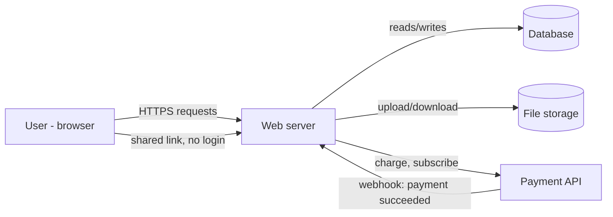

# Drawing the System

Threat modeling starts with a picture, not a checklist. Before you can ask "what could go wrong here," you need to know what "here" is - every component, every path data takes between them, and every point where you stop controlling that data. Skip the picture and you'll threat-model the parts of the system you happen to remember, which is a different exercise from threat-modeling the system.

## The example: a file-sharing app

Say you're building a service where users sign up, upload files, generate shareable links, and can pay for a premium tier with a larger storage quota. Small enough to sketch on one page, with all the pieces that make threat modeling worth doing:

- **Users** - anonymous visitors and logged-in accounts, via a browser.
- **Web server** - your application code: auth, upload handling, link generation, API routes.
- **Database** - user accounts, file metadata, share-link tokens, subscription status.
- **File storage** - the actual uploaded bytes (think S3 or equivalent).
- **Payment API** - a third-party processor (Stripe-shaped) that handles card data and tells you when someone paid.

## The diagram

A data-flow diagram (DFD) needs four symbol types: external entities (people or systems outside your control), processes (code that does something), data stores (where state lives), and arrows (data in motion). Draw it left to right, roughly in the order a request travels:



Nothing here needs special tooling - a whiteboard photo is a legitimate threat-modeling artifact. The point isn't polish, it's forcing every component and every data path into the open, including the ones you'd normally skip past because they're "just" a webhook or "just" a shared link.

Two paths are worth noticing before STRIDE starts. First, the shared-link flow lets a user reach the web server with *no login at all* - that's a distinct path from the authenticated one, with different assumptions. Second, the payment API talks back to you via a webhook, which means an external system gets to trigger state changes (marking an account as paid) inside your system.

## Marking trust boundaries

A trust boundary is any line an arrow crosses where the *level of control* changes - where data stops being something you validated and becomes something you're trusting on faith, or where a different party gains the ability to act. This is the single most useful line you'll draw on the whole diagram, because every STRIDE finding in Phase 2 sits on top of one.

Boundaries in the file-sharing example:

- **Browser to web server.** Everything a user sends - form fields, file contents, filenames, headers - is untrusted until validated. This is the obvious one; everyone marks it.
- **Web server to database.** Lower-trust than it looks. If any upstream input reaches a query unsanitized, the boundary you thought was "internal" was never real.
- **Web server to file storage.** A boundary in two directions: what gets *written* (can a filename or path escape the intended bucket/prefix?) and what gets *served back* (does a browser trust content coming from your storage domain more than it should?).
- **Web server to payment API, and back.** Two separate boundaries, not one. Outbound (you send a charge request) is you trusting a third party with money and data. Inbound (the webhook) is the third party sending *you* a command - "mark this account as paid" - trusting a network request to change account state.
- **The shared-link path.** A quieter boundary: the moment a link leaves an authenticated user's session and becomes a bearer token anyone with the URL can use. Control passes from "we know who this is" to "whoever holds this string."

Notice what marking boundaries does that just listing components doesn't: it turns "the database" from a box into a question - *which* arrows into that box crossed a boundary, and were they validated before they got there? STRIDE in Phase 2 answers that question boundary by boundary, instead of guessing at the whole system in one pass.

One habit worth keeping: redraw the boundaries when the architecture changes. A new admin dashboard, a new internal microservice, a new "trusted" partner integration - each one either sits inside an existing boundary or draws a new one. Assuming it's the former without checking is how internal tools become the least-scrutinized part of a system.

```quiz
[
  {
    "q": "What makes a line on a data-flow diagram a trust boundary?",
    "choices": ["It crosses between two different programming languages", "The level of control over the data changes at that point", "It's any connection to the internet"],
    "answer": 1,
    "explain": "A trust boundary marks where data stops being validated/controlled by you and starts being trusted from another party or unvalidated input - languages and protocols are irrelevant to that."
  },
  {
    "q": "In the file-sharing example, why are the outbound charge request and the inbound payment webhook treated as two separate trust boundaries?",
    "choices": ["Because they use different HTTP methods", "Because outbound is you trusting a third party, while inbound is a third party sending a command that changes your account state", "They aren't separate - it's one boundary counted twice"],
    "answer": 1,
    "explain": "Trust runs in one direction per arrow. Sending data out and accepting a command in are different exposures even between the same two systems."
  },
  {
    "q": "Why redraw trust boundaries when the architecture changes, instead of assuming new components fit inside existing ones?",
    "choices": ["It's required by compliance frameworks", "Diagrams need to stay visually up to date for onboarding", "A new component might introduce a boundary you haven't scrutinized yet, like an internal tool nobody threat-modeled"],
    "answer": 2,
    "explain": "New integrations and internal tools often get treated as automatically trusted just because they're 'internal' - that assumption is exactly what a fresh boundary check catches."
  }
]
```

---

[Guide overview](_guide.md) · [Phase 2: STRIDE, Applied →](02-stride-applied.md)
