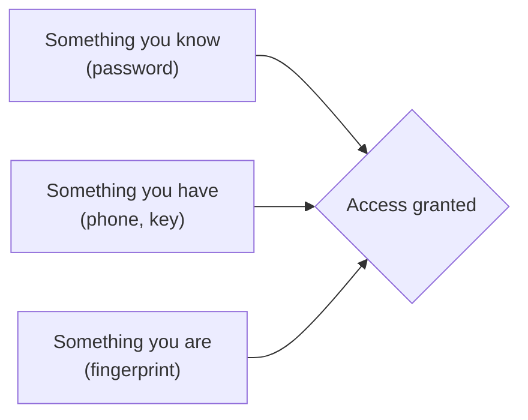

# One Secret Isn't Enough

Think about what a password actually is: a single string of characters that, if anyone else ever learns it, gives them everything you have. That's the whole design. One secret, and whoever holds it gets in — the system has no way to tell you apart from an attacker who happens to know the same string. For most of the internet's history, that was considered good enough. It isn't anymore, and the reasons aren't really about password strength.

## The password isn't the weak point — the secrecy is

A long, random, unique password is genuinely hard to guess. That was never really the problem. The problem is keeping any secret secret across millions of people, thousands of services, and years of time. Three things break that secrecy constantly, none of which have anything to do with how "strong" the password looks:

**Reuse.** Most people use the same handful of passwords across many sites, because remembering forty unique ones isn't realistic. So when one site gets breached, attackers don't just have access to that one site — they have a password they can try on your email, your bank, your work account. This is called **credential stuffing**: taking leaked username/password pairs from one breach and testing them everywhere else, automatically, at massive scale.

**Phishing.** An attacker doesn't need to crack your password if they can trick you into handing it over. A fake login page that looks exactly like your bank's, an urgent email about a "suspicious sign-in," a text that looks like it's from your delivery company — all designed to get you to type your real password into a page you don't control. The password itself was never weak; you handed it over voluntarily, believing you were somewhere safe.

**Breaches.** Companies get hacked. Databases of usernames and passwords leak — sometimes hashed properly, sometimes not, sometimes years before anyone notices. You did nothing wrong and your password was excellent, and it's still sitting in a file on a criminal forum because the company that stored it failed to protect it.

> None of these three break because your password was weak. They break because a password is a single fact, and single facts leak, get guessed, or get handed over by mistake.

## The fix: stop relying on one kind of proof

Two-factor authentication (2FA) — also called multi-factor authentication (MFA) when there are more than two — doesn't try to make secrets leak-proof. It assumes they *will* leak sometimes, and asks for a second, *different kind* of proof before letting anyone in. The security world groups proof into three categories:

- **Something you know** — a password, a PIN, the answer to a security question. Lives in your memory. Can be phished, guessed, or leaked from a breach.
- **Something you have** — your phone, a hardware key, a bank card. A physical object. An attacker across the world can't type in something they don't physically possess.
- **Something you are** — a fingerprint, a face scan. Biometrics. Hard to steal remotely, though not impossible to fake, and unlike a password you can't "reset" it if it's ever compromised.

2FA means combining proof from **two different categories**. A password plus a security question doesn't count — both are "something you know," so anyone who phishes one can probably get the other with the same trick. A password plus a code from your phone counts, because an attacker who steals your password over a phishing email still doesn't have your physical phone sitting in your pocket.

*What this diagram means:* logging in with 2FA means clearing at least two of these gates from two different categories — not two passwords, not two questions, but two genuinely different kinds of proof.

## Why this actually stops real attacks

Walk through the credential-stuffing scenario again, but now with 2FA turned on. An attacker buys a leaked list of email/password pairs from an old breach and runs them against your accounts. Your password is on that list — it's a real match. Without 2FA, that's it, they're in. With 2FA, the login pauses and asks for the second factor: a code from an app, a tap on a hardware key. The attacker doesn't have your phone. They don't have your key. The password being correct stopped being enough.

This is the entire value of 2FA in one sentence: it turns "steal one thing" into "steal two different kinds of things, from two different places, usually at the same time" — and that jump in difficulty is what keeps most opportunistic attackers out, even when your password has already leaked somewhere you don't know about.

2FA doesn't make your account unhackable — a sufficiently motivated, well-resourced attacker who steals your unlocked phone *and* knows your password can still get in. What it does is take you out of the pool of soft targets: the accounts that fall to automated, high-volume attacks that only try the one thing they have. That's most attacks. Phase 2 gets into which second factors resist even the harder, targeted attacks, and which ones are more theater than protection.

[← Overview](_guide.md) | [Phase 2: How the common methods actually work →](02-how-the-methods-work.md)
