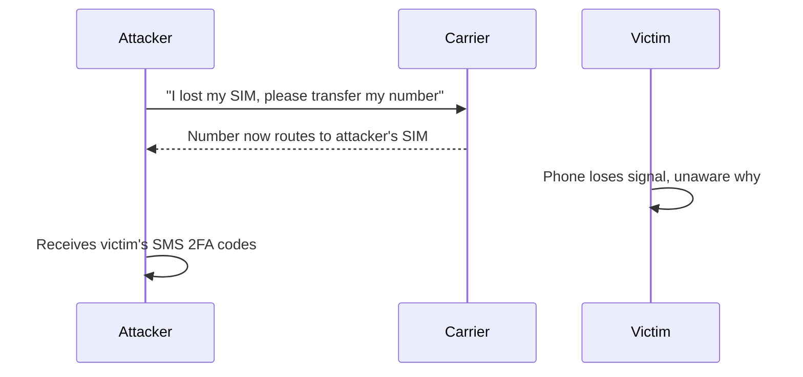
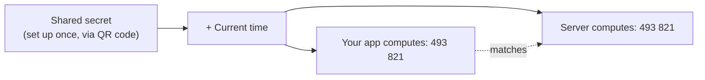
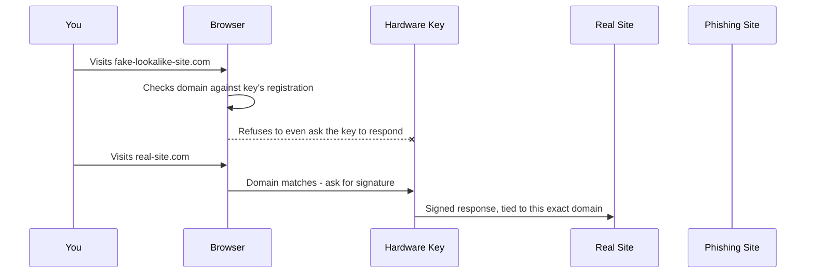

# How the Common Methods Actually Work

Not all "something you have" is created equal. A text message, an app on your phone, and a physical key all satisfy the same 2FA checkbox - but they're built on completely different mechanisms, and those mechanisms determine which real-world attacks each one survives. This is the part most people skip, and it's the part that actually matters when you're deciding what to turn on.

## SMS codes - the familiar one, and the weakest

You log in, the site texts you a six-digit code, you type it in. It feels secure because it involves your phone, a physical object only you should have. The catch is that the code doesn't actually depend on your phone at all - it depends on your **phone number**, and a phone number is a routing address controlled by your carrier, not a secret tied to a specific SIM card in your hand.

That distinction is exactly what **SIM-swap fraud** exploits. An attacker calls your mobile carrier, or bribes/tricks a support rep, and convinces them to move your phone number onto a SIM card the attacker controls - no access to your actual phone required. From that moment, every SMS code meant for you goes straight to the attacker instead. Combined with a leaked password, a SIM swap gives full account takeover, and the victim usually only finds out when their phone suddenly loses signal.



*What this diagram means:* the weak link isn't cryptography, it's a phone company's customer support process. The code itself is never cracked - it's delivered to the wrong device because the routing underneath it got hijacked.

SMS also travels over the carrier network in a way that, in some setups, can be intercepted through other network-level tricks entirely separate from SIM swapping. None of this means SMS 2FA is worthless - it still stops the huge majority of automated credential-stuffing attacks, because most attackers running those at scale aren't going to individually target your phone carrier. But against anyone willing to make a phone call, it's the thinnest of the three options.

## Authenticator apps (TOTP) - no network required

Apps like Google Authenticator, Authy, or 1Password's built-in generator show a six-digit code that changes every 30 seconds. Unlike SMS, nothing gets transmitted to generate that code - it's computed entirely on your device, offline.

Here's the mechanism, conceptually (no need to work through the actual math): when you scan the QR code to set up 2FA, the service and your app agree on a **shared secret** - a long random string neither of you ever transmits again after that one setup moment. From then on, both your app and the service's server independently run the same algorithm on two inputs: that shared secret, and the current time. This is called **TOTP** - Time-based One-Time Password. Because both sides know the secret and both sides have a clock, they arrive at the same six-digit code without ever needing to talk to each other again.



*What this diagram means:* the code your app shows and the code the server expects are calculated separately, from the same two ingredients, and they agree because both sides run the same formula. No code ever travels over SMS or the internet to get generated - only the one-time shared secret did, once, at setup.

This is why TOTP survives SIM swapping entirely: there's no phone number involved, so hijacking one does nothing. It's also why it works with your phone in airplane mode - the calculation needs a clock, not a signal. The one thing TOTP does depend on is that shared secret staying secret and the clocks staying roughly in sync (which is why setup usually warns you if your phone's clock drifts).

TOTP isn't immune to everything, though. A convincing phishing page can show you a fake login form, take both your password *and* the six-digit code you just typed, and relay both to the real site within the 30-second window before the code expires. This is called a **real-time phishing relay**, and it's the reason the next method exists.

## Hardware keys (WebAuthn) - phishing-resistant by design

A hardware security key (YubiKey, Google Titan, and similar) plugs into a USB port or taps over NFC, and you press a button on it to confirm a login. The mechanism behind it - a web standard called **WebAuthn** - is built specifically to close the one gap TOTP still has: it makes phishing structurally impossible, not just harder.

The key insight is *who* checks that you're on the real site. With a password or a TOTP code, **you** are the one deciding whether the page in front of you looks legitimate - and a good enough fake can fool a human. With WebAuthn, your **browser** performs that check automatically, as part of the protocol itself, before it ever lets the hardware key respond. The browser knows the actual domain it's connected to; a phishing site at `yourbank-login.com` is a different domain from `yourbank.com`, full stop, no matter how identical the page looks to a human eye.



*What this diagram means:* the hardware key never even gets asked to respond on the wrong domain, because the browser itself blocks that request before it reaches the key. There's no human judgment call to fool - the check happens in software, against the literal domain string, every single time.

That's the phrase "phishing-resistant" earning its keep: it's not that a human using a hardware key is more careful, it's that the deciding check moved from a person (who can be tricked) to the browser (which cannot be talked into ignoring a domain mismatch).

## The tradeoff across all three

```text
SMS codes         -> easiest to set up, no app needed, weakest (SIM-swap risk)
Authenticator app -> no network dependency, resists SIM swaps, still phishable in real time
Hardware key       -> phishing-resistant by design, requires buying/carrying a physical device
```

None of these are wrong choices in every situation - a bank account and a forum login don't carry the same stakes. What matters is knowing that "I have 2FA on" isn't one fact, it's a spectrum, and the method you picked determines exactly which attacks it stops.

```quiz
[
  {
    "q": "Why does a SIM-swap attack defeat SMS-based 2FA?",
    "choices": [
      "It cracks the six-digit code mathematically",
      "It reroutes your phone number to the attacker's SIM, so the code goes to them",
      "It intercepts the code from inside your phone's operating system",
      "It guesses the code using your carrier's default settings"
    ],
    "answer": 1,
    "explain": "The code isn't broken - it's delivered to the wrong device because the attacker convinced the carrier to move your number onto their SIM."
  },
  {
    "q": "What two inputs does a TOTP authenticator app combine to generate its six-digit code?",
    "choices": [
      "Your password and your username",
      "A shared secret set up once, and the current time",
      "Your phone number and the site's IP address",
      "A code sent by the server every 30 seconds"
    ],
    "answer": 1,
    "explain": "Both your app and the server independently compute the same code from a secret agreed at setup plus the current time - no network round trip needed to generate it."
  },
  {
    "q": "What makes hardware keys (WebAuthn) \"phishing-resistant\" in a way TOTP codes are not?",
    "choices": [
      "The key has a longer, harder-to-guess secret",
      "The browser checks the actual domain before the key responds, removing the human judgment call",
      "Hardware keys don't use cryptography at all",
      "The key refuses to work unless you're on your home network"
    ],
    "answer": 1,
    "explain": "With TOTP, a convincing fake page can still trick a human into typing a valid code into it. With WebAuthn, the browser itself verifies the domain before the key ever responds, so a lookalike site can't complete the exchange."
  }
]
```

Watch it animated: [two-factor authentication](/explainers/TwoFactor.dc.html)

[← Phase 1: One secret isn't enough](01-one-secret-isnt-enough.md) | [Overview](_guide.md) | [Phase 3: What this means for you →](03-what-this-means-for-you.md)
