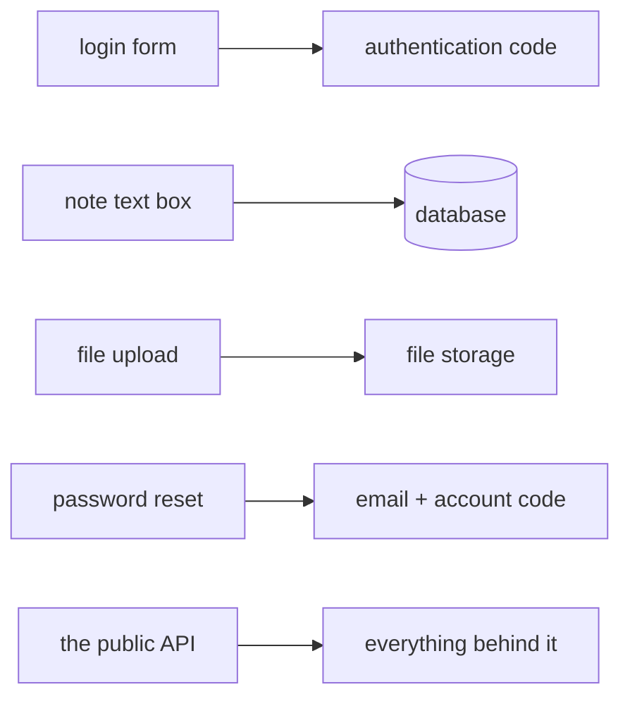
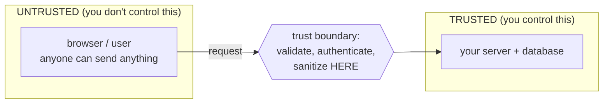

# Threat Modeling, Lightly

"Threat modeling" sounds like something that needs a whiteboard, a security team, and a two-day workshop. It can be that. But the version you'll actually use — the one that makes you meaningfully safer for almost no effort — is four questions you can answer on the back of a napkin before you build anything.

The point isn't to predict every attack. It's to *stop and think about abuse on purpose*, before the code ships, while changing things is still cheap.

## The four questions

The whole practice, stripped down, is this — and it's the structure the official guidance uses too (source: the [OWASP Threat Modeling Cheat Sheet](https://cheatsheetseries.owasp.org/cheatsheets/Threat_Modeling_Cheat_Sheet.html)):

```text
   1. What are we building / protecting?     ← know your system + its valuables
   2. What can go wrong?                      ← who'd attack it, and why
   3. How could they get in?                  ← the attack surface
   4. What are we going to do about it?        ← the defenses, prioritized
```

Let's take them one at a time, with a running example: a small web app where people log in and store private notes.

### Question 1 — What are we protecting?

You can't defend everything equally, so first name what's actually *valuable*. Not the whole system — the parts an attacker would want.

For the notes app:

- The notes themselves (private — **confidentiality**).
- The fact that a note can't be secretly edited (**integrity**).
- The login credentials (the keys to everything else).
- The app staying up so people can reach their notes (**availability**).

📝 **Terminology.** People call these *assets* — the things worth protecting. If a question feels too big, this is where you shrink it: most systems have two or three assets that really matter, and the rest is plumbing.

### Question 2 — Who'd attack it, and why?

Attackers have *motives*. Naming the motive tells you which asset is at risk and how hard someone will try.

- A random script wants any database it can dump and sell → it's after the notes and credentials (confidentiality).
- A jealous ex wants to read *one specific person's* notes → targeted, after confidentiality.
- A competitor wants the service embarrassed and offline → after availability.

You don't need a complete list. You need enough to realize *different attackers want different things*, which tells you what to protect first.

### Question 3 — How could they get in? (The attack surface)

This is the big one. Add up every place where the outside world can touch your system — every input, every door. That total is your **attack surface**.

📝 **Terminology.** *Attack surface* = the sum of all the points where an attacker can try to interact with your system: every form field, URL, API endpoint, file upload, login page, third-party integration, even the people who work there. The bigger it is, the more doors there are to check.

For the notes app, the attack surface includes:



Every arrow is a place to ask your Phase 1 question: *how could this be abused?* The login form could be guessed at. The text boxes could carry hostile input. The password reset could leak whether an account exists. You're not solving them yet — you're *listing the doors*.

💡 **Key point.** A smaller attack surface is safer almost for free. Every feature, endpoint, or input you *don't* expose is one you never have to defend. "Do we even need this door?" is one of the most powerful security questions there is.

### Question 4 — What do we do about it?

Now, and only now, you decide on defenses — and you prioritize. You'll have more risks than time. Spend your effort where a valuable asset (Q1) meets a likely attacker (Q2) through an open door (Q3). The leftover, low-stakes risks can wait or be accepted on purpose.

That's it. Four questions. You can run them in ten minutes, and you'll catch the obvious disasters before they're written into the code.

## Trust boundaries: where the world becomes "yours"

There's one idea that makes Question 3 click, and it's worth its own section because it's the single most useful concept in this whole guide: the **trust boundary**.

**What it actually is.** A trust boundary is the line where data crosses from somewhere you *don't* control into somewhere you *do*. On one side is the untrusted world — the browser, the network, the user, anything you can't vouch for. On the other side is your trusted system — your server, your database, your code.

📝 **Terminology.** *Trust boundary* = the line separating components you control and trust from those you don't. Data crossing *into* the trusted side must be treated as suspicious until you've checked it.

Here's the boundary in the notes app:



*What just happened:* Everything on the left of that line can be a lie. The browser can be modified. The request can be hand-crafted by a script that never opened your page. So the moment data *crosses* the boundary into your server, you treat it as guilty until proven innocent — you check who sent it, that it's well-formed, and that it's allowed to do what it's asking.

**Why this is the whole game.** Nearly every classic vulnerability is, at heart, *trusting data that crossed a trust boundary without checking it*. You trusted the note text, so a script slipped through. You trusted the login form, so a guessed password got in. You trusted the file upload, so something that wasn't an image landed on your server. Find your trust boundaries, and you've found the exact lines where your checks need to live.

⚠️ **Gotcha.** "But the data came from *my own* front-end / mobile app — surely that's trusted?" No. Anything on the user's side of the boundary can be altered, replayed, or skipped entirely. A friendly button in your app and a hostile script hitting your server look *identical* by the time they reach the boundary. Validation has to happen on the trusted side, every time — front-end checks are for helping honest users, not for stopping attackers.

🪖 **War story.** A very common mistake: an app validates input nicely in the browser (red error text, the works) and then trusts that the server is therefore safe. An attacker who never loads the page — just sends raw requests — sails straight past all of it. The browser checks were real; they were just on the wrong side of the line.

## Recap

1. **Threat modeling is four questions:** what are we protecting, who'd attack it and why, how could they get in (the attack surface), and what do we do about it.
2. **Assets** are the few things actually worth protecting — name them first so you don't try to defend everything equally.
3. The **attack surface** is every point where the outside world can touch your system; shrinking it makes you safer almost for free.
4. A **trust boundary** is the line where data crosses from the untrusted world into your trusted system — and *everything crossing into the trusted side must be checked*, because the other side can lie.

You now know how to find where the danger is. The last phase is about what to actually *do* there — and the principles that hold even after an attacker gets through the first door.

---

[← Guide overview](_guide.md) · [Phase 3: Defense in Depth & Least Privilege →](03-defense-in-depth.md)
