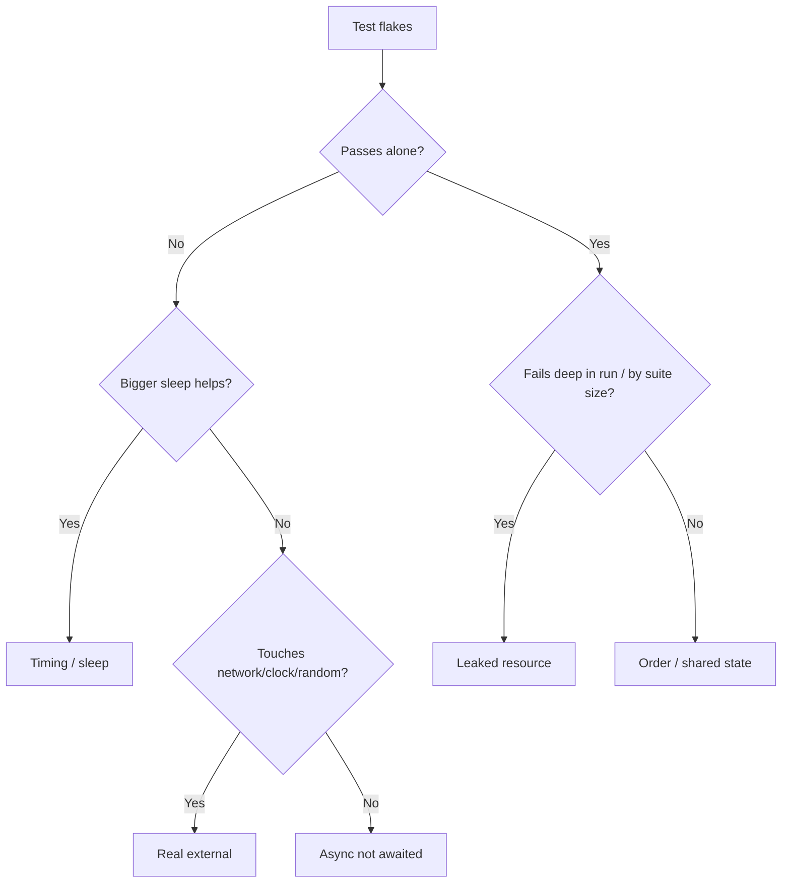

# The Usual Culprits

You've got the mental model from Phase 1: a flaky test depends on something it doesn't control. Good. Now you're staring at an actual flaky test and you need to know *which* something. The relief here is that the list is short. Flakiness comes from a handful of recurring sources, and each one leaves a recognizable fingerprint. Learn the five and you'll start diagnosing flaky tests on sight, before you've even read the stack trace.

We'll walk each culprit, show the shape it takes in code, and name the tell that gives it away.

## Culprit 1: Timing and sleeps

The most common source by a mile. The test assumes some work has finished "by now" — usually by sleeping a fixed number of milliseconds and then checking. On your laptop, the work finishes in time. On a loaded CI box, sometimes it doesn't, and the check runs against half-done state.

```javascript
// Flaky: hope the data loads within 100ms.
await sleep(100);
expect(screen.getText()).toBe('Loaded');

// Reliable: wait for the actual condition, however long it takes.
await waitFor(() => expect(screen.getText()).toBe('Loaded'));
```

*What just happened:* The first version is a bet that 100ms is enough — and a busy machine slows everything down, so the bet sometimes loses. The second waits for the *thing you actually care about* (the text appearing) instead of a fixed delay. A `sleep` in a test is almost always a guess wearing a number.

**Fingerprint:** the failure clusters on slow or busy machines, gets *more* frequent under load or parallelism, and you can "fix" it by bumping the sleep number (which is the tell — if a bigger sleep helps, it's a timing race).

## Culprit 2: Async not awaited

Subtler and nastier. The test kicks off asynchronous work but doesn't actually *wait* for it before asserting — or worse, the test function returns before the async work runs at all. The assertion races the operation, and sometimes the assertion wins.

```javascript
// Flaky: the test function returns before saveUser() resolves.
test('saves the user', () => {
  saveUser({ name: 'alice' });          // returns a Promise, but it's dropped
  expect(db.count()).toBe(1);           // runs before the save finishes
});

// Reliable: await the work, so the assertion runs after it completes.
test('saves the user', async () => {
  await saveUser({ name: 'alice' });
  expect(db.count()).toBe(1);
});
```

*What just happened:* In the first version the Promise from `saveUser` is created and immediately abandoned — the test moves straight to the assertion while the save is still in flight. Sometimes the save happens to finish first (pass), sometimes not (fail). The `async`/`await` version forces the assertion to wait for the save, removing the race.

**Fingerprint:** failures are erratic and don't correlate cleanly with machine speed; you often see "expected 1, got 0" or a value that's *one step behind* what you expected. A missing `await` (or a forgotten `return` of a Promise) is frequently the cause.

⚠️ **Gotcha.** Many test runners won't warn you when you forget to `await`. The test returns early and passes *most* of the time, so it looks healthy until the day the timing shifts. Treat any unawaited Promise in a test as a latent flake.

## Culprit 3: Test order and shared state

A test passes when run alone and fails when run after some other test — because the two share something they shouldn't: a database row, a global variable, a file on disk, a cache, an env var. One test leaves a mess; the next test trips over it.

```text
   test A:  creates user "alice"  (and does NOT clean up)
   test B:  asserts "no users exist"   ← passes alone, FAILS after A

   order [A, B] → B fails.    order [B, A] → B passes.
   CI shuffles or parallelizes → order changes → result flips → "flaky."
```

*What just happened:* Neither test is wrong on its own, but A leaks state into B. The moment your runner shuffles order, parallelizes, or someone adds a test in between, the result flips. A test that secretly depends on what ran before it isn't really one test — it's a hidden dependency.

**Fingerprint:** the test passes in isolation (`run it alone` → green) but fails in the full suite, or the failure moves around when you change the order or the parallelism. If "run it alone and it passes" is true, this is almost always your culprit.

## Culprit 4: Real network, clock, or randomness

The test reaches outside its own little world: it calls a live API, hits a real database over the network, reads the actual system clock, or uses unseeded randomness. Every one of those is an input you don't control, and any of them can hiccup or shift, failing your test for a reason that has nothing to do with your code.

```javascript
// Flaky: depends on the real wall clock — fails at the boundary, e.g. near midnight.
expect(formatTimestamp(Date.now())).toBe('2026-06-30');

// Flaky: depends on a live third-party API that can be slow, down, or rate-limited.
const res = await fetch('https://api.example.com/price');
expect(res.status).toBe(200);

// Flaky: depends on unseeded randomness — passes ~most of the time.
expect(pickRandom([1, 2, 3])).toBe(1);
```

*What just happened:* Each line lets the outside world decide the result. The clock rolls over a day boundary; the API rate-limits you on a bad afternoon; the random pick lands on a different value. None of these failures mean your code is wrong — they mean the test asked an uncontrolled source a question and didn't like the answer it happened to get.

**Fingerprint:** failures correlate with *external events* — time of day, a flaky third party, network blips — and often can't be reproduced on demand because the external condition has moved on.

## Culprit 5: Leaked resources

The quiet one. Tests open things — file handles, database connections, ports, timers, background tasks — and don't close them. For a while nothing breaks. Then you hit the OS file-handle limit, or the connection pool is exhausted, or a leftover timer fires during the *next* test and corrupts it. The failure shows up far from the test that actually caused it.

```text
   test 1..40:  each opens a DB connection, none closes it
   test 41:     "could not get connection: pool exhausted"  ← blamed unfairly

   The leak is in tests 1–40. Test 41 is just the one that ran out of room.
```

*What just happened:* The pool filled up gradually, and the test unlucky enough to need connection number 41 is the one that fails — even though it did nothing wrong. Leaks make flakiness that depends on how many tests ran before, which is maddening because the failing test is innocent.

**Fingerprint:** failures appear deep into a run, not at the start; they move to a *different* test when you add or remove tests; and error messages mention exhausted pools, "too many open files," or "address already in use." Suspect a leak when the victim is well downstream and changes with suite size.



*What just happened:* This is the same five culprits as a quick triage tree. "Passes alone?" splits the world: if yes, you're almost certainly in order/state or leak territory; if no, you're in timing, async, or external territory. It won't be right 100% of the time, but it points you at the likely suspect fast.

For builders: when you write a test, ask "what does this depend on besides the code?" If the answer includes a clock, a real service, randomness, the order of other tests, or a resource you open — that's a future flake you can prevent now. The cheapest flaky test to fix is the one you never wrote.

## Recap

The five usual culprits, each with its tell:

1. **Timing / sleeps** — fixed `sleep` then assert; fails under load; bigger sleep "helps."
2. **Async not awaited** — assertion races the operation; "expected 1, got 0," value one step behind.
3. **Order / shared state** — passes alone, fails in the suite; result moves with order or parallelism.
4. **Real externals** — live network, real clock, unseeded randomness; failures track time of day or a third party.
5. **Leaked resources** — unclosed handles/connections/timers; fails deep in the run, moves with suite size.

```quiz
[
  {
    "q": "A test passes when you run it by itself but fails when you run the whole suite. Which culprit is this almost always?",
    "choices": ["A fixed sleep that's too short", "Test order / shared state", "Unseeded randomness", "A leaked file handle"],
    "answer": 1,
    "explain": "Passes alone, fails together is the signature of order/shared-state: another test leaves state behind that this one trips over."
  },
  {
    "q": "Why is replacing `await sleep(100)` with `await waitFor(() => condition)` more reliable?",
    "choices": ["It runs faster on every machine", "It waits for the actual condition instead of betting a fixed delay is enough", "It disables parallelism", "It retries the whole test on failure"],
    "answer": 1,
    "explain": "A fixed sleep is a guess that a busy machine can lose; waiting for the real condition removes the race regardless of machine speed."
  },
  {
    "q": "Test #41 fails with 'connection pool exhausted' while tests #1–40 pass. Where is the bug most likely?",
    "choices": ["In test #41's assertions", "In tests #1–40 leaking connections they never close", "In the test runner itself", "In an unawaited Promise in #41"],
    "answer": 1,
    "explain": "Leaked resources make a downstream, innocent test the victim. The leak is in the earlier tests that opened connections without closing them."
  }
]
```

[← Phase 1: What a Flaky Test Actually Is](01-what-a-flaky-test-is.md) · [Guide overview](_guide.md) · [Phase 3: Diagnose, Fix, Quarantine](03-diagnose-fix-quarantine.md) →
