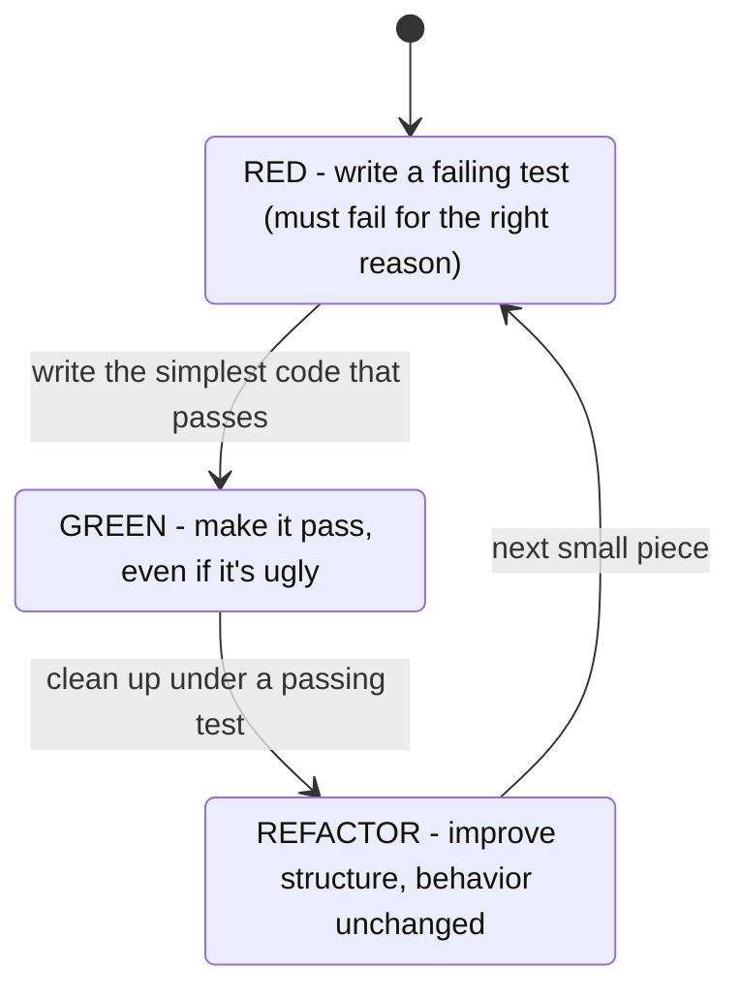

# TDD: Red, Green, Refactor

The first time someone tells you to "write the test before the code," it sounds backwards. How do you test
something that doesn't exist yet? Once you see what the test is *for*, writing it first stops being strange
and starts being the most useful thing you do all day.

The secret of TDD is this: **the test isn't really about catching bugs. It's about forcing you to decide
what you want before you build it.** You can't write a test for a function until you've answered "what do I
call it, what do I give it, and what should it hand back?" TDD just makes you answer those questions in
code, up front, where they're cheap.

## The mental model: a test is a design tool

**What it actually is.** Test-driven development is a loop with three steps, repeated in tiny increments:



You write a failing test that describes one small piece of behavior you want (**red**). You write the least
code that makes it pass (**green**). Then, with a passing test as your safety net, you improve the code
without changing what it does (**refactor**). Then you do it again for the next small piece.

**Why people get this wrong.** Most people think TDD means "write all your tests first, then write all your
code." It doesn't. The loop is *small* - often a single test and a few lines of code at a time. The rhythm
is fast and tight, not a big upfront test-writing phase.

**Why "red" matters more than it looks.** Watching the test *fail first* is not a formality - it proves the
test actually runs and checks something. A test that passes before you've written any code tests nothing,
and those are terrifyingly common. Red first means: when it goes green, you *know* your code is why.

## A worked cycle

Let's TDD a small, well-understood function: turning a count of cents into a price string like `"$4.05"`.
Well-understood logic with clear right answers is exactly where TDD is at its best (more on that in
[Phase 3](03-when-they-help.md)).

### Step 1 - Red: write a failing test

```console
$ cat money_test.py
from money import format_price

def test_formats_whole_dollars():
    assert format_price(500) == "$5.00"

$ pytest money_test.py
ImportError: cannot import name 'format_price' from 'money'
```
*What just happened:* The test failed - but notice *how*. It didn't fail on a wrong value; it failed because
`format_price` doesn't exist yet. That's a legitimate red: the test is wired up and genuinely depends on
code you haven't written. You've also just made three design decisions without agonizing over them - the
name (`format_price`), the input (an integer of cents), and the output (a `$`-prefixed string).

### Step 2 - Green: the simplest thing that passes

```console
$ cat money.py
def format_price(cents):
    return "$5.00"

$ pytest money_test.py
1 passed in 0.01s
```
*What just happened:* Yes, that's hard-coded, and yes, it's "wrong." But it makes the test pass, and that's
the whole job of the green step. Hard-coding on purpose feels silly the first time - it's actually a
discipline. It stops you from racing ahead and building things no test asked for. The next test will force
the hard-code out.

### Step 3 - Red again: add the test that breaks the cheat

```console
$ cat money_test.py
from money import format_price

def test_formats_whole_dollars():
    assert format_price(500) == "$5.00"

def test_formats_dollars_and_cents():
    assert format_price(405) == "$4.05"

$ pytest money_test.py
.F
>       assert format_price(405) == "$4.05"
E       AssertionError: assert '$5.00' == '$4.05'
1 failed, 1 passed
```
*What just happened:* The new test caught the hard-code red-handed. Now you're forced to write code that
actually computes the answer, because no single constant satisfies both tests.

### Step 4 - Green: write the real logic

```console
$ cat money.py
def format_price(cents):
    return "${:.2f}".format(cents / 100)

$ pytest money_test.py
.. 
2 passed in 0.01s
```
*What just happened:* Both tests pass. The logic is real now, and it's covered. `{:.2f}` formats the number
to exactly two decimal places, so `405 / 100` → `4.05` → `"$4.05"`.

### Step 5 - Refactor: clean up under the safety net

Suppose you decide the intent reads more clearly using integer math for dollars and cents. Because you have
two passing tests, you can change the implementation and instantly know if you broke anything:

```console
$ cat money.py
def format_price(cents):
    dollars, remainder = divmod(cents, 100)
    return "${}.{:02d}".format(dollars, remainder)

$ pytest money_test.py
2 passed in 0.01s
```
*What just happened:* You rewrote the internals - different approach entirely - and the tests confirmed the
behavior is unchanged. That confidence is the payoff of the refactor step. Refactoring without tests is
guessing; refactoring with them is engineering.

⚠️ **Gotcha - refactor means changing structure, *not* behavior.** If you find yourself changing what the
code outputs during the refactor step, you've slipped back into writing new features. Add a failing test
for that new behavior first (back to red). Keep the two activities separate; that separation is what keeps
TDD clean.

## Why this saves you later

Six months from now, someone asks you to handle negative amounts (refunds). You write a test for the refund
case, watch it fail, fix the code, and watch every existing test confirm you didn't break the old behavior.
TDD front-loads a little discipline today to buy you fearless change tomorrow, and leaves behind a suite of
tests that document exactly what the code is supposed to do.

📝 **Terminology.** People say *"test-first"* as a synonym for TDD, and *"the red-green-refactor loop"* for
the cycle itself. They're the same thing.

## Recap

1. **TDD is a design tool**, not just a bug-catcher - it forces you to decide what you want before you build it.
2. The loop is **red → green → refactor**, repeated in *tiny* increments.
3. **Red first proves the test works** - a test must fail for the right reason before you trust it passing.
4. **Green means the simplest code that passes**, even hard-coding; the next test forces real logic out.
5. **Refactor changes structure, never behavior** - the passing tests are your safety net for cleanup.

Now you have the loop. Next, we'll look at a style that sits on top of it - describing tests as *behavior*
in language a non-developer could read.

---

[← Guide overview](_guide.md) · [Phase 2: BDD - Describing Behavior →](02-describing-behavior.md)
