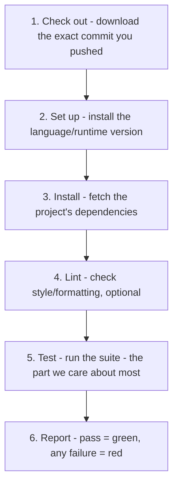

# Inside the Pipeline

You know *what* CI is now: a server that runs your tests on a clean machine. This phase opens the hood
and walks through *what a single run actually does*, step by step, then shows you the file that tells it
to do that. The goal isn't to make you a CI-config expert; it's so that when a run fails, you can read
the log and know which step broke and why.

## What one run does, in order

**What it actually is.** A CI run is a short, ordered checklist the server works through. Every system
calls the pieces something slightly different, but the shape is almost always the same:



📝 **Terminology.** The whole sequence is often called a **pipeline** or a **workflow**. One unit of
work inside it (a self-contained run on one machine) is a **job**. Each line a job runs is a **step**.
In GitHub Actions specifically, the file that defines all this is a **workflow**.

**Why the early steps matter for testing.** Steps 1–3 are setup, but they're where a surprising number
of "test failures" actually come from. If *install* fails - a dependency that no longer exists, a
version conflict - the run goes red before a single test executes. That's a broken environment, not a
broken test. Reading the log top to bottom tells you which it is.

## Failing the build, and fast feedback

**What it actually is.** Each step either succeeds or fails. The moment a step fails, the job stops and
the whole run is marked failed - this is called **failing the build.** "The build is red" just means
some step (often the test step) failed.

**Why CI stops on the first failure.** There's no point running the deploy steps if the tests failed -
you'd be shipping broken code. So the run halts at the first failure and reports immediately. This is
the **fast feedback** loop: you push, and within minutes you know whether your change is safe, while the
change is still fresh in your head. The longer feedback takes, the more you've moved on and the more it
costs to come back.

💡 **Key point.** "Failing the build" doesn't mean you broke something catastrophic. It means a check
that's *supposed* to catch problems caught one. A red build is the system working, not the system
breaking.

## A real (small) CI config

Here's a complete, minimal GitHub Actions workflow for a Node.js project. It lives in the repository at
`.github/workflows/ci.yml`, so it travels with the code. Read the comments - they map each line to the
checklist above.

```yaml
# .github/workflows/ci.yml
name: CI

# WHEN to run: on every push, and on every pull request.
on: [push, pull_request]

jobs:
  test:
    # WHERE to run: a fresh, clean Ubuntu machine, provided by GitHub.
    runs-on: ubuntu-latest

    steps:
      # 1. Check out - download the exact commit being tested.
      - uses: actions/checkout@v4

      # 2. Set up - install Node 20 on the clean machine.
      - uses: actions/setup-node@v4
        with:
          node-version: '20'

      # 3. Install - fetch dependencies from package-lock.json.
      - run: npm ci

      # 4. Lint - check formatting/style (optional but common).
      - run: npm run lint

      # 5. Test - THE part this guide is about.
      - run: npm test
```

*What just happened:* This file tells GitHub, "on every push or pull request, spin up a clean Ubuntu
machine, put Node 20 on it, install exactly the dependencies the lockfile pins, check the code style,
then run the test suite." The `test` job goes green only if **every** step exits successfully. If
`npm test` reports a single failing test, that step fails, the job fails, and the PR's check turns red.

⚠️ **Gotcha.** Notice `npm ci`, not `npm install`. `npm ci` installs *exactly* what's pinned in
`package-lock.json` and errors if the lockfile is out of sync - which is precisely what you want on a
clean CI machine, where "install whatever's newest" would let untested dependency versions sneak in.
(`ci` here is npm's "clean install" command - an unrelated coincidence of letters with *continuous
integration*.)

## Reading the run log

When a run finishes, you get a log - each step with a result and its output. Here's what the test step
looks like when everything passes:

```console
Run npm test

> myapp@1.0.0 test
> jest

 PASS  src/cart.test.js
 PASS  src/pricing.test.js
 PASS  src/checkout.test.js

Test Suites: 3 passed, 3 total
Tests:       142 passed, 142 total
Time:        6.4 s
```

*What just happened:* The server ran `npm test`, which ran Jest, which executed every test file. All 142
tests passed, so the step exited successfully and contributed a green check. The numbers here are
illustrative - your own run prints your real suite's counts and timing.

And here's the same step when one test fails:

```console
Run npm test

> myapp@1.0.0 test
> jest

 PASS  src/cart.test.js
 FAIL  src/pricing.test.js
   ● applies promo code to subtotal

     expect(received).toBe(expected)

     Expected: 90
     Received: 100

       at Object.<anonymous> (src/pricing.test.js:24:31)

 PASS  src/checkout.test.js

Test Suites: 1 failed, 2 passed, 3 total
Tests:       1 failed, 141 passed, 142 total
Time:        6.6 s
Error: Process completed with exit code 1.
```

*What just happened:* One test - `applies promo code to subtotal` - expected `90` but got `100`. Jest
reported it, then exited with code `1` (the universal "I failed" signal). CI saw the non-zero exit code,
marked the step failed, failed the job, and turned the PR red. **The log tells you exactly which test,
what it expected, what it got, and the file and line** - you don't have to guess, just re-run that one
test locally.

📝 **Terminology.** An **exit code** is the number a command returns when it finishes: `0` means
success, anything else means failure. This is how CI knows whether a step passed without understanding
anything about your test framework - it just checks the exit code. Your test runner exits `0` when all
tests pass and non-zero when any fail; that's the entire contract.

## Testing across versions and OSes (the matrix)

Sometimes "it passes" needs to mean "it passes *everywhere we support*." If your project must work on
several language versions or operating systems, you can ask CI to run the same job across a grid of
combinations - called a **build matrix.**

```yaml
jobs:
  test:
    runs-on: ${{ matrix.os }}
    strategy:
      matrix:
        os: [ubuntu-latest, windows-latest]
        node-version: ['18', '20']
    steps:
      - uses: actions/checkout@v4
      - uses: actions/setup-node@v4
        with:
          node-version: ${{ matrix.node-version }}
      - run: npm ci
      - run: npm test
```

*What just happened:* This runs the test job **four** times - Node 18 and Node 20, each on Ubuntu and
Windows (2 × 2). Each combination gets its own clean machine and its own green/red result; the overall
check passes only if all four pass. This catches the classic "works on my Node version / my OS but not
yours" bug before it reaches anyone.

⚠️ **Gotcha.** A matrix multiplies your CI time and cost - four combinations means four full test runs
per push. Add OSes and versions only where you genuinely support them. A library shipped to the world
needs a broad matrix; an internal app that only ever runs on one Node version on Linux does not. More on
keeping the suite fast in [Phase 3](03-keeping-ci-trustworthy.md).

**Why this saves you later.** When a matrix run is red on `windows-latest` but green on `ubuntu-latest`,
you've learned something specific and valuable for free: your code has an OS-specific assumption (a file
path, a line ending, a case-sensitive import) - a bug a single-machine setup would have shipped to a
Windows user to discover the hard way.

## Recap

1. A CI run is an **ordered checklist**: check out the code, set up the runtime, install dependencies,
   lint, **run the tests**, report.
2. Any step failing **fails the build** - the run stops and reports red. That's fast feedback, not
   catastrophe.
3. The config is a file in the repo (`.github/workflows/ci.yml` for GitHub Actions) that says *when*,
   *where*, and *what steps* to run.
4. CI reads **exit codes**: your test runner exits `0` on success, non-zero on failure, and the log
   names the exact failing test, expected vs. actual, file and line.
5. A **build matrix** runs the same tests across versions/OSes to catch "works on mine, not yours"
   bugs - at the cost of more CI time.

---

[← Phase 1: What CI Testing Actually Is](01-what-ci-testing-actually-is.md) · [Phase 3: Keeping CI Trustworthy →](03-keeping-ci-trustworthy.md)
