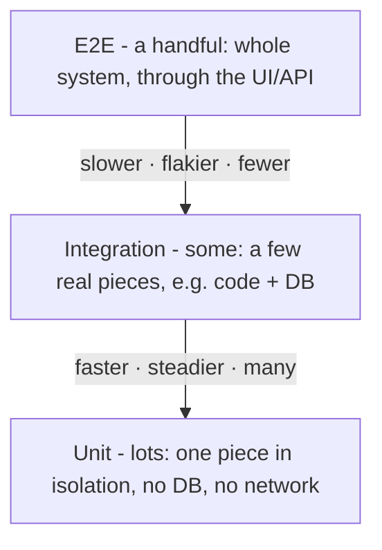

# The Testing Pyramid

Before we name the three levels, let's install the one picture that makes all of them make sense. If you only remember the definitions - "unit tests one thing, E2E tests everything" - you'll still be stuck guessing when you're staring at a new feature and wondering where its tests should go.

The picture is a pyramid, and the reason it's a *pyramid* and not, say, a stack of equal boxes, is the whole point. Once you see why the shape is what it is, the rest of this guide is mostly footnotes.

## The one idea underneath everything: how much do you run at once?

**What it actually is.** Every automated test makes one core decision before it does anything else: *how much of the system do I start up and run?* That's it. That's the axis the three levels live on.

- Run one small piece, by itself, with everything around it faked or absent → that's a **unit** test.
- Run a few real pieces together - say your code plus a real database → that's an **integration** test.
- Run the whole system the way a user would - through the UI or the public API, with everything real → that's an **end-to-end** (E2E) test.

📝 **Terminology - "the system under test."** Testers call the thing a given test is actually exercising the *system under test* (SUT). For a unit test the SUT is one function or class. For an E2E test the SUT is your entire running application. Same phrase, wildly different size - and that size is the thing that changes everything else.

**Why this matters.** "How much you run" isn't a trivia distinction. It directly drives two things you care about every single day: **how fast the test is**, and **how precisely it tells you where the bug is** when it fails. Hold onto those two - speed and pointing-power - because the pyramid shape falls right out of them.

## The shape

Here's the picture. Wider means *more tests of that kind*; taller-up means *more of the system per test*.



*Reading the picture:* as you climb, each test runs more of the system, so each one gets **slower** and more **flaky** (more moving parts = more things that can wobble for reasons unrelated to your bug). So you write **fewer** of them. Down at the base, each test runs almost nothing, so it's **fast** and **steady** - cheap enough to write thousands.

## Why the shape is this shape (and not flipped)

The pyramid is a recommendation, and the recommendation has two plain reasons behind it - the reasons you'll repeat to a teammate someday.

### Reason 1 - Speed compounds, and you run tests constantly

A unit test that touches no database, no disk, and no network finishes in well under a millisecond. An E2E test has to launch the app, open a browser, click through pages, and wait on a real server and a real database - that's seconds per test, sometimes many.

That gap doesn't stay small. You run your suite on every save, every commit, every pull request. A base of thousands of unit tests can finish before you've taken your hand off the keyboard. A suite that's mostly E2E turns "let me just run the tests" into a coffee break - so people stop running it, and tests you don't run might as well not exist.

💡 **Key point.** The pyramid is wide at the bottom because **fast tests get run, and tests that get run actually protect you.** Speed isn't a nice-to-have; it's what keeps the safety net in use.

### Reason 2 - When a test fails, it should point at the bug

This is the reason people forget, and it's the better one.

When a *unit* test fails, you know almost exactly where the problem is: it's in the one small piece that test runs. The failure is a pin dropped on a map.

```text
unit test fails    →  bug is in THIS function           (pin on the map)
E2E test fails     →  bug is somewhere in the request    (a region on the map)
                      path: browser? frontend? API?
                      business logic? database? network?
```

When an *E2E* test fails, all you've learned is "something, somewhere in that whole chain, is wrong." Now you get to go spelunking. The test caught a real problem - good - but it handed you a region, not a pin.

⚠️ **Gotcha - a green E2E suite is not the same as a debuggable one.** Teams sometimes brag that "everything's covered by E2E tests." Coverage isn't the issue; *diagnosis* is. The day one of those tests goes red, the broad ones cost you hours of "where even is this" that a unit test would have answered in seconds. Coverage that you can't act on quickly is worth less than it looks.

## So why have the top of the pyramid at all?

Fair question - if units are fast and precise, why not write only units?

Because units have a blind spot, and it's a big one: **a unit test only ever sees the one piece it runs.** It can't tell you whether your pieces actually fit together. Your function can pass every unit test while expecting a date string when the database hands it back a timestamp, or while calling an API endpoint the other team renamed last week. Each piece is individually correct; the *seams between them* are broken. Only a test that runs more than one real piece at once catches that.

That's what integration and E2E tests are for. They're slower and blunter, so you write few of them - but they cover the exact thing units can't: the connections. The pyramid isn't "units good, E2E bad." It's **each level covers what the level below it is blind to, so you buy a little of the expensive coverage and a lot of the cheap coverage.**

## Recap

1. Every test makes one decision first: **how much of the system does it run?** That single choice drives everything else.
2. More-of-the-system means **slower** and **flakier**, so you write **fewer** of those - and **less**-of-the-system means **faster** and **steadier**, so you write **many**.
3. The pyramid is wide at the base for two reasons: **fast tests actually get run**, and **narrow tests point straight at the bug** when they fail.
4. You still need the top because **units are blind to the seams between pieces** - integration and E2E exist to test the connections units can't see.

With the shape in hand, let's look at each level up close - what it catches, what it costs, and what one actually looks like.

---

[← Guide overview](_guide.md) · [Phase 2: The Three Levels →](02-the-three-levels.md)
