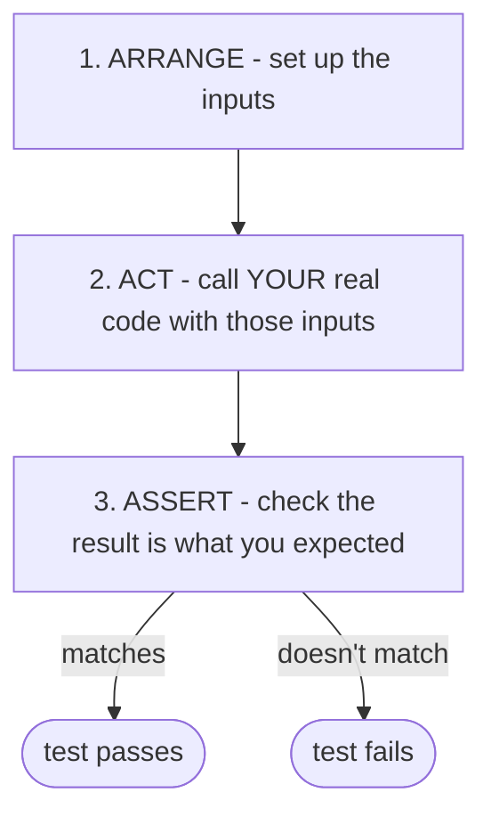

# What a Test Actually Is

The word "test" sounds official and heavy, like an exam your code has to sit. That heaviness scares people
off. Let's strip it down to what a test really is - smaller and far less magical than the word suggests. By
the end of this phase you'll be able to read a test and know exactly what it's doing.

## A test is just a small program that checks your code

**What it actually is.** A test is a tiny program whose only job is to:

1. **Run your real code** with some inputs you choose.
2. **Compare** what your code gave back against what you *expected* it to give back.
3. **Shout** if those two things don't match.

That's the whole idea. There's no special magic - a test is ordinary code that calls *your* ordinary code and
checks the answer. The "shouting" step has a name:

📝 **Terminology.** An *assertion* is a line in a test that says "this had better be true." `assert that the
result equals 90`. If it *is* true, the test quietly moves on. If it *isn't*, the assertion fails, and that
failure is what makes the whole test fail. A test is really just one or more assertions wrapped around a call
to your code.

Here's the shape of every test you'll ever write, drawn out:



This is sometimes called **Arrange–Act–Assert**, and once you see it you'll spot it in every test. It's just
"set things up, do the thing, check the thing."

## A real example: a function and a test for it

Let's make it concrete. Say you wrote a small function that applies a 10% discount for members:

```javascript
// price.js - the real code we want to trust
function priceFor(amount, isMember) {
  if (isMember) {
    return amount * 0.9; // members get 10% off
  }
  return amount;
}
```

*What just happened:* nothing yet - that's just the code we wrote. It might be right, it might be wrong. We
*believe* a $100 order for a member should cost $90, but belief isn't proof. A test turns the belief into a
check.

Now here's a test for it, written with a common test runner's style (`test` and `expect` - used by tools like
Jest and Vitest):

```javascript
// price.test.js - a small program that checks price.js
test("members get 10% off", () => {
  const result = priceFor(100, true); // ARRANGE inputs + ACT: call the real code
  expect(result).toBe(90);            // ASSERT: it had better equal 90
});
```

*What just happened:* this test calls your *actual* `priceFor` function with the inputs `100` and `true`, then
asserts the answer is exactly `90`. The `expect(...).toBe(...)` line is the assertion - the "this had better be
true" check. There's nothing else to it: it's a few lines of normal code that exercise your code and verify the
result.

## Watch it pass, then watch it fail

The whole value is in what happens when you run it. When the code is correct, the test runner is calm:

```console
$ npm test

  ✓ members get 10% off (2 ms)

  Test Suites: 1 passed, 1 total
  Tests:       1 passed, 1 total
```

*What just happened:* the runner found your test, ran it, the assertion held (`90 === 90`), so it printed a tick
and moved on. Green means: *the behavior you described is true right now.* That's all "passing" means - your
expectation matched reality this time.

Now suppose someone "improves" the code and fat-fingers the discount - `0.9` becomes `0.8`:

```javascript
function priceFor(amount, isMember) {
  if (isMember) {
    return amount * 0.8; // oops - now it's 20% off
  }
  return amount;
}
```

Run the tests again, change nothing else:

```console
$ npm test

  ✗ members get 10% off (3 ms)

    expect(received).toBe(expected)

    Expected: 90
    Received: 80

      3 |   const result = priceFor(100, true);
    > 4 |   expect(result).toBe(90);
        |                  ^

  Tests:       1 failed, 1 total
```

*What just happened:* the assertion expected `90` but the code now returns `80`, so the assertion failed, so the
test failed. And look at how *useful* the failure is: it tells you what it expected (`90`), what it actually got
(`80`), and the exact line where they disagreed. That's the net from Phase 1, working. You didn't ship a wrong
price; you got a red, specific, immediate "no" the moment the mistake entered the code.

⚠️ **A test that never fails is a test that never helped.** The failing run above is the *whole point* - a test
earns its keep by going red when the behavior is wrong. We'll come back to this in Phase 3, because a
surprising number of tests are written in a way that can never fail, and those are worse than no test at all.

💡 **Key point.** Green isn't the goal - *trustworthy green* is. A passing test is only meaningful if you've
seen (or can believe) it would go red when the thing it guards actually breaks.

## Why this saves you later

Once you see that a test is just "call the code, check the answer," the fog lifts. You stop imagining testing
as some separate discipline with its own dark arts, and start seeing it as *writing down, in code, the things
you already believe about your program.* "A member's $100 order costs $90." You believed that anyway - a
test just makes the belief permanent and self-checking, so the day someone breaks it, the code says so out
loud instead of you finding out from a refund request.

## Recap

1. A test is a **small program** that runs your real code with known inputs and checks the result.
2. The check is an **assertion** - "this had better be true"; a failed assertion fails the test.
3. Every test follows **Arrange–Act–Assert**: set up inputs, call your code, check the result.
4. **Passing** means your expectation matched reality this run; a good **failure** message tells you expected
   vs. actual and where - that specificity is the net doing its job.
5. A test only helps if it *can* fail when the behavior is wrong - aim for **trustworthy green**, not green at
   any cost.

You can now read a test and write one in your head. The last question is the one that keeps people sane: with
limited time, *what* should you actually bother testing - and what's a waste?

---

[← Guide overview](_guide.md) · [Phase 3: What's Worth Testing (Straight Talk) →](03-whats-worth-testing.md)
