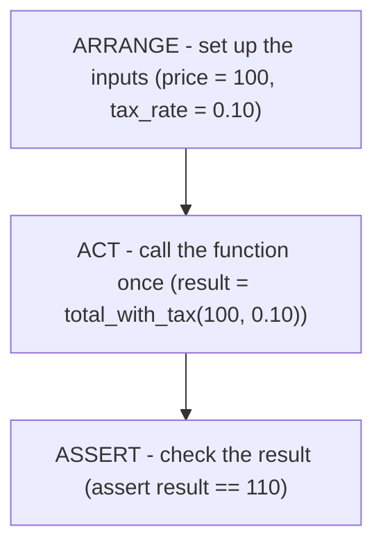

# Arrange, Act, Assert

Before you write a single line, it helps to know what you're aiming at - because a test isn't a mysterious
ritual. It's a tiny, repeatable experiment. You set something up, you do one thing to it, and you check
that what came out is what you expected. If a junior on your team can read a test top-to-bottom and say
"ah, this checks *that*," the test is doing its job.

That three-part shape has a name people use everywhere: **Arrange, Act, Assert** (often shortened to
"AAA"). Once you see it, you'll spot it in every test you ever read.

## What a unit test actually is

📝 **Terminology.** A **unit test** is a small piece of code that runs *one* other piece of code - usually
a single function - with known inputs, and checks that it produces the result you expect. The "unit" is
the small thing under test, normally one function.

It is not a special kind of program. It's just a function you write that *calls your function and checks
the answer*. The test runner finds it, runs it, and tells you pass or fail. That's the entire arrangement.

The reason tests feel scary is usually that people meet them as a wall of unfamiliar files before anyone
explains the shape. Once you have the shape, the wall turns back into a stack of small, boring functions -
which is exactly what you want.

## The three parts

Here's the shape, drawn out:



- **Arrange** - get everything ready. The inputs you'll pass in, and any setup the code depends on.
- **Act** - do the one thing you're testing. Call the function. Capture what it returns.
- **Assert** - state what *should* be true. If it's true, the test passes silently. If it's false, the
  test fails and tells you.

📝 **Terminology.** An **assertion** is a statement of what must be true. In Python you write it with the
built-in `assert` keyword: `assert result == 110` means "I claim `result` equals 110." If the claim holds,
nothing happens and execution continues. If it doesn't, Python raises an error - and that error is how the
test runner knows the test failed.

## A tiny function to test

Let's pick something real but small. Imagine a shop: you have a price, you add tax, you get a total. Here's
the function we'll test throughout the guide:

```python
def total_with_tax(price, tax_rate):
    return price + (price * tax_rate)
```

*What just happened:* nothing ran yet - this is the code *under test*, the thing we want to make sure
works. It takes a `price` and a `tax_rate` (like `0.10` for 10%), adds the tax on top, and returns the
total. For a price of `100` and a rate of `0.10`, we'd expect `110`.

Notice we picked a function that takes inputs and returns a value, with no surprises - no printing, no
saving to a file, no calling the internet. That's the easiest kind of code to test, and it's worth
*writing* your code this way partly because it makes testing this simple. (Code that talks to databases or
the network needs extra techniques - see [Mocking and Test Doubles](/guides/mocking-and-test-doubles) when
you get there.)

## Mapping the three parts onto our function

Now line up Arrange-Act-Assert against `total_with_tax`. Don't run anything yet - just read how the parts
map. We'll type the real file in the next phase.

```python
def test_total_with_tax_adds_ten_percent():
    # Arrange: set up the inputs
    price = 100
    tax_rate = 0.10

    # Act: call the function once, capture the result
    result = total_with_tax(price, tax_rate)

    # Assert: state what should be true
    assert result == 110
```

*What just happened:* you read your first complete test. It's an ordinary function whose name starts with
`test_` (that prefix is how pytest finds it - more on that next phase). Inside, the three parts are right
there in order: arrange the inputs, act by calling `total_with_tax`, assert the answer is `110`. The
comments aren't required, but writing them while you learn keeps the shape honest.

💡 **Key point.** A test is a function that calls your function and checks the result. Arrange the inputs,
Act by calling it, Assert the answer. Hold onto that one sentence - everything else in testing is a
variation on it.

⚠️ **Gotcha.** Keep the **Act** step to a single call to the thing you're testing. If a test calls three
different functions and then asserts, and it fails, you won't know *which* of the three broke. One test,
one behavior, one act - we'll come back to why this matters in [Phase 3](03-what-makes-a-good-test.md).

## Recap

1. A **unit test** is a small function that runs one piece of your code and checks the result.
2. Every test has the same three parts: **Arrange** (set up inputs), **Act** (call the code once),
   **Assert** (check the result).
3. An **assertion** (`assert result == 110`) states what must be true; if it's false, the test fails.
4. The easiest code to test is a function that takes inputs and returns a value - like `total_with_tax`.

You've got the shape. Next, let's turn this from a diagram into a real file you run - and watch it pass,
then fail.

---

[← Guide overview](_guide.md) · [Phase 2: Write It and Run It →](02-write-it-and-run-it.md)
