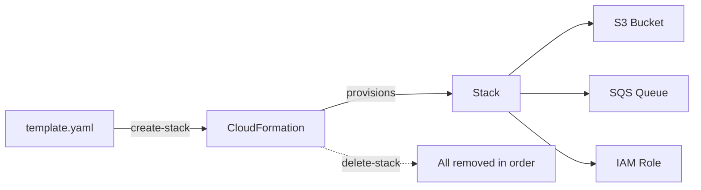

# The mental model: templates and stacks

Picture how most AWS environments actually start. Someone opens the console, clicks through a wizard to make an S3 bucket, clicks again for an SQS queue, attaches an IAM role by hand, and wires a Lambda to it. It works. Then three weeks later you need the same setup in a second region, or a new hire asks "what's actually running in this account?", and the honest answer is "nobody fully knows." The knowledge lives in click history and tribal memory. That's the pain CloudFormation exists to kill.

The core idea is two words: **template** and **stack**. Get those two clear and everything else is detail.

## A template is the recipe

A template is a text file - YAML or JSON - that *describes* the AWS resources you want. Not the clicks to make them. The end state. You say "I want a bucket named like this, a queue with this retention, a role with these permissions," and CloudFormation figures out the order to create them in and the calls to make.

Here's a small but complete template that creates one S3 bucket:

```yaml
# template.yaml
AWSTemplateFormatVersion: "2010-09-09"
Description: A single private bucket

Resources:
  AppBucket:
    Type: AWS::S3::Bucket
    Properties:
      BucketName: missing-manual-demo-bucket
      PublicAccessBlockConfiguration:
        BlockPublicAcls: true
        BlockPublicPolicy: true
        IgnorePublicAcls: true
        RestrictPublicBuckets: true
```

*What just happened:* you declared one resource. `AppBucket` is a **logical ID** - a name *you* pick that's local to this template. `Type` says what AWS thing it is. `Properties` are the settings. Notice you never wrote "create" or "make an API call" anywhere - the file is a description, not a script.

That's the whole shift in thinking. A shell script that calls the AWS CLI is a list of *steps*. A CloudFormation template is a *declaration of the result*. If you run a script twice you get two buckets (or an error). If you apply a template twice, CloudFormation sees the bucket already matches and does nothing. This property - same input, same end state, no matter how many times you run it - is **idempotence**, and it's the foundation of every infrastructure-as-code tool. The broader idea is covered tool-agnostically in [/guides/infrastructure-as-code-terraform](/guides/infrastructure-as-code-terraform).

## A stack is the running unit

When you hand that template to CloudFormation, what comes back is a **stack**. The stack is the live, managed group of resources that the template produced. This is the part people underestimate, so let it land: the stack is a *unit*. CloudFormation tracks every resource it created and the relationships between them.

That unit-ness buys you three things you cannot get from a folder of scripts:

- **Delete the stack, delete everything in it.** One command tears down the bucket, the queue, the role, the function - in the right order, cleaning up dependencies. No orphans.
- **CloudFormation knows what it owns.** It keeps a record of every resource and its current state. Ask it and it tells you exactly what's in the stack.
- **An update is a diff, not a redo.** Change the template and re-apply, and CloudFormation works out what actually changed and touches only that.



*What just happened:* the template flows in once, and from then on the stack is the thing you operate on. You don't manage the bucket and the queue separately - you manage the stack, and the stack manages them.

## Why declare it at all

If you've only ever clicked through consoles, the payoff might still feel abstract. Three concrete wins:

**Repeatability.** The same template makes the same stack in `us-east-1`, in `eu-west-1`, in a teammate's sandbox account. Environments stop drifting apart because they come from one source.

**Review.** The template is a file. It lives in Git. A change to your infrastructure becomes a pull request someone can read, comment on, and approve - *before* it touches a real account. Infrastructure changes get the same safety net as code changes.

**Honesty.** The template is the source of truth for what exists. Six months from now, the answer to "what's running?" is "read the template," not "spelunk through the console and hope."

> [!NOTE]
> CloudFormation is AWS's *native* tool - it's part of AWS, free to use (you pay only for the resources it creates), and it knows every AWS service the moment that service launches. That nativeness is its biggest strength and, as you'll see in Phase 3, the root of its main limitation too.

## For builders

You don't have to write a template to read one. When you adopt an AWS feature, search for its CloudFormation resource type - `AWS::Lambda::Function`, `AWS::DynamoDB::Table`, `AWS::EC2::Instance`. Every property maps to something you'd otherwise set by clicking. Reading the resource reference for a service is one of the fastest ways to learn what that service can actually do, because the template surface *is* the configuration surface.

```quiz
[
  {
    "q": "What is the relationship between a template and a stack?",
    "choices": [
      "They are two names for the same file",
      "A template describes the desired resources; a stack is the live managed group CloudFormation creates from it",
      "A stack is the YAML file and a template is the running infrastructure",
      "A template is for staging and a stack is for production"
    ],
    "answer": 1,
    "explain": "The template is the declarative recipe (text); the stack is the resulting managed unit of real resources."
  },
  {
    "q": "What does the logical ID (e.g. AppBucket) refer to?",
    "choices": [
      "The real AWS resource name, which must be globally unique",
      "A name local to the template that you use to reference the resource within it",
      "The AWS account ID the resource belongs to",
      "The region the resource is created in"
    ],
    "answer": 1,
    "explain": "Logical IDs are template-local names. The real (physical) name is either set in Properties or auto-generated by AWS."
  },
  {
    "q": "Why is a stack being a single unit useful?",
    "choices": [
      "It makes each resource cheaper to run",
      "Deleting the stack cleanly removes all its resources in dependency order, with no orphans",
      "It lets you skip IAM permissions",
      "It automatically encrypts every resource"
    ],
    "answer": 1,
    "explain": "Because CloudFormation tracks the whole group, it can create, update, and tear it down as one coherent unit."
  }
]
```

[← Overview](_guide.md) | [Phase 2: Writing and changing stacks for real →](02-writing-and-changing-stacks.md)
