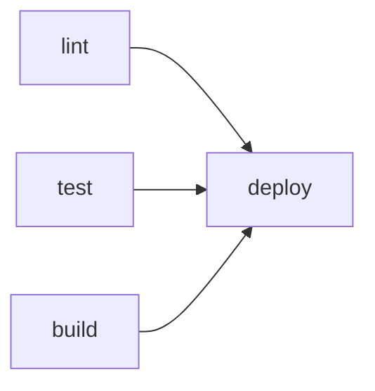

# The four nouns: jobs, executors, steps, workflows

Open someone's `.circleci/config.yml` cold and it looks like a wall of nested keys. The trick is that almost all of it is built from four nouns. Once you can name them, the wall turns into sentences. Let's meet them in the order they nest.

## A step is a single command

The smallest unit is a **step**. A step is one thing you do: check out the code, run a shell command, restore a cache. Most steps are shell commands.

```yaml
steps:
  - checkout
  - run: npm ci
  - run: npm test
```

*What just happened:* `checkout` is a built-in step that clones your repo into the working directory. The two `run` steps execute shell commands in order — install dependencies, then run tests. If `npm ci` fails (non-zero exit), CircleCI stops and never reaches `npm test`. Steps run top to bottom and the first failure ends the show.

A `run` step can be a one-liner like above, or a named multi-line block when you want it to read clearly in the UI:

```yaml
steps:
  - run:
      name: Run the test suite
      command: npm test
```

*What just happened:* same command, but now the CircleCI dashboard labels this step "Run the test suite" instead of showing the raw command. The `name` is purely for humans reading the build output — worth it for anything non-obvious.

## A job is a list of steps on one machine

A **job** is a named bundle of steps that run together on a single fresh machine. When the job ends, that machine is thrown away. This is the unit CircleCI schedules, reports, and shows you as a green or red dot.

```yaml
jobs:
  build-and-test:
    docker:
      - image: cimg/node:20.11
    steps:
      - checkout
      - run: npm ci
      - run: npm test
```

*What just happened:* we defined one job named `build-and-test`. It runs every step on a clean Docker container based on `cimg/node:20.11` (CircleCI's pre-built Node image). The job is the boundary of a workspace: those three steps share the same filesystem and the same machine, but nothing carries over to any other job unless you explicitly pass it.

If you come from GitHub Actions, a CircleCI **job** maps to an Actions **job**, and a CircleCI **step** maps to an Actions **step**. The shapes line up. See [Your first pipeline with GitHub Actions](/guides/your-first-pipeline-github-actions) if that's your reference point.

## An executor is the machine the job runs on

That `docker:` key under the job is the **executor** — your choice of *what kind of machine* the steps run on. This is where CircleCI gives you a real decision, so it's worth understanding the main options.

```yaml
jobs:
  fast-job:
    docker:
      - image: cimg/python:3.12      # runs your steps inside this container
  needs-real-vm:
    machine:
      image: ubuntu-2204:current     # a full Linux VM, not a container
  mac-build:
    macos:
      xcode: "15.3.0"                # a macOS machine for iOS/Mac builds
```

*What just happened:* three jobs, three executor types. The `docker` executor is the default workhorse — fast to start, your commands run inside the named container. The `machine` executor gives you a full virtual machine, which you need when your job itself runs Docker (building images, docker-compose) or needs kernel-level access a container can't give. The `macos` executor is a real Mac, required for anything Apple.

The mental rule: **reach for `docker` first** because it boots fastest. Move up to `machine` only when a container genuinely can't do the job — almost always because you need to build or run Docker images yourself.

> The `cimg/` images (short for "CircleCI image") come pre-loaded with the language plus common build tools, so they start faster than a raw `node` or `python` image where CircleCI has to install extras. Prefer them when one exists for your language.

## A workflow orchestrates the jobs

One job is rarely the whole story. You might want to lint, test, and build — and only deploy if all three pass. A **workflow** is the conductor: it says which jobs run, in what order, and what depends on what.

```yaml
workflows:
  test-then-deploy:
    jobs:
      - lint
      - test
      - build
      - deploy:
          requires:
            - lint
            - test
            - build
```

*What just happened:* `lint`, `test`, and `build` have no `requires`, so they start at the same time — they **fan out** and run in parallel. `deploy` lists all three under `requires`, so CircleCI holds it back until every one of them succeeds. If `test` goes red, `deploy` never runs at all. This dependency graph is the entire point of workflows: cheap parallelism where work is independent, hard gates where order matters.



*What just happened:* the three independent jobs fan out, then converge on `deploy`. CircleCI runs anything with no unmet dependency as early as it can, which is why putting independent work in separate jobs makes your pipeline finish sooner.

## How the four nouns stack

Put together, the hierarchy reads cleanly from the bottom up: **steps** live inside a **job**, the job runs on an **executor**, and a **workflow** decides how the jobs relate. Every CircleCI config you'll ever read is some arrangement of these four. The top of the file always declares the config version so CircleCI knows which feature set you're using:

```yaml
version: 2.1
jobs:
  # ... your jobs here
workflows:
  # ... your workflows here
```

*What just happened:* `version: 2.1` is the modern config format — it unlocks orbs, reusable commands, and parameters, which we lean on in the next phase. Always start a new config with it.

In the wild: a healthy repo's config is mostly workflow plumbing plus two or three focused jobs. When you see a single giant job doing everything in sequence, that's usually a config that grew without anyone splitting it — and a slow pipeline as a result, because nothing can run in parallel.

```quiz
[
  {
    "q": "In a CircleCI config, what does the executor (docker/machine/macos) decide?",
    "choices": [
      "The order jobs run in",
      "What kind of machine the job's steps run on",
      "Which branch triggers the build",
      "How many times a step retries on failure"
    ],
    "answer": 1,
    "explain": "The executor is the machine type for a job. Order between jobs is the workflow's responsibility, not the executor's."
  },
  {
    "q": "Three jobs in a workflow have no 'requires' key. What happens?",
    "choices": [
      "They run one after another in file order",
      "Only the first one runs",
      "They all start in parallel (fan-out)",
      "The config is invalid"
    ],
    "answer": 2,
    "explain": "Jobs with no unmet dependency start as early as possible, so jobs with no 'requires' fan out and run at the same time."
  },
  {
    "q": "When should you prefer the 'machine' executor over 'docker'?",
    "choices": [
      "Whenever you want faster startup",
      "When the job itself needs to build or run Docker images",
      "For every Node.js project",
      "Only for macOS builds"
    ],
    "answer": 1,
    "explain": "docker boots fastest and is the default choice. machine gives a full VM, which you need mainly when the job runs Docker itself; macOS builds use the macos executor."
  }
]
```

[← Overview](_guide.md) | [Phase 2: Writing a real config →](02-writing-a-real-config.md)
