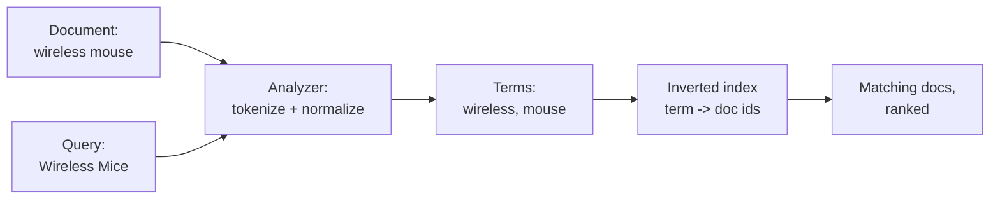

# Phase 1: The inverted index, or why search is a different problem

Here is the moment that sends most people toward a search engine. You have a `products` table, a search box, and a query that started life looking reasonable:

```sql
SELECT * FROM products WHERE description LIKE '%wireless%';
```

On your laptop, with a few hundred rows, this is instant. In production, with millions of rows, it is a slow, sweaty full-table scan every single time. And a search engine does not make this query faster. It makes the query unnecessary, by storing the data in a completely different shape. Understanding that shape is the whole game.

## Why LIKE cannot scale, in one picture

A normal database index, the kind you create on a column, is sorted by the *value*. That lets the database jump straight to a row when you ask for an exact value or a prefix:

```sql
-- A normal B-tree index helps with this. It can binary-search to "wireless".
WHERE name = 'wireless mouse'
WHERE name LIKE 'wireless%'   -- prefix: still usable

-- It is useless for this. The wildcard is on the LEFT.
WHERE description LIKE '%wireless%'
```

*What just happened:* `LIKE '%wireless%'` puts a wildcard at the front, so the database cannot use its sorted index, there is no "first letter" to seek to. It has to read every row and check each one. That is O(n), and n only grows.

The deeper problem is that a `LIKE` scan does not understand *words*. `'%cat%'` matches "category" and "scatter". It cannot find "running" when you search "run". It has no idea that "the" appears in every document and carries no signal. It returns rows in whatever order they were scanned, with no notion of which result is *better*. A database is built to answer "give me the rows where this is exactly true." Search is a different question: "give me the best documents for these words, even with typos, ranked by relevance." Different question, different data structure.

## The inverted index: flip the table on its side

A normal table maps a row to its words. You start with a document and read its contents:

```text
doc 1 -> "wireless mouse with usb receiver"
doc 2 -> "wireless keyboard and mouse combo"
doc 3 -> "wired gaming mouse"
```

An *inverted* index flips that. It maps each word to the list of documents that contain it. You start with a word and instantly get every document:

```text
wireless -> [1, 2]
mouse    -> [1, 2, 3]
keyboard -> [2]
wired    -> [3]
usb      -> [1]
gaming   -> [3]
```

*What just happened:* searching for "mouse" is no longer a scan. The engine looks up the single word "mouse" and reads back `[1, 2, 3]` directly, the answer is precomputed and sorted. Searching "wireless mouse" intersects `[1, 2]` with `[1, 2, 3]` to get `[1, 2]`. This is the same trick a book's index uses: you do not read all 400 pages to find every mention of "recursion," you flip to the back, find the word, and it lists the pages. The index was built once; every lookup after that is cheap.

That inversion is the one idea everything else hangs off. The cost moved: building the index is work done *at write time*, so reads, the thing your users wait on, become a lookup instead of a scan.



*What just happened:* notice the query goes through the *same* analyzer as the document. That is the secret to matching "Wireless Mice" against a document that said "wireless mouse," covered in Phase 2. Both sides get reduced to the same terms before they ever meet.

## Elasticsearch and OpenSearch: same engine, forked history

Both products are HTTP servers wrapped around Apache Lucene, the Java library that actually implements the inverted index. You talk to them with JSON over REST. They speak almost the same API, store data the same way, and solve the same problem.

The split is a licensing story, not a technical one. Elasticsearch is made by Elastic. In 2021 Elastic changed Elasticsearch's license away from the permissive Apache 2.0 terms, and Amazon (along with the community) forked the last Apache-licensed version into **OpenSearch**, which stays under Apache 2.0. Since then the two have drifted apart in some advanced features, but the core, indices, mappings, analyzers, the query DSL, BM25 scoring, is the same mental model in both.

> For this guide, when we say "the engine," it applies to both. Where a name or detail differs, that is usually a feature or paid-tier difference, not a difference in how search itself works. Learn one, you can read the other's docs.

## For builders

Reach for this when your search must understand language: relevance ranking, typo tolerance, matching "run" against "running," searching across many fields at once, faceted filters, autocomplete. Stay with your database when you need exact lookups, joins, transactions, or your "search" is honestly a filter on a few well-indexed columns. The two are not rivals; most real systems keep the database as the source of truth and feed a search engine alongside it. Phase 3 makes that call concrete.

```quiz
[
  {
    "q": "Why can a normal B-tree database index not speed up WHERE description LIKE '%wireless%'?",
    "choices": [
      "B-tree indexes only work on integer columns",
      "The leading wildcard means there is no sorted prefix to seek to, forcing a full scan",
      "LIKE is disabled on indexed columns by default",
      "The index is rebuilt on every query, which is slow"
    ],
    "answer": 1,
    "explain": "A B-tree is sorted by value, so it can seek a prefix. A leading % gives nothing to seek to, so every row must be read."
  },
  {
    "q": "What does an inverted index map?",
    "choices": [
      "Each document to the words it contains",
      "Each table to its foreign keys",
      "Each term to the list of documents that contain it",
      "Each row to its primary key"
    ],
    "answer": 2,
    "explain": "It is inverted from the normal document-to-words layout: term to document ids, so a word lookup returns matches directly."
  },
  {
    "q": "What is the main difference between Elasticsearch and OpenSearch?",
    "choices": [
      "OpenSearch uses a different index structure, not an inverted index",
      "They are unrelated products that happen to share a name",
      "OpenSearch is a fork created over a licensing change; the core search model is the same",
      "Elasticsearch cannot do full-text search"
    ],
    "answer": 2,
    "explain": "OpenSearch forked the last Apache-licensed Elasticsearch after a license change. Both wrap Lucene and share the core search model."
  }
]
```

[← Overview](_guide.md) | [Phase 2: Indexing, mappings, analyzers, and getting ranked results →](02-indexing-and-relevance.md)
