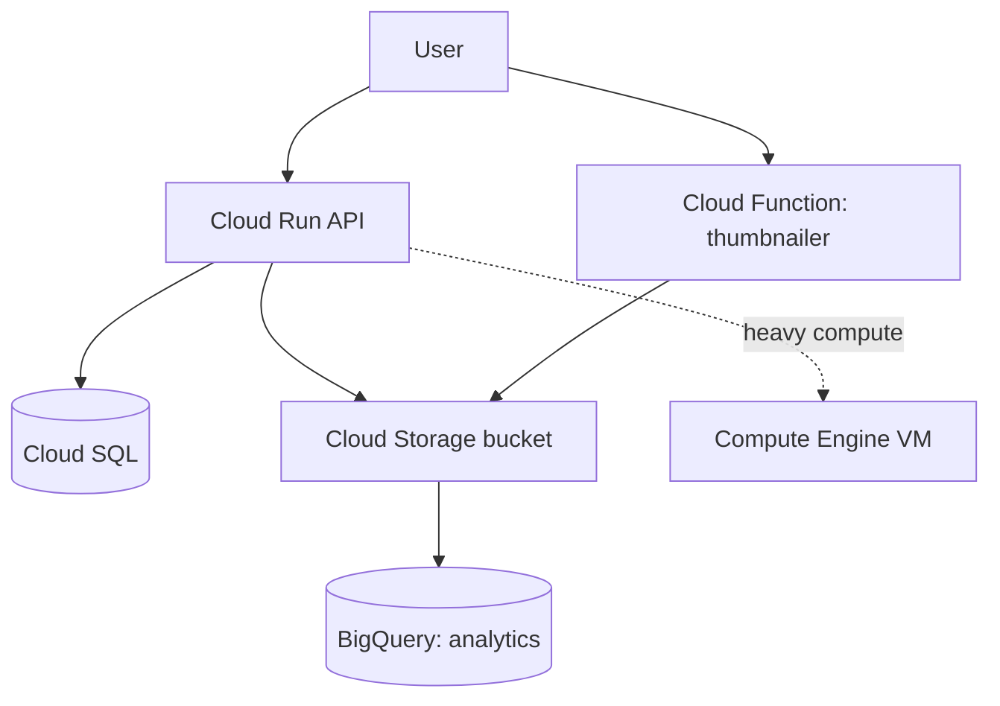

# The services you'll actually use

The console lists a hundred products. You need six. Everything else is a specialized variation you can learn the day a real need shows up. This phase walks the core six in the order most people meet them: a server, a place for files, a managed database, two ways to run code without managing a server, and the data warehouse that GCP is quietly famous for.

The shape to hold in your head: GCP gives you a **ladder of how much you manage**. At the bottom, you run a whole virtual machine and own everything on it. At the top, you hand Google a function and never think about servers at all. Pick the rung that matches how much control you actually need - lower is more control and more chores, higher is less of both.

## Compute Engine - a virtual machine you own

This is the bottom rung: a plain virtual server. You pick the CPU, RAM, and operating system, and you get a Linux or Windows box you SSH into and treat like any other machine.

```bash
# Create a small Linux VM in a specific zone
gcloud compute instances create web-1 \
  --zone=us-central1-a \
  --machine-type=e2-small \
  --image-family=debian-12 \
  --image-project=debian-cloud

# SSH straight in - gcloud handles the keys for you
gcloud compute ssh web-1 --zone=us-central1-a
```

*What just happened:* you created a VM named `web-1` and connected to it. Note the **zone** (`us-central1-a`): GCP splits the world into regions (a geographic area) and zones (an isolated data center within a region). A VM lives in exactly one zone. The `e2-small` is a **machine type** - a preset bundle of CPU and memory. The catch with Compute Engine: it bills while it's on whether or not anyone's using it, and patching, scaling, and uptime are your job.

Reach for Compute Engine when you need a full OS, custom software that won't run in a container, or a lift-and-shift of something that already expects a normal server.

## Cloud Storage - a place for files (buckets)

Object storage. You put files ("objects") into **buckets**, and Google keeps them durable and reachable over HTTP. This is where images, backups, build artifacts, and static website files go. It is not a filesystem and not a disk - it's a giant, addressable key-value store for blobs.

```bash
# Create a bucket (the name must be globally unique across all of GCP)
gcloud storage buckets create gs://my-app-uploads-481923 \
  --location=us-central1

# Copy a file up, then list what's in the bucket
gcloud storage cp ./logo.png gs://my-app-uploads-481923/
gcloud storage ls gs://my-app-uploads-481923/
# → gs://my-app-uploads-481923/logo.png
```

*What just happened:* you created a bucket and uploaded a file to it. The `gs://` prefix is how every tool refers to Cloud Storage paths. Bucket names share one global namespace - like project IDs, yours must be unique across the entire planet, which is why people append a project number or random suffix. You pay for what you store plus what you download out ("egress"); uploads are free.

## Cloud SQL - a managed relational database

You want PostgreSQL or MySQL, but you don't want to be the one applying security patches, configuring backups, and babysitting replication at 3am. Cloud SQL runs the database engine for you. You still get a normal Postgres or MySQL you connect to with normal tools - Google handles the operations underneath.

```bash
# Create a small PostgreSQL instance
gcloud sql instances create app-db \
  --database-version=POSTGRES_16 \
  --tier=db-f1-micro \
  --region=us-central1
```

*What just happened:* you stood up a managed Postgres instance. Backups, patching, and failover are now Google's responsibility. The trade: less control over the exact server config, and it's pricier than running the same database yourself on a raw VM - you're paying for not having to do the operations work. For most teams that's the right trade, because database operations is exactly the work that quietly eats weekends.

## Cloud Run - your container, no server to manage

Now we climb the ladder. You have an app in a container. You don't want to manage a VM to run it. Cloud Run takes your container image, runs it on demand, scales it up when traffic arrives, and scales it to **zero** when nobody's calling - so an idle service costs nothing.

```bash
# Deploy a container image straight to a public URL
gcloud run deploy my-api \
  --image=us-docker.pkg.dev/my-project/repo/my-api:latest \
  --region=us-central1 \
  --allow-unauthenticated
# → Service URL: https://my-api-xxxxxxxxxx-uc.a.run.app
```

*What just happened:* you deployed a container and got back a live HTTPS URL, with autoscaling and TLS handled for you. The key behavior is **scale-to-zero**: if your service gets no traffic, you run no instances and pay nothing for compute. The first request after idle has to start a container ("cold start"), which adds a little latency. Cloud Run is the sweet spot for most web APIs and backends today - container flexibility without VM chores.

## Cloud Functions - a single function on a trigger

The top rung. You don't even bring a container - you bring one function, and Google runs it in response to an event: an HTTP request, a file landing in a bucket, a message on a queue. Pure event-driven glue.

```bash
# Deploy an HTTP-triggered function from the current directory
gcloud functions deploy hello \
  --runtime=python312 \
  --trigger-http \
  --region=us-central1 \
  --entry-point=hello
```

*What just happened:* you deployed a single function reachable over HTTP, with no server and no container to think about. Cloud Functions shines for small, single-purpose reactions - "when a file is uploaded, generate a thumbnail" or "when this webhook fires, write a row." For anything with real structure, you'll usually outgrow it and move to Cloud Run; the line between them is mostly "one function" versus "a whole app."

## BigQuery - the data warehouse GCP is known for

This one is different in kind, and it's the service that made Google Cloud's reputation. BigQuery is a **serverless data warehouse**: you load enormous tables - billions of rows - and run plain SQL across all of them in seconds, with no servers, no indexes, no cluster to size. You don't provision anything; you query, and Google throws as much compute at it as the query needs.

```sql
-- Query a public dataset: top 5 names in the US name records
SELECT name, SUM(number) AS total
FROM `bigquery-public-data.usa_names.usa_1910_current`
GROUP BY name
ORDER BY total DESC
LIMIT 5;
```

*What just happened:* you ran standard SQL over a multi-billion-row public dataset and got an answer fast, without managing a single machine. BigQuery bills mainly by **how much data your query scans**, not by time - so `SELECT *` over a huge table is the expensive mistake; selecting only the columns you need is the cheap habit. This pay-per-scan model is why analytics teams gravitate to GCP.

## How they fit together



*What just happened:* a realistic small system. Users hit a Cloud Run API that reads and writes Cloud SQL and stores uploads in a bucket; a Cloud Function reacts to those uploads; data flows into BigQuery for analytics; and a Compute Engine VM stands ready for any workload that needs a full machine. You rarely use one service alone - they compose.

## In the wild

The instinct for newcomers is to default to Compute Engine because a VM feels familiar. Resist it. Each VM is a machine you now have to patch, monitor, and keep alive. The lazy-in-the-good-sense move is to climb as high up the ladder as your workload allows: a stateless web service goes on Cloud Run, a one-shot reaction goes in a Cloud Function, and you only drop down to a VM when something genuinely needs a full operating system. Less to manage means less that can page you.

```quiz
[
  {
    "q": "Which service runs your container, scales automatically, and scales to zero so an idle service costs nothing for compute?",
    "choices": ["Compute Engine", "Cloud Run", "Cloud SQL", "BigQuery"],
    "answer": 1,
    "explain": "Cloud Run runs container images on demand, autoscales with traffic, and scales to zero when idle so you pay nothing for compute while no requests arrive."
  },
  {
    "q": "BigQuery's main cost driver for a query is:",
    "choices": ["How long the query runs", "How many servers you provisioned", "How much data the query scans", "The number of rows returned"],
    "answer": 2,
    "explain": "BigQuery bills mainly by bytes scanned, which is why selecting only needed columns is far cheaper than SELECT * over a large table."
  },
  {
    "q": "You need to run legacy software that expects a full Linux operating system. Which service fits best?",
    "choices": ["Cloud Functions", "Cloud Run", "Compute Engine", "Cloud Storage"],
    "answer": 2,
    "explain": "Compute Engine gives you a full virtual machine with an OS you control, which is what lift-and-shift of legacy software needs."
  }
]
```

[← Phase 1: The project is the unit of everything](01-the-project-is-the-unit.md) · [Overview](_guide.md) · [Phase 3: IAM, billing, and the AWS map →](03-iam-billing-and-the-aws-map.md)
