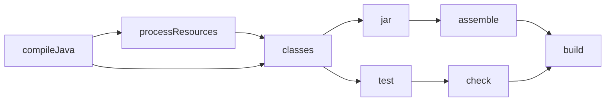

# The Build Is a Graph

Here's the reality you're starting from: a "build" sounds like one thing, one button. But turning source code into a shippable artifact is a chain of steps. Compile the code. Process the resources. Run the tests. Bundle everything into a JAR or an APK. Each step needs the step before it to be finished first. You can't bundle a JAR before you've compiled the classes that go in it.

Gradle's whole worldview is built on that ordering. Every step is a **task**, and the tasks form a graph: arrows point from a task to the tasks it depends on. Understand that graph and you understand Gradle. Everything else - the script syntax, the plugins, the caching - is detail hanging off this one idea.

## What a task actually is

A task is a named unit of work with inputs and outputs. `compileJava` takes your `.java` files (inputs) and produces `.class` files (outputs). `test` takes the compiled classes and produces test results. `jar` takes the classes and produces a `.jar`.

You can list every task available in a project:

```console
$ ./gradlew tasks
Build tasks
-----------
assemble - Assembles the outputs of this project.
build - Assembles and tests this project.
clean - Deletes the build directory.

Verification tasks
------------------
check - Runs all checks.
test - Runs the test suite.
```

*What just happened:* Gradle scanned your build script and the plugins it applies, then printed every task they registered, grouped by purpose. You didn't write most of these - the `java` plugin contributed them. Tasks are the vocabulary you'll use for the rest of your Gradle life.

## The graph, made visible

When you run a task, Gradle doesn't run it in isolation. It walks backward through the dependencies, builds an ordered plan, and runs each task exactly once. Ask Gradle to run `build`, and it figures out everything that has to happen first.



*What just happened:* This is a **DAG** - a directed acyclic graph. "Directed" because the arrows have direction (`build` needs `check`, not the other way round). "Acyclic" because there are no loops; a task can never depend on itself, directly or in a circle. Gradle topologically sorts this graph to decide run order. If two branches don't depend on each other, Gradle is free to run them in parallel.

You can see the plan without running it by using the `--dry-run` flag:

```console
$ ./gradlew build --dry-run
:compileJava SKIPPED
:processResources SKIPPED
:classes SKIPPED
:jar SKIPPED
:assemble SKIPPED
:compileTestJava SKIPPED
:test SKIPPED
:check SKIPPED
:build SKIPPED
```

*What just happened:* `--dry-run` printed the exact execution order Gradle would use, top to bottom, marking each `SKIPPED` because nothing actually ran. This is the resolved DAG flattened into a list. When a build does something you didn't expect, this is the first command to reach for - it shows you what Gradle thinks it's about to do.

## Why a programmable build, not config files

This is where Gradle parts ways with older tools. Maven (covered next door at [/guides/build-and-release-basics](/guides/build-and-release-basics) in spirit) describes a build with XML: a fixed structure you fill in. It's convention-heavy and predictable, which is a real strength. But the moment you need something the XML schema didn't anticipate, you're writing a plugin or fighting the format.

Gradle made the opposite bet. A build script is a **program** - Groovy or Kotlin code that runs and, as it runs, registers tasks and wires up the graph. That's the source of Gradle's reputation for flexibility: if you can express it in code, you can put it in your build.

```groovy
// A custom task, defined in three lines of real code.
tasks.register('greet') {
    doLast {
        println "Building ${project.name} on ${java.time.LocalDate.now()}"
    }
}
```

*What just happened:* You registered a brand-new task named `greet` whose action prints a line. Run `./gradlew greet` and it executes. There was no XML schema to satisfy and no plugin to install - the build script is a place where you can write logic directly. That power is also the danger, which Phase 3 gets into.

> The trade-off in one sentence: Maven gives you convention and predictability; Gradle gives you flexibility and the rope to overcomplicate your build. Most teams want the convention most of the time and the flexibility occasionally - which is why Gradle ships with strong defaults (those plugin-contributed tasks) so you rarely start from a blank file.

## Configuration vs execution: the two phases of every run

One mental model that saves you hours of confusion later: a Gradle run happens in two distinct phases. First **configuration** - Gradle executes your whole build script top to bottom to build the task graph. Then **execution** - Gradle runs the actions of the tasks you asked for.

```groovy
tasks.register('slow') {
    println "This prints during CONFIGURATION, every single build"
    doLast {
        println "This prints during EXECUTION, only when 'slow' runs"
    }
}
```

*What just happened:* The bare `println` runs while Gradle is still building the graph - even if you ran a completely different task. The `println` inside `doLast` runs only when `slow` actually executes. Mixing these up ("why does my expensive code run on every build?") is one of the most common Gradle confusions. Real work belongs inside `doLast` or a task action, never in the bare body.

## In the wild

When a CI build is mysteriously slow or runs the wrong things, experienced engineers reach for `./gradlew <task> --dry-run` and `./gradlew tasks` before reading a single line of the build script. The graph is the ground truth; the script is how the graph got built. Learn to read the graph and you can debug any Gradle project, even one you've never seen.

```quiz
[
  {
    "q": "What does it mean that Gradle's task graph is a DAG?",
    "choices": ["Tasks run in alphabetical order", "It is directed and acyclic, so dependencies have direction and no task can depend on itself in a loop", "Every task runs exactly twice", "Tasks are stored in a database"],
    "answer": 1,
    "explain": "DAG = directed acyclic graph. Arrows have direction and there are no cycles, which lets Gradle sort the tasks into a valid run order."
  },
  {
    "q": "You put a bare println in a task body (not inside doLast). When does it run?",
    "choices": ["Only when that task executes", "Never", "During the configuration phase, on every build", "Only on CI"],
    "answer": 2,
    "explain": "Code in the bare task body runs during configuration, which happens on every build regardless of which task you asked for. Real work belongs in doLast."
  },
  {
    "q": "What is the main philosophical difference between Gradle and Maven?",
    "choices": ["Gradle is faster because it is written in Rust", "Maven uses a programmable build script; Gradle uses fixed XML", "Gradle is a programmable build (code), while Maven favors fixed convention via XML", "There is no difference"],
    "answer": 2,
    "explain": "Gradle's build script is real Groovy/Kotlin code that registers tasks, giving flexibility. Maven favors convention through a fixed XML structure."
  }
]
```

[← Overview](_guide.md) | [Phase 2: The Build Script You Live In →](02-the-build-script-you-live-in.md)
